# CRM Core API - Análisis Exhaustivo del Backend

> **Nota**: Este es el README del **Backend (NestJS)**. Para documentación del **Frontend (Angular)**, ver [CRM Web Application README](../crm-web-app/README.md).

## Índice
1. [Análisis Arquitectónico y Estructural](#1-análisis-arquitectónico-y-estructural)
2. [Análisis de Lógica de Negocio por Módulo](#2-análisis-de-lógica-de-negocio-por-módulo)
3. [Diagramas de Arquitectura](#3-diagramas-de-arquitectura)
4. [Análisis de Servicios y Endpoints](#4-análisis-de-servicios-y-endpoints)
5. [Integraciones Externas](#5-integraciones-externas)
6. [Sistema de Autenticación y Autorización](#6-sistema-de-autenticación-y-autorización)
7. [Análisis Completo de Arquitectura](#7-análisis-completo-de-arquitectura)
8. [Casos de Uso de Negocio](#8-casos-de-uso-de-negocio)
9. [Diagrama de Entidades y Relaciones](#9-diagrama-de-entidades-y-relaciones)
10. [Análisis de Estados y Workflows](#10-análisis-de-estados-y-workflows)
11. [Flujos Completos de Procesos - Trazabilidad Detallada](#11-flujos-completos-de-procesos---trazabilidad-detallada)
12. [Resumen Ejecutivo](#12-resumen-ejecutivo)
13. [Análisis Profundo de Todos los Módulos](#13-análisis-profundo-de-todos-los-módulos)
14. [Comunicación con Frontend](#14-comunicación-con-frontend)

---

## 1. ANÁLISIS ARQUITECTÓNICO Y ESTRUCTURAL

### 1.1 Arquitectura General

El backend está construido con **NestJS 10** siguiendo una **Arquitectura Limpia (Clean Architecture)** con separación en capas:

- **Framework**: NestJS 10.0.5
- **Lenguaje**: TypeScript 4.9.5
- **Base de Datos**: MongoDB 7.6.2 (Mongoose)
- **Autenticación**: Auth0 (express-oauth2-jwt-bearer)
- **Cloud Storage**: AWS S3
- **Email**: AWS SES
- **VoIP**: CloudTalk
- **Notificaciones**: NotificationAPI
- **Patrón**: CQRS (Command Query Responsibility Segregation)

### 1.2 Estructura de Carpetas

```
src/
├── app/                    # Capa de Aplicación (Application Layer)
│   ├── application/        # Módulo Applications
│   │   ├── commands/       # Command Handlers
│   │   ├── queries/        # Query Handlers
│   │   ├── dtos/           # Data Transfer Objects
│   │   ├── services/       # Application Services
│   │   └── events/         # Event Handlers
│   ├── bank/               # Módulo Banks
│   ├── contact/            # Módulo Contacts
│   ├── company/            # Módulo Companies
│   ├── commission/         # Módulo Commissions
│   ├── campaign/           # Módulo Campaigns
│   ├── lead/               # Módulo Leads
│   ├── user/               # Módulo Users
│   └── common/             # Configuraciones y servicios compartidos
│
├── domain/                 # Capa de Dominio (Domain Layer)
│   ├── application/        # Entidades y lógica de negocio
│   │   ├── entities/       # Entidades de dominio
│   │   ├── commands/        # Commands (CQRS)
│   │   ├── queries/        # Queries (CQRS)
│   │   ├── repositories/   # Interfaces de repositorios
│   │   └── events/         # Domain Events
│   ├── bank/
│   ├── contact/
│   ├── company/
│   ├── commission/
│   ├── campaign/
│   ├── leads/
│   ├── user/
│   └── common/             # Utilidades y tipos compartidos
│
└── infra/                  # Capa de Infraestructura (Infrastructure Layer)
    ├── adapters/           # Adaptadores externos
    │   ├── rest/           # REST Controllers (Resources)
    │   ├── mongo/          # Implementaciones MongoDB
    │   ├── aws/            # Servicios AWS (S3, SES)
    │   ├── auth0/          # Integración Auth0
    │   ├── cloudtalk/      # Integración VoIP
    │   ├── notification-api/ # Integración NotificationAPI
    │   └── systeme/        # Integración Systeme
    ├── common/             # Middlewares, Guards, Decorators
    └── di/                 # Dependency Injection (Módulos NestJS)
```

### 1.3 Patrones Arquitectónicos

#### 1. Clean Architecture / Hexagonal Architecture

**Separación en 3 Capas Principales:**

1. **Domain Layer** (`src/domain/`):
   - Entidades de negocio puras (sin dependencias externas)
   - Interfaces de repositorios
   - Commands y Queries (CQRS)
   - Domain Events
   - Lógica de negocio pura

2. **Application Layer** (`src/app/`):
   - Command Handlers y Query Handlers
   - DTOs (Data Transfer Objects)
   - Application Services
   - Event Handlers
   - Orquestación de casos de uso

3. **Infrastructure Layer** (`src/infra/`):
   - REST Controllers (Resources)
   - Implementaciones de repositorios (MongoDB)
   - Adaptadores externos (AWS, Auth0, etc.)
   - Middlewares, Guards, Filters
   - Dependency Injection (NestJS Modules)

#### 2. CQRS (Command Query Responsibility Segregation)

**Separación de Commands y Queries:**

- **Commands**: Modifican el estado (Create, Update, Delete)
  - Ubicación: `domain/*/commands/` y `app/*/commands/`
  - Ejemplo: `CreateApplicationCommand`, `AcceptOfferCommand`

- **Queries**: Solo leen datos (Get, Search, List)
  - Ubicación: `domain/*/queries/` y `app/*/queries/`
  - Ejemplo: `GetApplicationByIdQuery`, `SearchApplicationsQuery`

**Ventajas:**
- Separación clara de responsabilidades
- Optimización independiente de lectura/escritura
- Escalabilidad mejorada

#### 3. Repository Pattern

**Interfaces en Domain, Implementaciones en Infrastructure:**

```typescript
// Domain Layer (Interface)
interface ApplicationRepository {
  create(application: Application): Promise<Application>;
  findById(id: string): Promise<Application | null>;
  // ...
}

// Infrastructure Layer (Implementación)
class MongoApplicationRepository implements ApplicationRepository {
  // Implementación con Mongoose
}
```

#### 4. Dependency Injection (NestJS)

- Módulos NestJS para organización
- Inyección de dependencias automática
- Providers registrados en módulos
- Guards y Filters globales

#### 5. Event-Driven Architecture

- Domain Events para comunicación entre bounded contexts
- Event Handlers en Application Layer
- Ejemplo: `ApplicationAcceptedEvent` → Crea Commission automáticamente

### 1.4 Módulos Principales

#### Application Module
- **Propósito**: Gestión completa de aplicaciones de préstamo
- **Endpoints**: 27+ recursos REST
- **Comandos**: 22 comandos (create, update, delete, transfer, etc.)
- **Queries**: 8 queries (search, getById, getNotifications, etc.)

#### Bank Module
- **Propósito**: Gestión de instituciones financieras
- **Endpoints**: 11 recursos REST
- **Comandos**: 8 comandos
- **Queries**: 4 queries

#### Contact Module
- **Propósito**: Gestión de contactos (personas físicas)
- **Endpoints**: 11 recursos REST
- **Comandos**: 8 comandos
- **Queries**: 4 queries

#### Company Module
- **Propósito**: Gestión de empresas
- **Endpoints**: 12 recursos REST
- **Comandos**: 8 comandos
- **Queries**: 5 queries

#### Commission Module
- **Propósito**: Gestión de comisiones
- **Endpoints**: 5 recursos REST
- **Comandos**: 3 comandos
- **Queries**: 3 queries

#### Campaign Module
- **Propósito**: Gestión de campañas de marketing
- **Endpoints**: 8 recursos REST
- **Comandos**: 7 comandos
- **Queries**: 2 queries

#### Lead Module
- **Propósito**: Gestión de leads y prospectos
- **Endpoints**: 7 recursos REST
- **Comandos**: 4 comandos
- **Queries**: 4 queries

#### User Module
- **Propósito**: Gestión de usuarios del sistema
- **Endpoints**: 15 recursos REST
- **Comandos**: 11 comandos
- **Queries**: 4 queries

---

## 2. ANÁLISIS DE LÓGICA DE NEGOCIO POR MÓDULO

### 2.1 MÓDULO: APPLICATION (Aplicaciones)

#### a) Propósito y Funcionalidad

**Propósito de Negocio:**
Gestiona el ciclo completo de solicitudes de préstamo comercial, desde la creación hasta el cierre, incluyendo envío a bancos, recepción de ofertas y aceptación.

**Problema que Resuelve:**
- Centralización de solicitudes de préstamo
- Coordinación con múltiples bancos simultáneamente
- Gestión de documentos complejos (bank statements, MTD, credit card, filled apps)
- Trazabilidad completa de cambios y estados
- Automatización de comisiones al aceptar ofertas

**Usuarios Objetivo:**
- **Agentes/Brokers**: Crean, envían y gestionan aplicaciones
- **Supervisores**: Supervisan aplicaciones del equipo
- **Administradores**: Acceso completo, pueden eliminar aplicaciones

#### b) Estructura de Datos

**Entidades Principales:**

1. **Application**:
   - `id`, `company_id`, `amount`, `product_type`
   - `status`: READY_TO_SEND, SENT, OFFERED, OFFER_ACCEPTED, COMPLETED, REJECTED
   - `substatus`: CONTRACT_REQUESTED, CONTRACT_SIGNED, FUNDED, etc.
   - `position`: 1-5
   - `documents`: Bank statements, MTD, credit card, filled apps, additional statements
   - `referral`: Información de referral
   - `notifications`: Array de BankNotifications
   - `created_at`, `updated_at`, `created_by`, `owner_id`

2. **BankNotification**:
   - `id`, `application_id`, `bank_id`
   - `status`: PENDING, SENT, OFFERED, ACCEPTED, REJECTED
   - `offers`: Array de Offers
   - `message`: Mensaje enviado al banco
   - `sent_at`, `responded_at`

3. **Offer**:
   - `id`, `notification_id`, `bank_id`
   - `amount`, `factor_rate`, `commission`, `payment_plan`
   - `status`: PENDING, ACCEPTED, ON_HOLD, REJECTED
   - `created_at`, `updated_at`

4. **DraftApplication**:
   - Similar a Application pero en estado borrador
   - Puede publicarse como Application

#### c) Comandos Principales

1. **CreateApplicationCommand**:
   - Valida monto ($1,000 - $20,000,000)
   - Valida documentos requeridos (4 bank statements)
   - Calcula períodos dinámicamente
   - Crea aplicación en estado READY_TO_SEND

2. **AddNotificationsToApplicationCommand**:
   - Valida que aplicación esté en READY_TO_SEND
   - Valida que tenga posición establecida
   - Crea BankNotifications para cada banco seleccionado
   - Cambia estado a SENT

3. **AcceptOfferCommand**:
   - Valida que oferta exista y esté en PENDING
   - Acepta oferta (status: ACCEPTED)
   - Rechaza otras ofertas de la misma notificación
   - Cambia estado de aplicación a OFFER_ACCEPTED
   - **Crea Commission automáticamente** (Domain Event)

4. **CompleteApplicationCommand**:
   - Valida que aplicación esté en OFFER_ACCEPTED
   - Cambia estado a COMPLETED
   - Bloquea aplicación para edición

5. **RejectApplicationCommand**:
   - Puede ejecutarse desde cualquier estado
   - Cambia estado a REJECTED
   - Rechaza todas las notificaciones pendientes

6. **TransferApplicationCommand**:
   - Valida que aplicación no esté COMPLETED
   - Transfiere ownership a otro usuario
   - Actualiza `owner_id`

#### d) Queries Principales

1. **SearchApplicationsQuery**:
   - Búsqueda con filtros (status, period, search term)
   - Paginación
   - Ordenamiento
   - Filtrado por permisos (own vs all)

2. **GetApplicationByIdQuery**:
   - Obtiene aplicación completa con todas las relaciones
   - Incluye company, notifications, offers, documents

3. **GetBankNotificationsQuery**:
   - Obtiene todas las notificaciones de una aplicación
   - Agrupa por fecha
   - Incluye ofertas

4. **GetRecommendedBanksQuery**:
   - Calcula bancos recomendados basado en:
     - Constraints del banco (amount, industry, territory)
     - Blacklist
     - Historial previo

#### e) Reglas de Negocio Críticas

1. **Crear Aplicación**:
   - Monto: $1,000 - $20,000,000 (solo enteros)
   - Bank Statements: 4 períodos requeridos
   - MTD Statements: 1 período opcional
   - Credit Card Statements: 3 períodos opcionales
   - Additional Statements: Máximo 5 opcionales
   - Períodos calculados dinámicamente basados en última aplicación de company
   - Si no hay aplicaciones previas, usa últimos 4 períodos desde hoy

2. **Enviar a Bancos**:
   - Solo aplicaciones en READY_TO_SEND
   - Debe tener posición establecida (1-5)
   - Mensaje: 15-800 caracteres
   - Crea una BankNotification por cada banco

3. **Gestionar Ofertas**:
   - Un banco puede enviar múltiples ofertas
   - Solo una oferta aceptada por notificación
   - Al aceptar: crea Commission automáticamente (DRAFT)
   - Ofertas pueden actualizarse antes de aceptar

4. **Estados y Transiciones**:
   ```
   READY_TO_SEND → SENT → OFFERED → OFFER_ACCEPTED → COMPLETED
                                ↓
                            REJECTED
   ```

#### f) Eventos de Dominio

1. **ApplicationAcceptedEvent**:
   - Se dispara al aceptar una oferta
   - Handler crea Commission automáticamente
   - Estado: DRAFT

2. **DraftApplicationCreatedEvent**:
   - Se dispara al crear un draft
   - Puede usarse para notificaciones

### 2.2 MÓDULO: BANK (Bancos)

#### a) Propósito y Funcionalidad

**Propósito de Negocio:**
Gestiona instituciones financieras (lenders/brokers) que reciben y responden a aplicaciones de préstamo.

**Estructura de Datos:**
- Información básica (nombre, dirección, contacto)
- Constraints (amount min/max, industries, territories)
- Blacklist (puede estar blacklisted con nota)
- Contactos (múltiples contactos por banco)
- Documentos

**Operaciones:**
- Crear, actualizar, eliminar bancos
- Gestionar blacklist
- Enviar emails a bancos
- Obtener ofertas de un banco

### 2.3 MÓDULO: CONTACT (Contactos)

#### a) Propósito y Funcionalidad

**Propósito de Negocio:**
Gestiona personas físicas (miembros de empresas o independientes).

**Validaciones:**
- Edad: 21-99 años
- Máximo 5 teléfonos
- Máximo 5 emails
- Máximo 6 documentos totales
- Máximo 4 documentos por tipo

**Operaciones:**
- Crear, actualizar, eliminar contactos
- Agregar documentos
- Crear notas
- Buscar por SSN

### 2.4 MÓDULO: COMPANY (Empresas)

#### a) Propósito y Funcionalidad

**Propósito de Negocio:**
Gestiona empresas que solicitan préstamos.

**Validaciones:**
- Máximo 10 miembros
- Máximo 4 documentos por tipo

**Operaciones:**
- Crear, actualizar, eliminar companies
- Gestionar miembros (contacts asociados)
- Agregar documentos
- Crear notas
- Transferir ownership

### 2.5 MÓDULO: COMMISSION (Comisiones)

#### a) Propósito y Funcionalidad

**Propósito de Negocio:**
Gestiona distribución de comisiones cuando se acepta una oferta.

**Estructura:**
- PSF (Processing Service Fee) con distribución
- Commission con distribución
- Estado: DRAFT → PUBLISHED

**Operaciones:**
- Crear automáticamente al aceptar oferta
- Guardar distribución (sin publicar)
- Publicar comisión (hace final)

### 2.6 MÓDULO: CAMPAIGN (Campañas)

#### a) Propósito y Funcionalidad

**Propósito de Negocio:**
Gestiona campañas de marketing que generan leads.

**Estados:**
- STOPPED ↔ STARTED

**Operaciones:**
- Crear, iniciar, detener campañas
- Enviar siguiente batch de leads
- Webhooks para notificaciones

### 2.7 MÓDULO: LEAD (Leads)

#### a) Propósito y Funcionalidad

**Propósito de Negocio:**
Gestiona leads/prospectos antes de convertirlos en contactos.

**Estructura:**
- LeadGroup: Grupo de leads importados (CSV/Excel)
- Prospects: Prospectos individuales dentro del grupo

**Operaciones:**
- Crear lead group desde archivo
- Buscar leads/prospects
- Agregar notas a prospects
- Transferir ownership

### 2.8 MÓDULO: USER (Usuarios)

#### a) Propósito y Funcionalidad

**Propósito de Negocio:**
Gestiona usuarios del sistema, roles y permisos.

**Operaciones:**
- Crear, actualizar, habilitar/deshabilitar usuarios
- Gestionar roles
- Realizar llamadas (VoIP)
- Consolidar affiliates

---

## 3. DIAGRAMAS DE ARQUITECTURA

### 3.1 Arquitectura de Capas

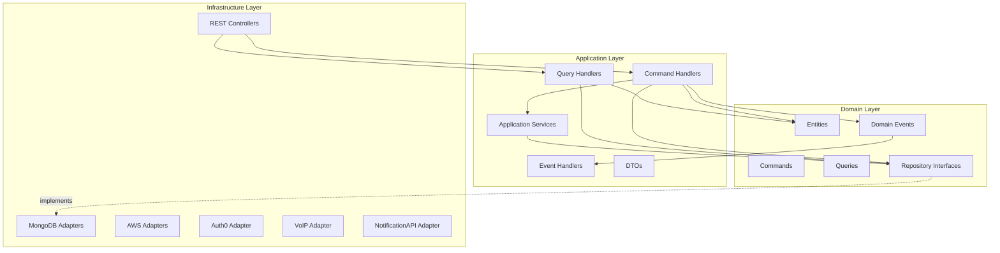

### 3.2 Flujo de Request (CQRS)

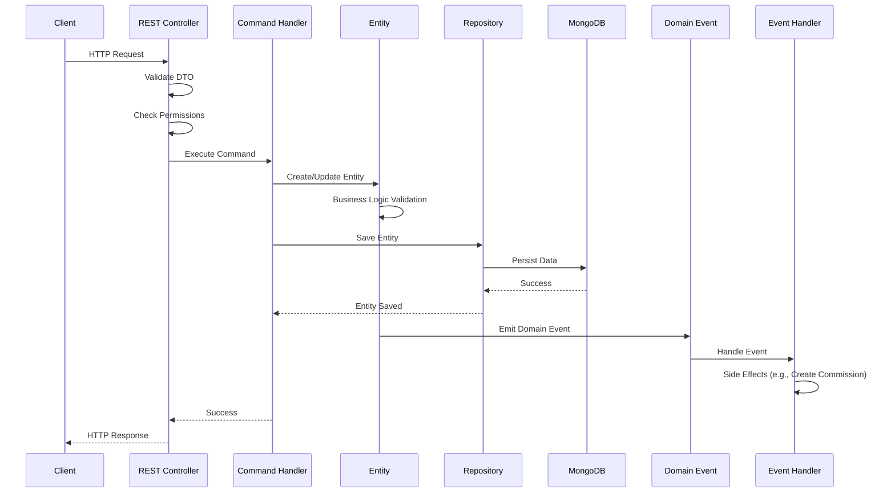

### 3.3 Flujo de Query

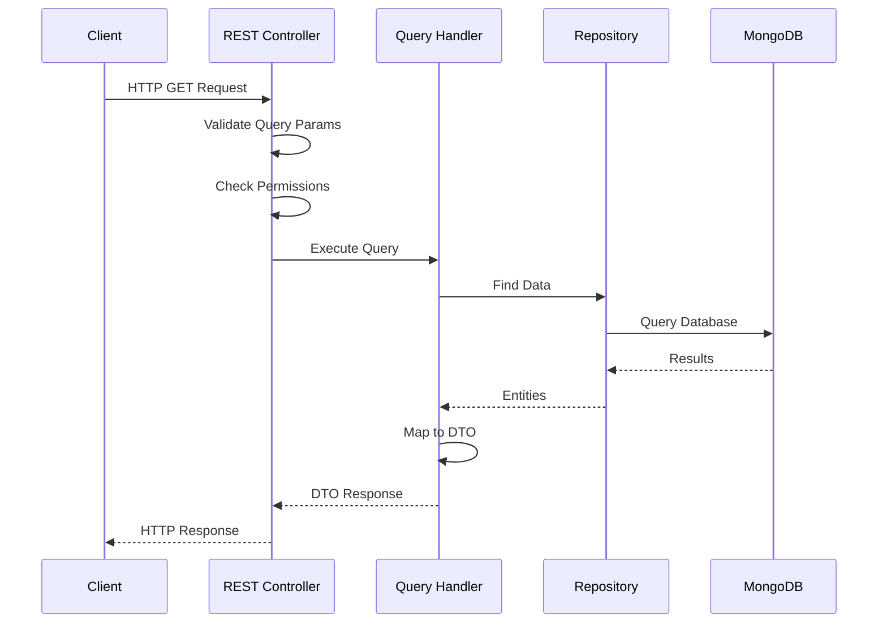

### 3.4 Arquitectura de Módulos NestJS

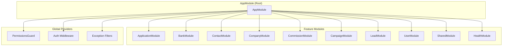

---

## 4. ANÁLISIS DE SERVICIOS Y ENDPOINTS

### 4.1 Endpoints REST por Módulo

#### Applications (`/v1/applications`)

**Commands (POST/PUT/PATCH/DELETE):**
- `POST /v1/applications` - Crear aplicación
- `PUT /v1/applications/:id/notifications` - Enviar a bancos
- `PUT /v1/applications/:id/notifications/:nId/accept/:offerId` - Aceptar oferta
- `PUT /v1/applications/:id/notifications/:nId/cancel/:offerId` - Cancelar oferta
- `PUT /v1/applications/:id/notifications/:nId/update/:offerId` - Actualizar oferta
- `PUT /v1/applications/:id/complete` - Completar aplicación
- `PATCH /v1/applications/:id/reject` - Rechazar aplicación
- `PUT /v1/applications/:id/substatus` - Actualizar subestado
- `PATCH /v1/applications/:id/position/:position` - Establecer posición
- `DELETE /v1/applications/:id` - Eliminar aplicación
- `PUT /v1/applications/:id/transfer-to/:userId` - Transferir aplicación

**Queries (GET):**
- `GET /v1/applications` - Buscar aplicaciones
- `GET /v1/applications/:id` - Obtener por ID
- `GET /v1/applications/:id/notifications` - Obtener notificaciones
- `GET /v1/applications/:id/recommended-banks` - Bancos recomendados
- `GET /v1/last-application-period/:companyId` - Último período válido

**Drafts (`/v1/drafts`):**
- `GET /v1/drafts` - Buscar drafts
- `GET /v1/drafts/:id` - Obtener draft
- `POST /v1/drafts` - Crear draft
- `PUT /v1/drafts/:id` - Actualizar draft
- `PUT /v1/drafts/:id/publish` - Publicar draft
- `DELETE /v1/drafts/:id` - Eliminar draft
- `PUT /v1/drafts/:id/transfer-to/:userId` - Transferir draft

**Webhooks:**
- `PUT /v1/applications/:id/send-to-banks` - Webhook para envío
- `PUT /v1/webhooks/applications/notification/reject` - Webhook de rechazo

#### Banks (`/v1/banks`)
- `GET /v1/banks` - Buscar bancos
- `GET /v1/banks/:id` - Obtener banco
- `POST /v1/banks` - Crear banco
- `PUT /v1/banks/:id` - Actualizar banco
- `DELETE /v1/banks/:id` - Eliminar banco
- `GET /v1/banks/:id/offers` - Obtener ofertas
- `PUT /v1/banks/:id/blacklist` - Agregar a blacklist
- `POST /v1/banks/send-email` - Enviar email a bancos

#### Contacts (`/v1/contacts`)
- `GET /v1/contacts` - Buscar contactos
- `GET /v1/contacts/:id` - Obtener contacto
- `GET /v1/contacts/ssn/:ssn` - Buscar por SSN
- `POST /v1/contacts` - Crear contacto
- `PUT /v1/contacts/:id` - Actualizar contacto
- `DELETE /v1/contacts/:id` - Eliminar contacto
- `POST /v1/contacts/:id/files` - Agregar archivo
- `POST /v1/contacts/:id/notes` - Crear nota
- `PUT /v1/contacts/:id/transfer-to/:userId` - Transferir contacto

#### Companies (`/v1/companies`)
- `GET /v1/companies` - Buscar companies
- `GET /v1/companies/:id` - Obtener company
- `POST /v1/companies` - Crear company
- `PUT /v1/companies/:id` - Actualizar company
- `DELETE /v1/companies/:id` - Eliminar company
- `POST /v1/companies/:id/files` - Agregar archivo
- `POST /v1/companies/:id/notes` - Crear nota
- `PUT /v1/companies/:id/transfer-to/:userId` - Transferir company

#### Commissions (`/v1/commissions`)
- `GET /v1/commissions` - Buscar comisiones
- `GET /v1/commissions/:id` - Obtener comisión
- `PUT /v1/commissions/:id` - Guardar comisión (sin publicar)
- `PUT /v1/commissions/:id/publish` - Publicar comisión

#### Campaigns (`/v1/campaigns`)
- `GET /v1/campaigns` - Listar campañas
- `GET /v1/campaigns/:id` - Obtener campaña
- `POST /v1/campaigns` - Crear campaña
- `PUT /v1/campaigns/:id/start` - Iniciar campaña
- `PUT /v1/campaigns/:id/stop` - Detener campaña
- `GET /v1/campaigns/:id/send-next` - Enviar siguiente batch
- `POST /v1/campaigns/notification` - Webhook de notificación
- `POST /v1/campaigns/stop-all` - Detener todas

#### Leads (`/v1/leads`)
- `GET /v1/leads` - Buscar lead groups
- `GET /v1/leads/prospects` - Buscar prospects
- `GET /v1/leads/prospects/:id` - Obtener prospect
- `POST /v1/leads` - Crear lead group (desde archivo)
- `POST /v1/leads/prospects/:id/notes` - Agregar nota a prospect
- `PUT /v1/leads/:id/transfer-to/:userId` - Transferir lead

#### Users (`/v1/users`)
- `GET /v1/users` - Buscar usuarios
- `GET /v1/users/:id` - Obtener usuario
- `GET /v1/users/roles` - Listar roles
- `POST /v1/users` - Crear usuario
- `PUT /v1/users` - Actualizar perfil propio
- `PUT /v1/users/:id` - Actualizar usuario
- `PUT /v1/users/roles/add` - Agregar rol
- `PUT /v1/users/roles/remove` - Remover rol
- `DELETE /v1/users/disable/:id` - Deshabilitar usuario
- `PUT /v1/users/enable/:id` - Habilitar usuario
- `POST /v1/users/make-a-call` - Realizar llamada
- `POST /v1/users/make-custom-a-call` - Llamada personalizada
- `POST /v1/users/create-affiliate` - Crear affiliate
- `PUT /v1/users/consolidate-affiliate` - Consolidar affiliate

### 4.2 Middlewares Globales

1. **SetRequestIdMiddleware**: Asigna ID único a cada request
2. **CreateRequestContextMiddleware**: Crea contexto de request
3. **RouterLoggerMiddleware**: Logging de requests
4. **WebhookAuthMiddleware**: Autenticación para webhooks
5. **CreateWebhookContextMiddleware**: Contexto para webhooks
6. **validateAuthorizationToken**: Valida JWT token (Auth0)
7. **CreateAuthContextMiddleware**: Crea contexto de autenticación
8. **DecodeTokenMiddleware**: Decodifica token y extrae permisos

### 4.3 Guards

1. **PermissionsGuard** (Global):
   - Valida permisos antes de ejecutar cualquier endpoint
   - Usa decorator `@RequiredPermissions()`
   - Verifica permisos del usuario desde JWT token

### 4.4 Exception Filters

1. **UnauthorizedExceptionFilter**: Maneja errores 401
2. **ForbiddenExceptionFilter**: Maneja errores 403

---

## 5. INTEGRACIONES EXTERNAS

### 5.1 Auth0

**Propósito**: Autenticación y autorización

**Integración**:
- Valida JWT tokens en cada request
- Extrae permisos del token (claim `permissions`)
- Middleware `validateAuthorizationToken` valida token
- `DecodeTokenMiddleware` decodifica y almacena en contexto

**Configuración**:
- `AUTH0_AUDIENCE`: Audience del token
- `AUTH0_TOKEN_ISSUER`: Issuer del token
- `AUTH0_TOKEN_ALGORITHM`: Algoritmo (RS256)

### 5.2 MongoDB

**Propósito**: Base de datos principal

**Integración**:
- Mongoose ODM
- Schemas por entidad
- Repositorios implementan interfaces de dominio
- Lazy connection habilitado

**Configuración**:
- `MONGODB_HOST`, `MONGODB_PORT`
- `MONGODB_DATABASE_NAME`
- `MONGODB_USERNAME`, `MONGODB_PASSWORD`

### 5.3 AWS S3

**Propósito**: Almacenamiento de archivos (documentos, imágenes)

**Integración**:
- `@aws-sdk/client-s3` para uploads
- `@aws-sdk/lib-storage` para multipart uploads
- `S3MediaRepository` implementa `MediaRepository`

**Configuración**:
- `AWS_S3_KEY`, `AWS_S3_SECRET`
- `AWS_S3_REGION`

### 5.4 AWS SES

**Propósito**: Envío de emails

**Integración**:
- `@aws-sdk/client-sesv2`
- `SESMailerService` para envío de emails
- Usado para enviar emails a bancos

**Configuración**:
- `SES_DEFAULT_FROM`
- `SES_API_KEY`, `SES_SECRET_KEY`

### 5.5 CloudTalk (VoIP)

**Propósito**: Sistema de llamadas telefónicas

**Integración**:
- `CloudTalkVoIPProviderRepository` implementa `VoIPProviderRepository`
- Endpoint `/v1/users/make-a-call` inicia llamadas

**Configuración**:
- `VOIP_BASE_URL`
- `VOIP_USERNAME`, `VOIP_PASSWORD`

### 5.6 NotificationAPI

**Propósito**: Notificaciones push en tiempo real

**Integración**:
- `notificationapi-node-server-sdk`
- `NotificationAPIRepository` implementa `NotificationRepository`
- Envía notificaciones sobre cambios importantes

**Configuración**:
- `NOTIFICATION_API_CLIENT_ID`
- `NOTIFICATION_API_CLIENT_SECRET`
- `NOTIFICATION_API_CHANNEL_ID`

### 5.7 Systeme

**Propósito**: Integración con sistema externo de contactos

**Integración**:
- `SystemeExternalContactsRepository`
- Sincronización de contactos externos

**Configuración**:
- `SYSTEME_API_KEY`
- `SYSTEME_BASE_URL`

### 5.8 Scheduler Service

**Propósito**: Servicio externo para tareas programadas

**Integración**:
- `HttpSchedulerService` para comunicación HTTP
- Usado para programar tareas (ej: enviar notificaciones pendientes)

**Configuración**:
- `SCHEDULER_SERVICE_BASE_URL`

---

## 6. SISTEMA DE AUTENTICACIÓN Y AUTORIZACIÓN

### 6.1 Autenticación (Auth0)

**Flujo**:
1. Cliente envía request con JWT token en header `Authorization: Bearer <token>`
2. `validateAuthorizationToken` middleware valida token con Auth0
3. `DecodeTokenMiddleware` decodifica token y extrae información
4. `CreateAuthContextMiddleware` crea contexto de autenticación
5. Contexto almacenado en `ExtendedAuthContextStorage`

**Información del Token**:
- `sub`: User ID
- `permissions`: Array de permisos
- `tenants`: Array de tenant IDs
- `email`, `name`, etc.

### 6.2 Autorización (Permisos)

**Sistema de Permisos**:
- Permisos vienen en JWT token (claim `permissions`)
- Enum `Permission` define todos los permisos disponibles
- `PermissionsGuard` valida permisos antes de ejecutar endpoint
- Decorator `@RequiredPermissions()` especifica permisos requeridos

**Tipos de Permisos**:
- **CRUD**: `CREATE_APPLICATION`, `READ_APPLICATION`, `UPDATE_APPLICATION`, `DELETE_APPLICATION`
- **Own vs All**: `LIST_APPLICATIONS` vs `LIST_OWN_APPLICATIONS`
- **Actions**: `SEND_APPLICATION`, `TRANSFER_APPLICATION`
- **View Full**: `VIEW_FULL_SSN`, `VIEW_FULL_PHONE`, `VIEW_FULL_TAX_ID`, `VIEW_FULL_EMAIL`

**Permisos por Módulo**:

**Applications**:
- `CREATE_APPLICATION`, `READ_APPLICATION`, `LIST_APPLICATIONS`
- `READ_OWN_APPLICATION`, `LIST_OWN_APPLICATION`
- `DELETE_APPLICATION`, `UPDATE_APPLICATION`
- `SEND_APPLICATION`, `TRANSFER_APPLICATION`
- `VIEW_FULL_NOTIFICATION`

**Contacts**:
- `CREATE_CONTACT`, `READ_CONTACT`, `LIST_CONTACTS`
- `READ_OWN_CONTACT`, `LIST_OWN_CONTACTS`
- `DELETE_CONTACT`, `UPDATE_CONTACT`
- `ADD_CONTACT_NOTE`, `DELETE_CONTACT_NOTE`

**Companies**:
- `CREATE_COMPANY`, `READ_COMPANY`, `LIST_COMPANIES`
- `READ_OWN_COMPANY`, `LIST_OWN_COMPANIES`
- `DELETE_COMPANY`, `UPDATE_COMPANY`, `TRANSFER_COMPANY`
- `ADD_COMPANY_NOTE`, `DELETE_COMPANY_NOTE`

**Banks**:
- `CREATE_BANK`, `READ_BANK`, `LIST_BANKS`
- `DELETE_BANK`, `UPDATE_BANK`
- `SEND_EMAIL_TO_BANKS`

**Commissions**:
- `READ_COMMISSION`, `LIST_COMMISSIONS`
- `UPDATE_COMMISSION`, `PUBLISH_COMMISSION`

**Leads**:
- `CREATE_LEAD`, `READ_LEAD`, `LIST_LEADS`
- `LIST_OWN_LEADS`, `DELETE_LEAD`
- `ADD_PROSPECT_NOTE`, `TRANSFER_LEAD`

**Users**:
- `LIST_USER`, `CREATE_USER`, `UPDATE_USER`

**Calls**:
- `REQUEST_CALL`, `REQUEST_CUSTOM_CALL`

**Campaigns**:
- `LIST_CAMPAIGNS`, `CREATE_CAMPAIGN`

**Dashboard**:
- `READ_DASHBOARD`

### 6.3 Rutas Públicas

Rutas que no requieren autenticación:
- `GET /v1/config` - Configuración pública
- `GET /health` - Health check

### 6.4 Rutas de Webhook

Rutas con autenticación especial (webhook key):
- `PUT /v1/applications/:id/send-to-banks`
- `PUT /v1/webhooks/applications/notification/reject`
- `POST /v1/webhooks/affiliate`
- `PUT /v1/webhooks/affiliate/consolidate`
- `GET /v1/campaigns/:id/send-next`
- `POST /v1/campaigns/notification`
- `POST /v1/campaigns/stop-all`

---

## 7. ANÁLISIS COMPLETO DE ARQUITECTURA

### 7.1 Patrones Arquitectónicos

La aplicación CRM Core API utiliza una combinación de patrones arquitectónicos modernos que proporcionan escalabilidad, mantenibilidad y testabilidad:

#### 1. Clean Architecture / Hexagonal Architecture

**Descripción**: Arquitectura en capas concéntricas donde las capas internas no dependen de las externas.

**Estructura de Capas**:

```
┌─────────────────────────────────────────┐
│   Infrastructure Layer (Outer)          │
│   - REST Controllers                    │
│   - MongoDB Adapters                    │
│   - External Service Adapters           │
└─────────────────────────────────────────┘
              ↓ depende de
┌─────────────────────────────────────────┐
│   Application Layer (Middle)            │
│   - Command Handlers                    │
│   - Query Handlers                      │
│   - DTOs                                │
│   - Application Services                │
│   - Event Handlers                      │
└─────────────────────────────────────────┘
              ↓ depende de
┌─────────────────────────────────────────┐
│   Domain Layer (Inner - Core)           │
│   - Entities (Business Objects)        │
│   - Value Objects                       │
│   - Domain Events                       │
│   - Repository Interfaces              │
│   - Domain Services                     │
│   - Business Rules                     │
└─────────────────────────────────────────┘
```

**Principios**:
- **Independencia de Frameworks**: Domain layer no depende de NestJS
- **Independencia de UI**: Domain no sabe sobre REST
- **Independencia de Base de Datos**: Domain no sabe sobre MongoDB
- **Independencia de Servicios Externos**: Domain no sabe sobre AWS, Auth0, etc.

**Ventajas**:
- ✅ **Testabilidad**: Domain puede testearse sin infraestructura
- ✅ **Mantenibilidad**: Cambios en infraestructura no afectan lógica de negocio
- ✅ **Flexibilidad**: Fácil cambiar MongoDB por PostgreSQL, REST por GraphQL
- ✅ **Escalabilidad**: Lógica de negocio centralizada y reutilizable

**Trade-offs**:
- ⚠️ **Complejidad inicial**: Más capas = más archivos y estructura
- ⚠️ **Curva de aprendizaje**: Requiere entender Clean Architecture
- ⚠️ **Overhead**: Mappers entre capas

**Mitigación**:
- Estructura clara y documentada
- Convenciones de nombres consistentes
- Mappers automatizados donde sea posible

#### 2. CQRS (Command Query Responsibility Segregation)

**Descripción**: Separación de operaciones que modifican estado (Commands) de operaciones que solo leen (Queries).

**Estructura**:

```
Commands (Write)                    Queries (Read)
├── CreateApplicationCommand        ├── GetApplicationByIdQuery
├── AcceptOfferCommand              ├── SearchApplicationsQuery
├── UpdateApplicationCommand        ├── GetBankNotificationsQuery
└── ...                             └── ...
```

**Implementación**:

```typescript
// Domain Layer
domain/application/
├── commands/
│   ├── create-application.command.ts
│   └── accept-offer.command.ts
└── queries/
    ├── get-application-by-id.query.ts
    └── search-applications.query.ts

// Application Layer
app/application/
├── commands/
│   ├── create-application.command-handler.ts
│   └── accept-offer.command-handler.ts
└── queries/
    ├── get-application-by-id.query-handler.ts
    └── search-applications.query-handler.ts
```

**Ventajas**:
- ✅ **Optimización independiente**: Commands y Queries pueden optimizarse por separado
- ✅ **Escalabilidad**: Pueden escalarse independientemente
- ✅ **Separación clara**: Modificaciones vs Lecturas
- ✅ **Flexibilidad**: Fácil cambiar implementación de queries sin afectar commands

**Trade-offs**:
- ⚠️ **Más código**: Handlers separados para cada operación
- ⚠️ **Complejidad**: Dos flujos diferentes para entender
- ⚠️ **Consistencia eventual**: En algunos casos (mitigado con transacciones)

**Mitigación**:
- Estructura clara (commands/ vs queries/)
- Handlers siguen mismo patrón
- Documentación de flujos

#### 3. Repository Pattern

**Descripción**: Abstracción del acceso a datos mediante interfaces en Domain, implementaciones en Infrastructure.

**Estructura**:

```typescript
// Domain Layer - Interface
domain/application/repositories/
└── application.repository.ts
    interface ApplicationRepository {
      createOne(application: Application): Observable<Id>;
      findById(id: Id): Observable<Application | null>;
      updateOne(application: Application): Observable<void>;
      searchApplications(query: SearchApplicationsQuery): Observable<Application[]>;
    }

// Infrastructure Layer - Implementation
infra/adapters/mongo/application/repositories/
└── mongo-application.repository.ts
    class MongoApplicationRepository implements ApplicationRepository {
      // Implementación con Mongoose
    }
```

**Ventajas**:
- ✅ **Independencia de BD**: Domain no sabe sobre MongoDB
- ✅ **Testabilidad**: Fácil mockear repositorios en tests
- ✅ **Flexibilidad**: Cambiar MongoDB por PostgreSQL sin tocar Domain
- ✅ **Abstracción**: Lógica de acceso a datos encapsulada

**Trade-offs**:
- ⚠️ **Capa adicional**: Más abstracción = más código
- ⚠️ **Mappers**: Necesarios entre Domain Entities y MongoDB Documents

**Mitigación**:
- Repositorios son delgados
- Mappers claros y reutilizables
- Documentación de mapeos

#### 4. Event-Driven Architecture

**Descripción**: Uso de Domain Events para desacoplar side effects y permitir extensibilidad.

**Estructura**:

```typescript
// Domain Layer - Event
domain/application/events/
└── application-accepted.event.ts
    class ApplicationAcceptedEvent {
      constructor(
        public readonly applicationId: Id,
        public readonly companyId: Id,
        public readonly bankId: Id,
        public readonly commission: CommissionDetail,
      ) {}
    }

// Application Layer - Event Handler
app/application/events/
└── application-accepted.event-handler.ts
    @EventHandler(ApplicationAcceptedEvent)
    class ApplicationAcceptedEventHandler {
      handle(event: ApplicationAcceptedEvent): Observable<void> {
        // Crea Commission automáticamente
      }
    }
```

**Flujo**:

```
Command Handler → Domain Entity → Emite Event → Event Handler → Side Effect
```

**Ventajas**:
- ✅ **Desacoplamiento**: Commands no saben sobre side effects
- ✅ **Extensibilidad**: Fácil agregar nuevos handlers
- ✅ **Trazabilidad**: Eventos documentan qué pasó
- ✅ **Testabilidad**: Eventos pueden testearse independientemente

**Trade-offs**:
- ⚠️ **Debugging**: Más difícil rastrear flujos completos
- ⚠️ **Orden de ejecución**: Debe manejarse cuidadosamente
- ⚠️ **Consistencia eventual**: En algunos casos

**Mitigación**:
- Eventos bien documentados
- Handlers idempotentes cuando sea posible
- Logging detallado de eventos

#### 5. Dependency Injection (NestJS)

**Descripción**: NestJS proporciona DI container que gestiona dependencias automáticamente.

**Estructura**:

```typescript
// Module
@Module({
  providers: [
    CreateApplicationCommandHandler,
    ApplicationRepository, // Interface
    {
      provide: InjectionConstant.APPLICATION_REPOSITORY,
      useClass: MongoApplicationRepository, // Implementation
    },
  ],
})
export class ApplicationModule {}

// Handler
@CommandHandler(CreateApplicationCommand)
class CreateApplicationCommandHandler {
  constructor(
    @Inject(InjectionConstant.APPLICATION_REPOSITORY)
    private readonly repository: ApplicationRepository,
  ) {}
}
```

**Ventajas**:
- ✅ **Testabilidad**: Fácil inyectar mocks
- ✅ **Flexibilidad**: Cambiar implementaciones sin tocar código
- ✅ **Mantenibilidad**: Dependencias explícitas

**Trade-offs**:
- ⚠️ **Complejidad**: Requiere entender DI container
- ⚠️ **Configuración**: Módulos deben configurarse correctamente

#### 6. Module Pattern (Feature-Based)

**Descripción**: Organización por features/dominios en lugar de por tipo de archivo.

**Estructura**:

```
src/
├── app/
│   ├── application/     # Feature completo
│   │   ├── commands/
│   │   ├── queries/
│   │   ├── dtos/
│   │   └── events/
│   ├── bank/
│   ├── contact/
│   └── ...
├── domain/
│   ├── application/     # Domain del feature
│   │   ├── entities/
│   │   ├── commands/
│   │   ├── queries/
│   │   └── repositories/
│   └── ...
└── infra/
    ├── adapters/
    │   ├── rest/application/
    │   └── mongo/application/
    └── ...
```

**Ventajas**:
- ✅ **Alta cohesión**: Todo relacionado con un feature está junto
- ✅ **Bajo acoplamiento**: Features independientes
- ✅ **Escalabilidad**: Fácil añadir nuevos features
- ✅ **Colaboración**: Equipos pueden trabajar en features diferentes

**Trade-offs**:
- ⚠️ **Duplicación potencial**: Algunos servicios pueden duplicarse
- ⚠️ **Navegación**: Más difícil encontrar archivos específicos

**Mitigación**:
- SharedModule para código común
- Convenciones de nombres consistentes
- Documentación de estructura

### 7.2 Separación de Responsabilidades

#### Capa 1: Domain Layer (Núcleo)

**Responsabilidad**: Lógica de negocio pura, independiente de tecnología.

**Componentes**:
- **Entities**: Objetos de negocio con comportamiento (Application, Contact, Company)
- **Value Objects**: Objetos inmutables (Address, Phone, Email)
- **Domain Events**: Eventos de negocio (ApplicationAcceptedEvent)
- **Repository Interfaces**: Contratos de acceso a datos
- **Domain Services**: Lógica de negocio que no pertenece a una entidad
- **Business Rules**: Validaciones y reglas de negocio

**Características**:
- ✅ No depende de frameworks (NestJS, MongoDB, etc.)
- ✅ No depende de infraestructura (AWS, Auth0, etc.)
- ✅ Contiene toda la lógica de negocio
- ✅ Testeable sin infraestructura

**Ejemplo**:

```typescript
// domain/application/entities/application.entity.ts
class Application {
  acceptOffer(notificationId: Id, offerId: Id): Result<void> {
    // Lógica de negocio pura
    // No sabe sobre MongoDB, REST, AWS, etc.
  }
}
```

#### Capa 2: Application Layer (Orquestación)

**Responsabilidad**: Orquestar casos de uso, coordinar entre Domain y Infrastructure.

**Componentes**:
- **Command Handlers**: Procesan commands, orquestan Domain
- **Query Handlers**: Procesan queries, coordinan acceso a datos
- **DTOs**: Data Transfer Objects (requests/responses)
- **Application Services**: Servicios de aplicación (no de dominio)
- **Event Handlers**: Manejan Domain Events, ejecutan side effects

**Características**:
- ✅ Depende de Domain (usa Entities, Repository Interfaces)
- ✅ No depende directamente de Infrastructure (usa interfaces)
- ✅ Orquesta flujos de negocio
- ✅ Transforma entre DTOs y Domain Entities

**Ejemplo**:

```typescript
// app/application/commands/create-application.command-handler.ts
@CommandHandler(CreateApplicationCommand)
class CreateApplicationCommandHandler {
  handle(command: CreateApplicationCommand): Observable<Id> {
    // 1. Valida usando Domain
    // 2. Crea Entity usando Domain
    // 3. Guarda usando Repository Interface
    // 4. Retorna resultado
  }
}
```

#### Capa 3: Infrastructure Layer (Adaptadores)

**Responsabilidad**: Implementar detalles técnicos, adaptar sistemas externos.

**Componentes**:
- **REST Controllers**: Endpoints HTTP, validación de requests
- **MongoDB Adapters**: Implementaciones de repositorios
- **External Adapters**: AWS S3, Auth0, CloudTalk, NotificationAPI
- **Mappers**: Conversión entre Domain Entities y MongoDB Documents
- **Middlewares**: Autenticación, logging, request context

**Características**:
- ✅ Depende de Application y Domain
- ✅ Implementa interfaces definidas en Domain
- ✅ Maneja detalles técnicos (HTTP, MongoDB, AWS)
- ✅ Adapta sistemas externos

**Ejemplo**:

```typescript
// infra/adapters/rest/application/resources/create-application.resource.ts
@Controller('v1/applications')
class CreateApplicationResource {
  @Post()
  handle(@Req() req: Request): Observable<Response> {
    // 1. Valida request HTTP
    // 2. Crea Command desde DTO
    // 3. Dispara Command Handler
    // 4. Retorna Response HTTP
  }
}
```

#### Cross-Cutting Concerns

**Componentes**:
- **Guards**: PermissionsGuard (validación de permisos)
- **Middlewares**: Auth, Logging, Request Context
- **Exception Filters**: Manejo centralizado de errores
- **Interceptors**: Transformación de requests/responses

**Características**:
- ✅ Aplicados globalmente o por ruta
- ✅ No pertenecen a una capa específica
- ✅ Afectan múltiples features

### 7.3 Diagrama de Arquitectura Completo

#### Diagrama de Alto Nivel - Arquitectura en Capas

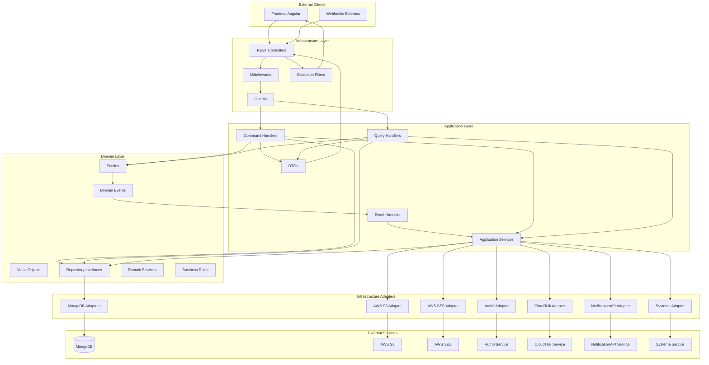

#### Diagrama de Flujo de Datos entre Capas

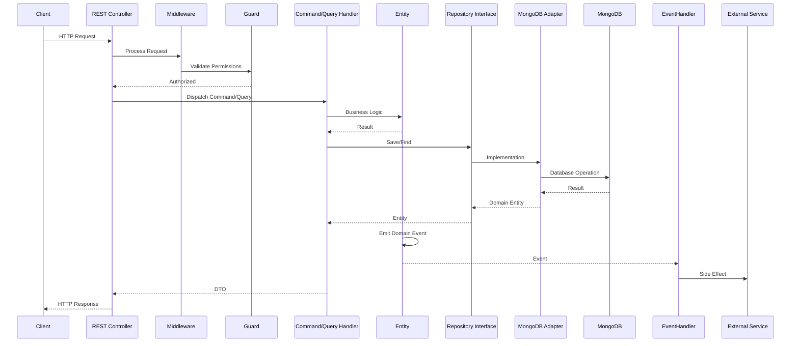

#### Diagrama de Módulos y Dependencias

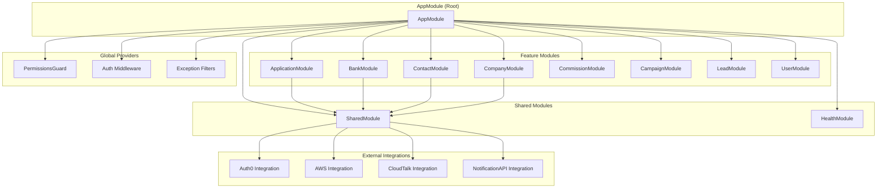

### 7.4 Decisiones de Diseño y Trade-offs

#### Decisión 1: Clean Architecture vs MVC Tradicional

**Decisión**: Clean Architecture con 3 capas (Domain, Application, Infrastructure)

**Razones**:
- ✅ **Independencia**: Lógica de negocio independiente de frameworks
- ✅ **Testabilidad**: Domain testeable sin infraestructura
- ✅ **Mantenibilidad**: Cambios en infraestructura no afectan negocio
- ✅ **Escalabilidad**: Fácil escalar y cambiar tecnologías

**Trade-offs**:
- ⚠️ **Complejidad**: Más capas = más archivos y estructura
- ⚠️ **Curva de aprendizaje**: Requiere entender Clean Architecture
- ⚠️ **Overhead**: Mappers entre capas

**Alternativa Considerada**: MVC tradicional
- ❌ Lógica de negocio mezclada con controladores
- ❌ Difícil testear sin base de datos
- ❌ Acoplamiento fuerte con framework

**Decisión Final**: Clean Architecture por beneficios a largo plazo

#### Decisión 2: CQRS vs CRUD Tradicional

**Decisión**: CQRS con Commands y Queries separados

**Razones**:
- ✅ **Optimización**: Commands y Queries optimizados independientemente
- ✅ **Escalabilidad**: Pueden escalarse por separado
- ✅ **Claridad**: Separación clara entre escritura y lectura
- ✅ **Flexibilidad**: Fácil cambiar implementación de queries

**Trade-offs**:
- ⚠️ **Más código**: Handlers separados para cada operación
- ⚠️ **Complejidad**: Dos flujos diferentes
- ⚠️ **Duplicación**: Algunos handlers pueden tener lógica similar

**Alternativa Considerada**: CRUD tradicional con servicios
- ❌ Mezcla lectura y escritura
- ❌ Difícil optimizar por separado
- ❌ Menos flexible

**Decisión Final**: CQRS por beneficios de escalabilidad y optimización

#### Decisión 3: MongoDB vs PostgreSQL

**Decisión**: MongoDB como base de datos principal

**Razones**:
- ✅ **Flexibilidad**: Esquema flexible, fácil evolucionar
- ✅ **Documentos anidados**: Fits domain model (Application con documentos, notas, etc.)
- ✅ **Escalabilidad horizontal**: Fácil escalar
- ✅ **JSON nativo**: Fits TypeScript/JavaScript

**Trade-offs**:
- ⚠️ **Transacciones**: Sin transacciones ACID complejas (mitigado con transacciones simples)
- ⚠️ **Joins**: Más complejos (mitigado con diseño de documentos)
- ⚠️ **Consistencia**: Eventual en algunos casos

**Alternativa Considerada**: PostgreSQL
- ❌ Esquema rígido, migraciones complejas
- ❌ Joins necesarios para relaciones
- ❌ Menos flexible para documentos anidados

**Decisión Final**: MongoDB por flexibilidad y fit con domain model

#### Decisión 4: Domain Events vs Direct Calls

**Decisión**: Domain Events para side effects (ej: crear Commission al aceptar oferta)

**Razones**:
- ✅ **Desacoplamiento**: Commands no saben sobre side effects
- ✅ **Extensibilidad**: Fácil agregar nuevos handlers
- ✅ **Trazabilidad**: Eventos documentan qué pasó
- ✅ **Testabilidad**: Eventos testeables independientemente

**Trade-offs**:
- ⚠️ **Debugging**: Más difícil rastrear flujos completos
- ⚠️ **Orden**: Debe manejarse cuidadosamente
- ⚠️ **Consistencia**: Eventual en algunos casos

**Alternativa Considerada**: Llamadas directas en Command Handler
- ❌ Acoplamiento fuerte
- ❌ Difícil extender
- ❌ Violación de Single Responsibility

**Decisión Final**: Domain Events por desacoplamiento y extensibilidad

#### Decisión 5: Repository Pattern vs Active Record

**Decisión**: Repository Pattern con interfaces en Domain

**Razones**:
- ✅ **Independencia**: Domain no sabe sobre MongoDB
- ✅ **Testabilidad**: Fácil mockear repositorios
- ✅ **Flexibilidad**: Cambiar MongoDB sin tocar Domain
- ✅ **Abstracción**: Lógica de acceso encapsulada

**Trade-offs**:
- ⚠️ **Capa adicional**: Más abstracción = más código
- ⚠️ **Mappers**: Necesarios entre Domain y MongoDB

**Alternativa Considerada**: Active Record (Mongoose directamente en Entities)
- ❌ Entities acopladas a MongoDB
- ❌ Difícil testear sin base de datos
- ❌ Violación de Clean Architecture

**Decisión Final**: Repository Pattern por independencia y testabilidad

#### Decisión 6: Feature-Based vs Layer-Based Organization

**Decisión**: Organización por features (Application, Bank, Contact, etc.)

**Razones**:
- ✅ **Alta cohesión**: Todo relacionado con un feature está junto
- ✅ **Bajo acoplamiento**: Features independientes
- ✅ **Escalabilidad**: Fácil añadir nuevos features
- ✅ **Colaboración**: Equipos pueden trabajar en features diferentes

**Trade-offs**:
- ⚠️ **Duplicación**: Algunos servicios pueden duplicarse
- ⚠️ **Navegación**: Más difícil encontrar archivos específicos

**Alternativa Considerada**: Organización por capas (todos los commands juntos, etc.)
- ❌ Difícil encontrar código relacionado
- ❌ Baja cohesión
- ❌ Más acoplamiento

**Decisión Final**: Feature-Based por cohesión y escalabilidad

### 7.5 Resumen de Arquitectura

**Patrones Principales**:
1. ✅ **Clean Architecture**: 3 capas (Domain, Application, Infrastructure)
2. ✅ **CQRS**: Commands y Queries separados
3. ✅ **Repository Pattern**: Interfaces en Domain, implementaciones en Infrastructure
4. ✅ **Event-Driven**: Domain Events para side effects
5. ✅ **Dependency Injection**: NestJS DI container
6. ✅ **Module Pattern**: Feature-based organization

**Separación de Responsabilidades**:
- **Domain Layer**: Lógica de negocio pura, independiente
- **Application Layer**: Orquestación de casos de uso
- **Infrastructure Layer**: Implementación de detalles técnicos

**Ventajas Clave**:
- ✅ Testabilidad sin infraestructura
- ✅ Mantenibilidad a largo plazo
- ✅ Escalabilidad horizontal y vertical
- ✅ Flexibilidad para cambiar tecnologías

**Trade-offs Aceptados**:
- ⚠️ Complejidad inicial mayor
- ⚠️ Más archivos y estructura
- ⚠️ Curva de aprendizaje

**Mitigaciones**:
- Estructura clara y documentada
- Convenciones de nombres consistentes
- Ejemplos y documentación completa

---

## 8. CASOS DE USO DE NEGOCIO

### 8.1 Caso de Uso: Crear y Gestionar una Aplicación

**Actor**: Agente/Broker

**Flujo Completo**:

1. **Crear Aplicación**:
   - Seleccionar Company existente
   - Completar formulario: monto ($1K-$20M), producto, referral
   - Subir documentos: 4 bank statements (requeridos), MTD, credit card, filled apps, additional statements
   - Validar: no archivos duplicados, períodos correctos
   - Backend crea Application en estado `READY_TO_SEND`

2. **Enviar a Bancos**:
   - Establecer posición (1-5) para prioridad
   - Seleccionar bancos destino (puede ver recomendados basados en constraints)
   - Escribir mensaje opcional (15-800 caracteres)
   - Backend crea BankNotification por cada banco
   - Estado cambia a `SENT`

3. **Recibir y Gestionar Ofertas**:
   - Bancos responden con ofertas (vía webhook o manualmente)
   - Estado de notificación cambia a `OFFERED`
   - Usuario ve ofertas con detalles (monto, factor rate, points, commission, payment plan)
   - Puede aceptar, rechazar o actualizar oferta
   - Al aceptar → Estado `OFFER_ACCEPTED`, **Commission creada automáticamente** (DRAFT)

4. **Completar Aplicación**:
   - Una vez financiada, marca como `COMPLETED`
   - La comisión puede editarse y publicarse

**Reglas de Negocio**:
- Solo aplicaciones en `READY_TO_SEND` pueden enviarse
- Debe tener posición establecida antes de enviar
- Al aceptar oferta, se crea Commission automáticamente
- Solo aplicaciones en `OFFER_ACCEPTED` pueden completarse

### 8.2 Caso de Uso: Leads → Contacts → Companies → Applications

**Actor**: Agente/Broker

**Flujo de Conversión**:

1. **Importar Leads**:
   - Marketing crea campaña
   - Sube archivo CSV/Excel con prospectos
   - Backend crea `LeadGroup` con múltiples `Prospects`
   - Cada prospect tiene información básica (nombre, teléfono, email, etc.)

2. **Gestionar Prospects**:
   - Agente ve prospects asignados
   - Realiza llamadas (registradas en `call_history`)
   - Añade notas sobre interacciones
   - Programa `follow_up_call`

3. **Convertir a Contact**:
   - Cuando prospect está calificado, agente crea `Contact`
   - Completa información personal (SSN, identificación, documentos)
   - Backend vincula Prospect → Contact (preserva historial)

4. **Crear o Asociar Company**:
   - Si el contact tiene empresa, crea `Company`
   - Asocia el `Contact` como miembro de la `Company`
   - Puede añadir más miembros (máx 10)

5. **Crear Application**:
   - Desde la Company, crea `Application`
   - Sigue flujo del Caso de Uso 8.1

**Relación de Negocio**: 
- Un Lead puede convertirse en múltiples Contacts (si hay múltiples personas)
- Un Contact puede ser miembro de múltiples Companies
- Una Company puede tener múltiples Applications
- Las Applications se envían a múltiples Banks
- Cada Bank puede enviar múltiples Offers

### 8.3 Caso de Uso: Sistema de Comisiones

**Actor**: Administrador/Contador

**Flujo**:

1. **Creación Automática**:
   - Cuando se acepta una oferta, backend crea automáticamente `Commission`
   - Estado inicial: `DRAFT`
   - Estructura: PSF (Processing Service Fee) + Commission, cada uno con distribución

2. **Configurar Distribución**:
   - Administrador edita distribución de PSF y Commission
   - Puede asignar montos a múltiples usuarios
   - Guarda sin publicar (puede editar múltiples veces)

3. **Publicar Comisión**:
   - Una vez configurada, publica la comisión
   - Estado cambia a `PUBLISHED`
   - Ya no puede editarse

**Reglas de Negocio**:
- Commission se crea automáticamente al aceptar oferta
- Solo puede editarse en estado DRAFT
- Una vez publicada, es final

### 8.4 Caso de Uso: Gestión de Campañas

**Actor**: Marketing

**Flujo**:

1. **Crear Campaña**:
   - Define nombre, configuración
   - Estado inicial: `STOPPED`

2. **Iniciar Campaña**:
   - Cambia estado a `STARTED`
   - Sistema comienza a generar leads automáticamente
   - Puede enviar batches de leads periódicamente

3. **Gestionar Leads Generados**:
   - Leads se asignan a agentes
   - Agentes trabajan los leads (ver Caso de Uso 8.2)

4. **Detener Campaña**:
   - Cambia estado a `STOPPED`
   - Deja de generar nuevos leads

**Automatizaciones**:
- Generación automática de leads cuando campaña está `STARTED`
- Asignación automática de leads a agentes
- Webhooks para notificaciones de campaña

### 8.5 Caso de Uso: Sistema de Llamadas Telefónicas

**Actor**: Agente/Broker

**Flujo**:

1. **Iniciar Llamada**:
   - Agente hace click en teléfono de un Contact/Prospect
   - Frontend llama a `POST /v1/users/make-a-call`
   - Backend valida permisos (`REQUEST_CALL`)

2. **Backend Procesa**:
   - `VoIPService` hace request a CloudTalk
   - CloudTalk inicia llamada
   - Backend registra llamada en historial

3. **Registro de Llamada**:
   - Llamada queda registrada en `call_history` del Prospect/Contact
   - Puede añadirse nota sobre la llamada

**Integración**:
- CloudTalk para VoIP
- Registro automático de llamadas
- Historial completo de interacciones

---

## 9. DIAGRAMA DE ENTIDADES Y RELACIONES

### 9.1 Modelo de Datos

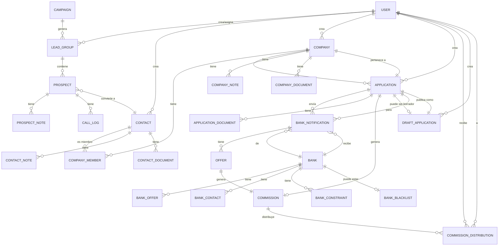

### 9.2 Relaciones de Negocio Detalladas

#### User (Usuario)
- **1:N** con LeadGroup (crea/asigna)
- **1:N** con Contact (crea)
- **1:N** con Company (crea)
- **1:N** con Application (crea/gestiona)
- **1:N** con DraftApplication (crea)
- **N:M** con Commission (recibe distribución vía CommissionDistribution)

#### LeadGroup → Prospect
- **1:N**: Un grupo contiene múltiples prospects
- Los prospects se convierten en Contacts (preservando historial)
- Prospects tienen notas y call logs

#### Contact → Company
- **N:M**: Un contact puede ser miembro de múltiples companies (vía CompanyMember)
- **1:N**: Un contact puede tener múltiples notes y documents
- Contact puede existir independientemente (no siempre es miembro de company)

#### Company → Application
- **1:N**: Una company puede tener múltiples applications
- Las applications tienen estado y posición
- Applications pueden estar en diferentes estados simultáneamente

#### Application → BankNotification → Offer
- **1:N**: Una application se envía a múltiples banks (notifications)
- **1:N**: Cada notification puede tener múltiples offers
- **1:1**: Una offer aceptada genera una commission

#### Commission → DistributionItem → User
- **1:N**: Una commission se distribuye entre múltiples users
- Cada distribución tiene un monto específico
- Hay dos tipos de distribución: PSF y Commission

#### Campaign → LeadGroup
- **1:N**: Una campaign genera múltiples lead groups
- Lead groups se crean automáticamente cuando campaign está STARTED

#### DraftApplication → Application
- **1:1**: Un draft puede publicarse como Application
- Draft preserva toda la información para crear Application

---

## 10. ANÁLISIS DE ESTADOS Y WORKFLOWS

### 10.1 Workflow Principal: Aplicación de Préstamo

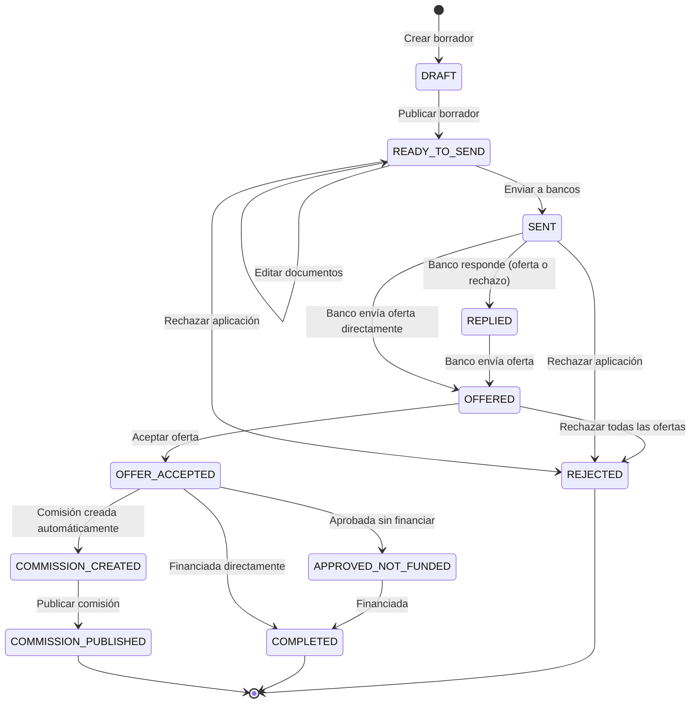

**Transiciones Válidas**:
- `READY_TO_SEND → SENT`: Al enviar a bancos (requiere posición 1-5)
- `SENT → REPLIED`: Banco responde (oferta o rechazo)
- `SENT → OFFERED`: Banco envía oferta
- `REPLIED → OFFERED`: Banco envía oferta después de rechazo previo
- `OFFERED → OFFER_ACCEPTED`: Usuario acepta oferta
- `OFFER_ACCEPTED → COMPLETED`: Completar manualmente
- `OFFER_ACCEPTED → APPROVED_NOT_FUNDED`: Aprobada pero no financiada
- `APPROVED_NOT_FUNDED → COMPLETED`: Financiada
- Cualquier estado → `REJECTED`: Rechazar aplicación

### 10.2 Workflow de Notificación de Banco

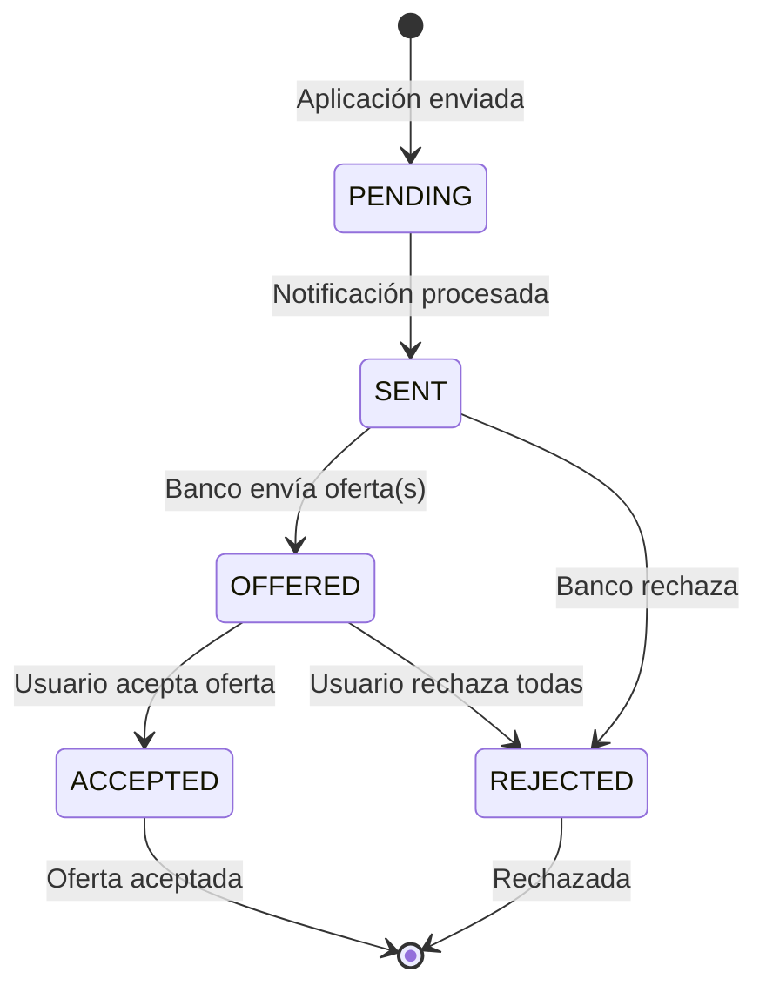

**Transiciones**:
- `PENDING → SENT`: Backend procesa notificación
- `SENT → OFFERED`: Banco envía oferta (vía webhook o manual)
- `SENT → REJECTED`: Banco rechaza
- `OFFERED → ACCEPTED`: Usuario acepta oferta
- `OFFERED → REJECTED`: Usuario rechaza todas las ofertas

### 10.3 Workflow de Oferta

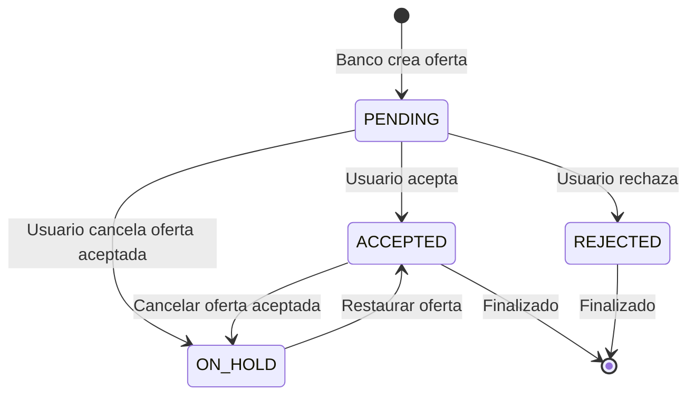

**Estados de Oferta**:
- `PENDING`: Oferta creada, esperando acción
- `ACCEPTED`: Oferta aceptada por usuario
- `REJECTED`: Oferta rechazada
- `ON_HOLD`: Oferta aceptada pero cancelada

### 10.4 Workflow de Comisión

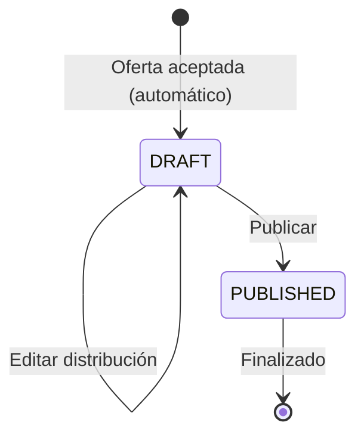

**Transiciones**:
- `[*] → DRAFT`: Se crea automáticamente al aceptar oferta
- `DRAFT → DRAFT`: Puede editarse múltiples veces
- `DRAFT → PUBLISHED`: Publicar (hace final, no puede editarse)

### 10.5 Workflow de Campaña

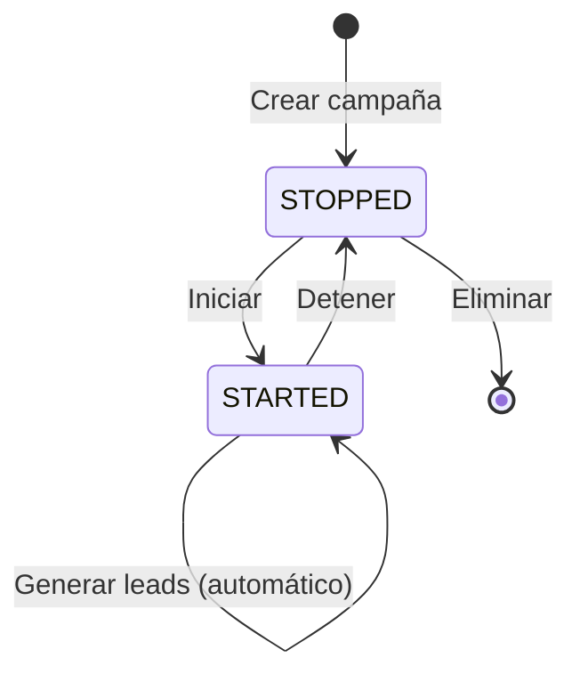

**Estados**:
- `STOPPED`: Campaña detenida, no genera leads
- `STARTED`: Campaña activa, genera leads automáticamente

### 10.6 Automatizaciones

**Automáticas**:
1. **Creación de Commission**: 
   - Trigger: `ApplicationAcceptedEvent` se dispara al aceptar oferta
   - Handler: `ApplicationAcceptedEventHandler` crea Commission automáticamente
   - Estado inicial: `DRAFT`
   - Estructura: PSF + Commission con distribución inicial

2. **Cambio de Estado OFFERED**: 
   - Cuando un banco envía una oferta, el estado de la notificación cambia automáticamente a `OFFERED`
   - Si Application está en `SENT`, cambia a `OFFERED`

3. **Cambio de Estado SENT**: 
   - Al enviar aplicación a bancos, estado cambia de `READY_TO_SEND` a `SENT`
   - Se crean BankNotifications automáticamente

4. **Generación de Leads**: 
   - Cuando campaña está `STARTED`, genera leads automáticamente
   - Asignación automática a agentes

5. **Validación de Permisos**: 
   - Middleware valida permisos automáticamente en cada request
   - Extrae permisos del JWT token

**Manuales**:
1. Envío de aplicaciones a bancos
2. Aceptación/rechazo de ofertas
3. Publicación de comisiones
4. Completado de aplicaciones
5. Transferencia de entidades entre usuarios
6. Creación de notas y documentos

---

## 11. FLUJOS COMPLETOS DE PROCESOS - TRAZABILIDAD DETALLADA

**Nota**: El frontend documenta estos mismos flujos desde perspectiva de usuario e interacciones de UI. Ver [Frontend README - Sección 12](../crm-web-app/README.md#12-flujos-completos-de-procesos---trazabilidad-detallada) para detalles de:
- Interacciones de usuario
- Actualizaciones de UI
- Manejo de formularios multi-paso
- Gestión de estado local con Signals

### 11.1 FLUJO COMPLETO: Lead → Contact → Company → Application

#### FASE 1: Importar Leads

**Punto de Entrada**: Marketing sube archivo CSV/Excel

**Proceso**:
1. **Frontend**: Usuario selecciona archivo y lo sube
2. **API Call**: `POST /v1/leads` (FormData con archivo)
3. **Backend - Command Handler**: `CreateLeadGroupCommandHandler`
   - Parsea archivo CSV/Excel
   - Valida formato y datos
   - Crea `LeadGroup` entity
   - Crea múltiples `Prospect` entities (uno por fila)
   - Asigna prospects a usuario actual
4. **Persistencia**: Guarda en MongoDB
5. **Resultado**: LeadGroup creado con N Prospects

**Validaciones**:
- Archivo debe ser CSV o Excel válido
- Columnas requeridas: nombre, teléfono, email (mínimo)
- No duplicados por teléfono/email

#### FASE 2: Gestionar Prospects

**Punto de Entrada**: Agente ve prospects asignados

**Proceso**:
1. **Query**: `GET /v1/leads/prospects` (filtrado por usuario)
2. **Backend - Query Handler**: `SearchProspectsQueryHandler`
   - Filtra por `owner_id` (permisos own vs all)
   - Retorna prospects con notas y call logs
3. **Agente Realiza Acciones**:
   - Hace llamada: `POST /v1/users/make-a-call`
   - Agrega nota: `POST /v1/leads/prospects/:id/notes`
   - Programa follow-up

**Reglas de Negocio**:
- Prospects solo visibles para owner (a menos que tenga `LIST_LEADS`)
- Call logs se registran automáticamente
- Notas pueden tener niveles (INFO, WARNING, CRITICAL)

#### FASE 3: Convertir Prospect → Contact

**Punto de Entrada**: Agente decide convertir prospect calificado

**Proceso**:
1. **Frontend**: Usuario completa formulario de Contact
2. **Validaciones Frontend**:
   - Edad: 21-99 años
   - Máximo 5 teléfonos
   - Máximo 5 emails
   - Máximo 6 documentos totales
3. **API Call**: `POST /v1/contacts` (FormData)
4. **Backend - Command Handler**: `CreateContactCommandHandler`
   - Valida datos de negocio
   - Crea `Contact` entity
   - Vincula Prospect → Contact (preserva historial)
   - Sube documentos a S3
5. **Persistencia**: Guarda Contact en MongoDB
6. **Resultado**: Contact creado, vinculado al Prospect original

**Transformaciones**:
- Prospect data → Contact data
- Backend vincula Prospect → Contact (preserva historial)

#### FASE 4: Crear Company y Asociar Contact

**Punto de Entrada**: Agente crea Company desde Contact

**Proceso**:
1. **Frontend**: Formulario multi-paso
   - Paso 1: Información básica (nombre, EIN, industria, tipo entidad)
   - Paso 2: Dirección y contacto
   - Paso 3: Miembros (asociar Contact creado, máx 10)
   - Paso 4: Documentos (máx 4 por tipo)
   - Paso 5: Notas opcionales
2. **Validaciones**:
   - Máximo 10 miembros
   - Máximo 4 documentos por tipo
3. **API Call**: `POST /v1/companies` (FormData)
4. **Backend - Command Handler**: `CreateCompanyCommandHandler`
   - Valida datos
   - Crea `Company` entity
   - Crea `CompanyMember` entities (vincula Contacts)
   - Sube documentos a S3
5. **Persistencia**: Guarda Company en MongoDB
6. **Resultado**: Company creada con Contact como miembro

**Transformaciones**:
- Contact → CompanyMember
- Asociación: Company tiene N Members (Contacts)

#### FASE 5: Crear Application desde Company

**Punto de Entrada**: Agente crea Application desde Company

**Proceso**:
1. **Frontend**: Formulario multi-paso
   - Paso 1: Detalles (Company, monto $1K-$20M, producto, referral)
   - Paso 2: Bank Statements (4 períodos requeridos)
   - Paso 3: Additional Statements (MTD, credit card, additional)
2. **Cálculo Dinámico de Períodos**:
   - Query: `GET /v1/last-application-period/:companyId`
   - Si Company tiene aplicaciones previas: calcula desde último período válido
   - Si no: usa últimos 4 períodos desde hoy
3. **Validaciones**:
   - Monto: $1,000 - $20,000,000 (solo enteros)
   - Bank statements: 4 períodos requeridos
   - No archivos duplicados (validación global)
4. **API Call**: `POST /v1/applications` (FormData: body + archivos)
5. **Backend - Command Handler**: `CreateApplicationCommandHandler`
   - Valida monto, producto, documentos
   - Calcula períodos si es necesario
   - Crea `Application` entity
   - Sube documentos a S3
   - Estado inicial: `READY_TO_SEND`
6. **Persistencia**: Guarda Application en MongoDB
7. **Resultado**: Application creada, lista para enviar a bancos

**Transformaciones**:
- Formulario → Application entity
- Archivos → ApplicationDocuments
- Estado inicial: `READY_TO_SEND`

**Manejo de Errores**:
- Validaciones de formulario: errores mostrados en UI
- Errores de backend: mensajes específicos
- Errores de S3: retry automático

**Notificaciones**:
- NotificationAPI: "Application created successfully"
- Usuario recibe notificación en tiempo real

**Punto de Salida**: Application en estado `READY_TO_SEND`, lista para enviar a bancos

### 11.2 FLUJO: Enviar Application a Bancos

**Punto de Entrada**: Usuario hace click en "Send to Banks" en Application details

**Proceso Detallado**:

1. **Validación Inicial**:
   - Frontend verifica: Application.status === `READY_TO_SEND`
   - Frontend verifica: Application.position !== null (1-5)
   - Si no tiene posición: muestra modal para establecer

2. **Establecer Posición (si no tiene)**:
   - API Call: `PATCH /v1/applications/:id/position/:position`
   - Backend valida: status === `READY_TO_SEND`
   - Backend valida: position entre 1-5
   - Actualiza Application.position

3. **Cargar Bancos**:
   - Query: `GET /v1/applications/:id/recommended-banks`
   - Backend - Query Handler: `GetRecommendedBanksQueryHandler`
     - Obtiene Application
     - Calcula bancos recomendados basado en:
       - Bank constraints (amount min/max, industries, territories)
       - Bank blacklist (excluye bancos blacklisted)
       - Historial previo
   - Retorna lista de bancos recomendados

4. **Seleccionar Bancos**:
   - Usuario puede seleccionar de recomendados o buscar manualmente
   - Puede seleccionar múltiples bancos
   - Validación: al menos un banco debe seleccionarse

5. **Escribir Mensaje**:
   - Mensaje opcional: 15-800 caracteres
   - Validación frontend y backend

6. **Enviar**:
   - API Call: `PUT /v1/applications/:id/notifications`
   - Request body: `{ bank_ids: string[], message?: string }`
   - Backend - Command Handler: `AddNotificationsToApplicationCommandHandler`
     - Valida: Application.status === `READY_TO_SEND`
     - Valida: Application.position !== null
     - Valida: bank_ids no vacío
     - Valida: bancos no están en blacklist
     - Para cada bank_id:
       - Crea `BankNotification` entity
       - Estado inicial: `PENDING`
       - Asocia a Application
     - Actualiza Application.status → `SENT`
     - Guarda en MongoDB

7. **Procesamiento de Notificaciones**:
   - Backend puede procesar notificaciones inmediatamente o en background
   - Cambia BankNotification.status: `PENDING → SENT`
   - Puede enviar emails a bancos (si está configurado)

8. **Resultado**:
   - Application.status: `SENT`
   - N BankNotifications creadas (una por banco)
   - Usuario recibe notificación de éxito

**Manejo de Errores**:
- Application no en `READY_TO_SEND`: Error 400
- Posición no establecida: Error 400
- Banco en blacklist: Error 400
- Error al crear notificaciones: Rollback, Error 500

**Notificaciones**:
- NotificationAPI: "Application sent to X banks"
- Usuario recibe notificación en tiempo real

**Punto de Salida**: Application en estado `SENT`, N BankNotifications creadas

### 11.3 FLUJO: Gestionar Ofertas y Aceptar

**Punto de Entrada**: Banco responde con oferta (vía webhook o manualmente)

**Proceso Detallado**:

1. **Banco Envía Oferta**:
   - Webhook: `PUT /v1/applications/:id/notifications/:nId` (con offer data)
   - O Manual: Usuario crea oferta desde UI
   - API Call: `POST /v1/applications/:id/notifications/:nId/offers`

2. **Backend - Command Handler**: `CreateOfferCommandHandler`
   - Valida: BankNotification existe y pertenece a Application
   - Valida: BankNotification.status permite ofertas
   - Crea `Offer` entity con datos:
     - `purchased_amount`: Monto de la oferta
     - `factor_rate`: Factor rate
     - `points`: Puntos
     - `commission`: Comisión
     - `payment_plan`: Plan de pago
   - Añade Offer a BankNotification.offers[]
   - Si BankNotification.status === `SENT`: cambia a `OFFERED`
   - Si Application.status === `SENT`: cambia a `OFFERED`
   - Guarda en MongoDB

3. **Notificación**:
   - NotificationAPI: "New offer received from Bank X"
   - Usuario recibe notificación en tiempo real

4. **Usuario Ve Ofertas**:
   - Query: `GET /v1/applications/:id/notifications`
   - Backend retorna todas las notificaciones con ofertas
   - Frontend agrupa por fecha y muestra ofertas

5. **Usuario Acepta Oferta**:
   - API Call: `PUT /v1/applications/:id/notifications/:nId/accept/:offerId`
   - Backend - Command Handler: `AcceptOfferCommandHandler`
     - Valida: Offer existe y pertenece a BankNotification
     - Valida: Offer.status === `PENDING`
     - Valida: Application puede aceptar ofertas
     - Actualiza Offer.status → `ACCEPTED`
     - Rechaza otras ofertas de la misma notificación (status → `REJECTED`)
     - Actualiza BankNotification.status → `ACCEPTED`
     - Actualiza Application.status → `OFFER_ACCEPTED`
     - **Emite Domain Event**: `ApplicationAcceptedEvent`
   - **Event Handler**: `ApplicationAcceptedEventHandler`
     - Crea `Commission` entity automáticamente
     - Estado: `DRAFT`
     - Estructura: PSF + Commission con distribución inicial
     - Guarda Commission en MongoDB
   - Guarda cambios en MongoDB

6. **Resultado**:
   - Offer.status: `ACCEPTED`
   - BankNotification.status: `ACCEPTED`
   - Application.status: `OFFER_ACCEPTED`
   - Commission creada automáticamente (DRAFT)

**Manejo de Errores**:
- Offer no existe: Error 404
- Offer ya aceptada: Error 400
- Application bloqueada: Error 400
- Error al crear Commission: Log error, pero oferta se acepta

**Notificaciones**:
- NotificationAPI: "Offer accepted, Commission created"
- Usuario recibe notificación con link a Commission

**Punto de Salida**: Oferta aceptada, Commission creada en DRAFT

### 11.4 FLUJO: Completar Application

**Punto de Entrada**: Usuario marca Application como completada

**Proceso**:

1. **Validación**:
   - Frontend verifica: Application.status === `OFFER_ACCEPTED`
   - Frontend verifica: Commission está PUBLISHED (opcional)

2. **API Call**: `PUT /v1/applications/:id/complete`
3. **Backend - Command Handler**: `CompleteApplicationCommandHandler`
   - Valida: Application.status === `OFFER_ACCEPTED`
   - Valida: Existe BankNotification con status `ACCEPTED`
   - Valida: Existe Offer aceptada
   - Actualiza Application.status → `COMPLETED`
   - Guarda en MongoDB

4. **Resultado**:
   - Application.status: `COMPLETED`
   - Application bloqueada para edición

**Manejo de Errores**:
- Application no en `OFFER_ACCEPTED`: Error 400
- No hay oferta aceptada: Error 400

**Punto de Salida**: Application en estado `COMPLETED`, bloqueada

### 11.5 FLUJO: Transferir Application

**Punto de Entrada**: Supervisor transfiere Application a otro usuario

**Proceso**:

1. **Validación de Permisos**:
   - Frontend verifica: `TRANSFER_APPLICATION` permission
   - Frontend verifica: Application no está `COMPLETED`

2. **Buscar Usuario**:
   - Query: `GET /v1/users` (búsqueda)
   - Usuario selecciona destinatario

3. **Transferir**:
   - API Call: `PUT /v1/applications/:id/transfer-to/:userId`
   - Backend - Command Handler: `TransferApplicationCommandHandler`
     - Valida: Application no está `COMPLETED`
     - Valida: Usuario destino existe
     - Actualiza Application.createdBy → userId
     - Guarda en MongoDB

4. **Resultado**:
   - Application transferida a nuevo usuario
   - Nuevo usuario puede gestionar la Application

**Manejo de Errores**:
- Application en `COMPLETED`: Error 400
- Usuario no existe: Error 404
- Sin permisos: Error 403

**Notificaciones**:
- NotificationAPI: "Application transferred to User X"
- Ambos usuarios reciben notificación

**Punto de Salida**: Application transferida, nuevo owner asignado

### 11.6 FLUJO: Rechazar Application

**Punto de Entrada**: Usuario rechaza Application

**Proceso**:

1. **Seleccionar Razón**:
   - Usuario selecciona razón de rechazo (enum)
   - Si razón es "OTHER": debe escribir descripción (10-150 caracteres)

2. **API Call**: `PATCH /v1/applications/:id/reject`
3. **Backend - Command Handler**: `RejectApplicationCommandHandler`
   - Valida razón y descripción
   - Actualiza Application.status → `REJECTED`
   - Actualiza Application.rejectReason y rejectReasonDescription
   - Rechaza todas las BankNotifications pendientes
   - Guarda en MongoDB

4. **Resultado**:
   - Application.status: `REJECTED`
   - Application bloqueada para edición
   - Todas las notificaciones rechazadas

**Manejo de Errores**:
- Razón inválida: Error 400
- Descripción requerida pero vacía: Error 400

**Punto de Salida**: Application en estado `REJECTED`, bloqueada

### 11.7 FLUJO COMPLETO: Crear Application (Diagrama Detallado)

**Punto de Entrada**: Usuario (Agente) autenticado con permiso `CREATE_APPLICATION`

```mermaid
flowchart TD
    Start([Usuario: Crear Application]) --> CheckAuth{¿Autenticado?}
    CheckAuth -->|No| RedirectLogin[Redirigir a login]
    CheckAuth -->|Sí| CheckPerms{¿Tiene permiso<br/>CREATE_APPLICATION?}
    
    CheckPerms -->|No| Error403[Error 403: Forbidden]
    CheckPerms -->|Sí| NavigateCreate[Navegar a /applications/create]
    
    NavigateCreate --> LoadCompanies[GET /v1/companies<br/>Cargar companies disponibles]
    LoadCompanies --> SelectCompany[Usuario selecciona Company]
    
    SelectCompany --> ValidateCompany{¿Company<br/>válida?}
    ValidateCompany -->|No| ShowErrorCompany[Error: Company inválida]
    ShowErrorCompany --> SelectCompany
    ValidateCompany -->|Sí| GetLastPeriod[GET /v1/last-application-period/:companyId<br/>Calcular períodos]
    
    GetLastPeriod --> HasPrevApps{¿Company tiene<br/>aplicaciones previas?}
    HasPrevApps -->|Sí| CalcFromLast[Calcular 4 períodos<br/>desde último período válido]
    HasPrevApps -->|No| CalcFromToday[Calcular últimos 4 períodos<br/>desde hoy]
    
    CalcFromLast --> FillStep1[Paso 1: Detalles<br/>- Company seleccionada<br/>- Monto $1K-$20M<br/>- Producto<br/>- Referral opcional]
    CalcFromToday --> FillStep1
    
    FillStep1 --> ValidateStep1{¿Datos válidos?}
    ValidateStep1 -->|No| ShowErrors1[Mostrar errores]
    ShowErrors1 --> FillStep1
    ValidateStep1 -->|Sí| FillStep2[Paso 2: Bank Statements<br/>Subir 4 archivos<br/>uno por período]
    
    FillStep2 --> ValidateStep2{¿4 archivos<br/>subidos?}
    ValidateStep2 -->|No| ShowErrors2[Error: Faltan archivos]
    ShowErrors2 --> FillStep2
    ValidateStep2 -->|Sí| CheckDuplicates{¿Archivos<br/>duplicados?}
    
    CheckDuplicates -->|Sí| ShowErrorDup[Error: Archivos duplicados]
    ShowErrorDup --> FillStep2
    CheckDuplicates -->|No| FillStep3[Paso 3: Additional Statements<br/>- MTD opcional<br/>- Credit Card opcional<br/>- Additional opcional máx 5]
    
    FillStep3 --> ValidateStep3{¿Documentos<br/>válidos?}
    ValidateStep3 -->|No| ShowErrors3[Mostrar errores]
    ShowErrors3 --> FillStep3
    ValidateStep3 -->|Sí| CreateFormData[Crear FormData:<br/>body JSON + archivos]
    
    CreateFormData --> APIRequest[POST /v1/applications<br/>Body: FormData<br/>Headers: Authorization, X-Tenant]
    
    APIRequest --> BackendValidate[Backend: Validar permisos<br/>PermissionsGuard]
    BackendValidate --> ParseBody[Parsear body JSON<br/>y archivos]
    
    ParseBody --> CreateCommand[CreateApplicationCommand.create():<br/>- Validar companyId<br/>- Validar monto $1K-$20M<br/>- Validar producto<br/>- Validar documentos]
    
    CreateCommand --> CommandValid{¿Command<br/>válido?}
    CommandValid -->|No| Error400Cmd[Error 400: Invalid command]
    CommandValid -->|Sí| CommandHandler[CreateApplicationCommandHandler.handle()]
    
    CommandHandler --> CheckCompany[Verificar Company existe<br/>companyRepository.findById]
    CheckCompany --> CompanyExists{¿Company<br/>existe?}
    CompanyExists -->|No| Error404Company[Error 404: Company not found]
    CompanyExists -->|Sí| CheckDuplicate[Verificar duplicado:<br/>getActiveByPeriod]
    
    CheckDuplicate --> IsDuplicate{¿Ya existe aplicación<br/>activa en período?}
    IsDuplicate -->|Sí| Error409[Error 409: ApplicationDuplicated]
    IsDuplicate -->|No| GetLastApp[Obtener última aplicación<br/>de company]
    
    GetLastApp --> CreateEntity[Application.create():<br/>- Validar monto<br/>- Validar producto<br/>- Validar documentos<br/>- Validar períodos<br/>- Validar no duplicados]
    
    CreateEntity --> EntityValid{¿Entity<br/>válida?}
    EntityValid -->|No| Error400Entity[Error 400: Invalid entity]
    EntityValid -->|Sí| CloneTenants[AppClonerService:<br/>Clonar para todos los tenants]
    
    CloneTenants --> StartTransaction[Iniciar transacción MongoDB]
    StartTransaction --> SaveMongo[Guardar Application entities<br/>en MongoDB]
    
    SaveMongo --> SaveS3[Guardar archivos en S3:<br/>- Bank statements<br/>- MTD statements<br/>- Credit card statements<br/>- Additional statements]
    
    SaveS3 --> S3Success{¿Archivos<br/>guardados?}
    S3Success -->|Error| Rollback[Rollback transacción]
    S3Success -->|Sí| Commit[Commit transacción]
    
    Commit --> EmitEvent[Emitir evento:<br/>ApplicationCreated]
    EmitEvent --> Return201[Retornar 201 Created<br/>{ id: string }]
    
    Return201 --> FrontendReceive[Frontend recibe ID]
    FrontendReceive --> NavigateDetails[Navegar a /applications/:id]
    NavigateDetails --> LoadDetails[GET /v1/applications/:id]
    LoadDetails --> ShowDetails[Mostrar detalles Application<br/>Estado: READY_TO_SEND]
    
    ShowDetails --> End([Application creada<br/>Estado: READY_TO_SEND])
    
    Error403 --> EndError([Error])
    Error400Cmd --> EndError
    Error404Company --> EndError
    Error409 --> EndError
    Error400Entity --> EndError
    Rollback --> EndError
```

**Explicación Paso a Paso**:

1. **Punto de Entrada**: Usuario autenticado navega a `/applications/create`
2. **Validación de Permisos**: `PermissionGuard` verifica `CREATE_APPLICATION`
3. **Carga de Companies**: Frontend carga lista de companies disponibles
4. **Selección de Company**: Usuario selecciona Company existente
5. **Cálculo de Períodos**: Backend calcula períodos requeridos (última aplicación o estándar)
6. **Formulario Multi-Paso**: Usuario completa 3 pasos
7. **Validaciones Frontend**: Validaciones en tiempo real
8. **Request HTTP**: `POST /v1/applications` con FormData
9. **Backend - Command Handler**: Valida, crea entity, guarda
10. **Persistencia**: MongoDB + S3 en transacción
11. **Respuesta**: 201 Created con ID
12. **Navegación**: Frontend navega a detalles

**Transformaciones de Datos**:
- Formulario → `CreateApplicationRequest` DTO
- DTO → `CreateApplicationCommand` (Domain)
- Command → `Application` entity
- Entity → MongoDB Document
- Archivos → S3 Objects

**Cambios de Estado**:
- Application: `null` → `READY_TO_SEND`

**Notificaciones**:
- NotificationAPI: "Application created successfully"

**Manejo de Errores**:
- Validaciones: Errores mostrados en UI
- Backend: Errores específicos (400, 404, 409, 500)
- S3: Retry automático, rollback si falla

### 11.8 FLUJO COMPLETO: Enviar Application a Bancos (Diagrama Detallado)

**Punto de Entrada**: Usuario hace click en "Send to Banks" en Application details

```mermaid
flowchart TD
    Start([Usuario: Enviar a Bancos]) --> CheckStatus{¿Application.status<br/>=== READY_TO_SEND?}
    CheckStatus -->|No| Error400Status[Error 400: Invalid status]
    CheckStatus -->|Sí| CheckPosition{¿Application.position<br/>establecida?}
    
    CheckPosition -->|No| ShowPositionModal[Mostrar modal:<br/>Establecer posición 1-5]
    ShowPositionModal --> SetPosition[PATCH /v1/applications/:id/position/:position]
    SetPosition --> ValidatePosition{¿Position<br/>1-5?}
    ValidatePosition -->|No| Error400Pos[Error 400: Invalid position]
    ValidatePosition -->|Sí| UpdatePosition[Actualizar Application.position]
    UpdatePosition --> LoadBanks
    CheckPosition -->|Sí| LoadBanks[GET /v1/applications/:id/recommended-banks]
    
    LoadBanks --> GetRecommended[GetRecommendedBanksQueryHandler:<br/>- Obtener Application<br/>- Obtener todos los Banks<br/>- Filtrar por constraints:<br/>  * amount min/max<br/>  * industries<br/>  * territories<br/>- Excluir blacklisted<br/>- Retornar recomendados]
    
    GetRecommended --> ShowBanks[Mostrar bancos recomendados<br/>+ búsqueda manual]
    ShowBanks --> SelectBanks[Usuario selecciona bancos<br/>múltiples permitidos]
    
    SelectBanks --> ValidateSelection{¿Al menos<br/>un banco?}
    ValidateSelection -->|No| ShowErrorSelection[Error: Seleccionar al menos un banco]
    ShowErrorSelection --> SelectBanks
    ValidateSelection -->|Sí| WriteMessage[Escribir mensaje opcional<br/>15-800 caracteres]
    
    WriteMessage --> ValidateMessage{¿Mensaje<br/>válido?}
    ValidateMessage -->|No| ShowErrorMsg[Error: Mensaje inválido]
    ShowErrorMsg --> WriteMessage
    ValidateMessage -->|Sí| SendRequest[PUT /v1/applications/:id/notifications<br/>Body: { bank_ids: string[], message?: string }]
    
    SendRequest --> BackendValidate[Backend: Validar permisos<br/>SEND_APPLICATION]
    BackendValidate --> ValidateApp[Validar Application:<br/>- status === READY_TO_SEND<br/>- position !== null]
    
    ValidateApp --> AppValid{¿Application<br/>válida?}
    AppValid -->|No| Error400App[Error 400: Invalid application]
    AppValid -->|Sí| ValidateBanks[Validar bancos:<br/>- Existen<br/>- No están en blacklist]
    
    ValidateBanks --> BanksValid{¿Bancos<br/>válidos?}
    BanksValid -->|No| Error400Banks[Error 400: Invalid banks]
    BanksValid -->|Sí| CommandHandler[AddNotificationsToApplicationCommandHandler]
    
    CommandHandler --> CreateNotifications[Para cada bank_id:<br/>- Crear BankNotification entity<br/>- status: PENDING<br/>- Asociar a Application]
    
    CreateNotifications --> UpdateApp[Actualizar Application:<br/>- Añadir notifications[]<br/>- status: SENT]
    
    UpdateApp --> StartTransaction[Iniciar transacción MongoDB]
    StartTransaction --> SaveMongo[Guardar Application<br/>y BankNotifications]
    
    SaveMongo --> ScheduleJob[Scheduler Service:<br/>Programar job para enviar]
    ScheduleJob --> JobScheduled{¿Job<br/>programado?}
    JobScheduled -->|Error| LogError[Log error,<br/>pero guardar igual]
    JobScheduled -->|Sí| Commit[Commit transacción]
    LogError --> Commit
    
    Commit --> ProcessNotifications[Procesar notificaciones:<br/>- Cambiar status: PENDING → SENT<br/>- Enviar emails a bancos opcional]
    
    ProcessNotifications --> EmitEvent[Emitir evento:<br/>ApplicationSentToBanks]
    EmitEvent --> Return200[Retornar 200 OK]
    
    Return200 --> FrontendReceive[Frontend recibe éxito]
    FrontendReceive --> RefreshUI[Refrescar UI:<br/>GET /v1/applications/:id]
    RefreshUI --> ShowUpdated[Mostrar Application actualizada<br/>Estado: SENT<br/>N notificaciones creadas]
    
    ShowUpdated --> NotificationAPI[NotificationAPI:<br/>Application sent to X banks]
    NotificationAPI --> UserNotified[Usuario recibe notificación]
    UserNotified --> End([Application enviada<br/>Estado: SENT])
    
    Error400Status --> EndError([Error])
    Error400Pos --> EndError
    Error400App --> EndError
    Error400Banks --> EndError
```

**Explicación Paso a Paso**:

1. **Validación Inicial**: Frontend verifica status y posición
2. **Establecer Posición**: Si no tiene, usuario establece (1-5)
3. **Cargar Bancos**: Query calcula bancos recomendados basado en constraints
4. **Selección**: Usuario selecciona bancos (múltiples)
5. **Mensaje**: Mensaje opcional 15-800 caracteres
6. **Request**: `PUT /v1/applications/:id/notifications`
7. **Backend**: Valida, crea BankNotifications, actualiza Application
8. **Scheduler**: Programa job para procesar notificaciones
9. **Procesamiento**: Cambia status PENDING → SENT, envía emails
10. **Notificación**: Usuario recibe notificación

**Transformaciones**:
- Selección de bancos → `AddNotificationsToApplicationCommand`
- Command → N `BankNotification` entities
- Application.status: `READY_TO_SEND` → `SENT`

**Cambios de Estado**:
- Application: `READY_TO_SEND` → `SENT`
- BankNotifications: `null` → `PENDING` → `SENT`

**Notificaciones**:
- NotificationAPI: "Application sent to X banks"
- Emails a bancos (opcional)

### 11.9 FLUJO COMPLETO: Aceptar Oferta y Crear Commission (Diagrama Detallado)

**Punto de Entrada**: Usuario acepta oferta desde Application details

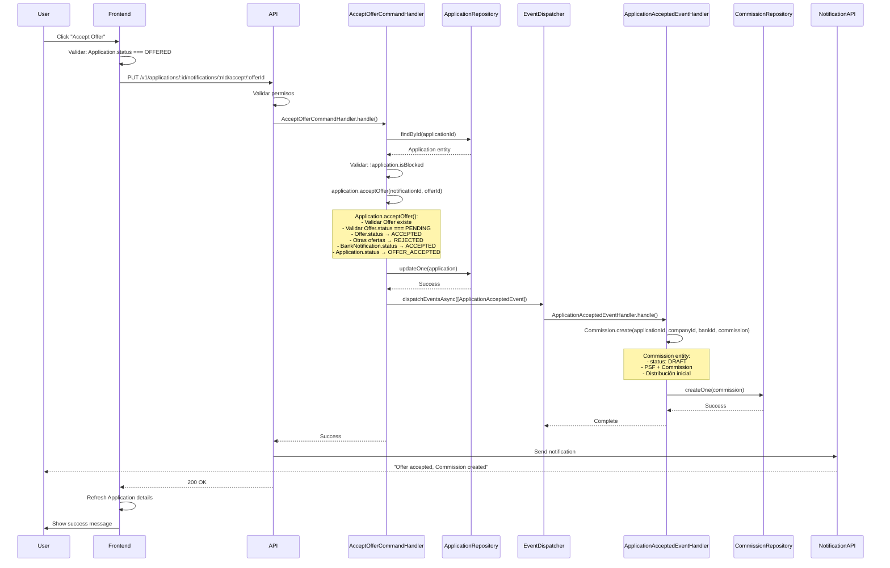

**Explicación Paso a Paso**:

1. **Usuario Acepta**: Click en "Accept Offer"
2. **Validación Frontend**: Application.status === OFFERED
3. **API Call**: `PUT /v1/applications/:id/notifications/:nId/accept/:offerId`
4. **Command Handler**: `AcceptOfferCommandHandler`
   - Obtiene Application
   - Valida no bloqueada
   - Llama `application.acceptOffer()`
5. **Domain Logic** (Application.acceptOffer):
   - Valida Offer existe y está PENDING
   - Offer.status → ACCEPTED
   - Otras ofertas de misma notificación → REJECTED
   - BankNotification.status → ACCEPTED
   - Application.status → OFFER_ACCEPTED
6. **Persistencia**: Guarda Application actualizada
7. **Domain Event**: Emite `ApplicationAcceptedEvent`
8. **Event Handler**: `ApplicationAcceptedEventHandler`
   - Crea Commission entity (DRAFT)
   - Guarda en MongoDB
9. **Notificación**: NotificationAPI notifica al usuario
10. **Respuesta**: 200 OK, frontend refresca

**Transformaciones**:
- Offer.status: `PENDING` → `ACCEPTED`
- BankNotification.status: `OFFERED` → `ACCEPTED`
- Application.status: `OFFERED` → `OFFER_ACCEPTED`
- Commission: `null` → `DRAFT` (nueva entidad)

**Cambios de Estado**:
- Application: `OFFERED` → `OFFER_ACCEPTED`
- BankNotification: `OFFERED` → `ACCEPTED`
- Offer: `PENDING` → `ACCEPTED`
- Commission: `null` → `DRAFT` (creada)

**Notificaciones**:
- NotificationAPI: "Offer accepted, Commission created"
- Link a Commission details

**Manejo de Errores**:
- Offer no existe: 404
- Offer ya aceptada: 400
- Application bloqueada: 400
- Error al crear Commission: Log error, pero oferta se acepta

### 11.10 FLUJO COMPLETO: Publicar Commission

**Punto de Entrada**: Administrador publica Commission

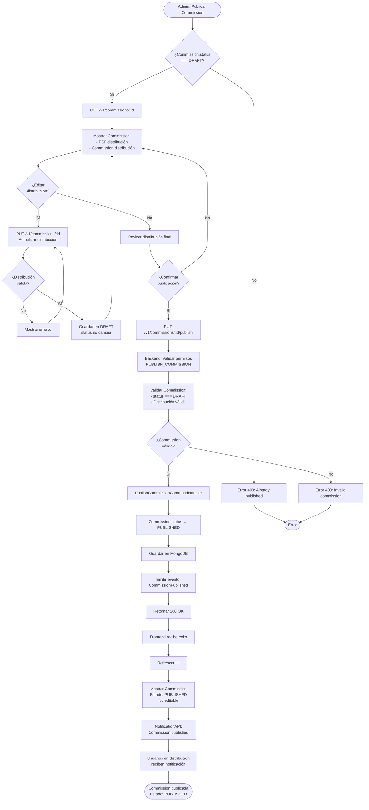

**Explicación Paso a Paso**:

1. **Cargar Commission**: GET /v1/commissions/:id
2. **Editar Distribución** (opcional): Puede editar múltiples veces en DRAFT
3. **Revisar**: Administrador revisa distribución final
4. **Publicar**: PUT /v1/commissions/:id/publish
5. **Backend**: Valida, actualiza status → PUBLISHED
6. **Persistencia**: Guarda en MongoDB
7. **Notificación**: Usuarios en distribución reciben notificación

**Transformaciones**:
- Commission.status: `DRAFT` → `PUBLISHED`
- Commission editable: `true` → `false`

**Cambios de Estado**:
- Commission: `DRAFT` → `PUBLISHED`

**Notificaciones**:
- NotificationAPI: "Commission published"
- Usuarios en distribución reciben notificación

### 11.11 FLUJO COMPLETO: Importar Leads desde CSV/Excel

**Punto de Entrada**: Marketing sube archivo CSV/Excel

```mermaid
flowchart TD
    Start([Marketing: Importar Leads]) --> CheckPerms{¿Tiene permiso<br/>CREATE_LEAD?}
    CheckPerms -->|No| Error403[Error 403]
    CheckPerms -->|Sí| SelectFile[Seleccionar archivo CSV/Excel]
    
    SelectFile --> ValidateFile{¿Archivo<br/>válido?}
    ValidateFile -->|No| ShowErrorFile[Error: Archivo inválido]
    ShowErrorFile --> SelectFile
    ValidateFile -->|Sí| CreateFormData[Crear FormData:<br/>file + body JSON]
    
    CreateFormData --> APIRequest[POST /v1/leads<br/>Body: FormData]
    APIRequest --> BackendValidate[Backend: Validar permisos]
    BackendValidate --> ParseFile[Parser CSV/Excel:<br/>read-excel-file]
    
    ParseFile --> ValidateFormat{¿Formato<br/>válido?}
    ValidateFormat -->|No| Error400Format[Error 400: Invalid format]
    ValidateFormat -->|Sí| ProcessRows[Procesar filas:<br/>Para cada fila]
    
    ProcessRows --> ValidateRow{¿Fila<br/>válida?}
    ValidateRow -->|No| SkipRow[Saltar fila<br/>Agregar a skipped]
    ValidateRow -->|Sí| CreateProspect[Prospect.create():<br/>- Validar nombre<br/>- Validar teléfono<br/>- Validar email opcional]
    
    CreateProspect --> ProspectValid{¿Prospect<br/>válido?}
    ProspectValid -->|No| SkipRow
    ProspectValid -->|Sí| CheckDuplicate{¿Prospect<br/>duplicado?}
    
    CheckDuplicate -->|Sí| SkipRow
    CheckDuplicate -->|No| AddProspect[Añadir a lista]
    
    SkipRow --> MoreRows{¿Más filas?}
    AddProspect --> MoreRows
    
    MoreRows -->|Sí| ProcessRows
    MoreRows -->|No| CreateLeadGroup[LeadGroup.create():<br/>- fileName<br/>- totalProspects<br/>- ownerId]
    
    CreateLeadGroup --> StartTransaction[Iniciar transacción MongoDB]
    StartTransaction --> SaveLeadGroup[Guardar LeadGroup]
    SaveLeadGroup --> SaveProspects[Guardar todos los Prospects]
    
    SaveProspects --> Commit[Commit transacción]
    Commit --> Return201[Retornar 201 Created<br/>+ skipped rows]
    
    Return201 --> FrontendReceive[Frontend recibe:<br/>- LeadGroup ID<br/>- Skipped rows]
    FrontendReceive --> ShowResults[Mostrar resultados:<br/>- Total importados<br/>- Filas omitidas]
    ShowResults --> NavigateLeads[Navegar a /leads]
    NavigateLeads --> End([LeadGroup creado<br/>con N Prospects])
    
    Error403 --> EndError([Error])
    Error400Format --> EndError
```

**Explicación Paso a Paso**:

1. **Seleccionar Archivo**: Usuario selecciona CSV/Excel
2. **Validación Frontend**: Archivo válido
3. **API Call**: POST /v1/leads (FormData)
4. **Parser**: Backend parsea archivo (read-excel-file)
5. **Procesar Filas**: Para cada fila:
   - Validar formato
   - Crear Prospect entity
   - Verificar duplicados
   - Agregar a lista o saltar
6. **Crear LeadGroup**: Con todos los Prospects válidos
7. **Persistencia**: Guardar LeadGroup y Prospects en transacción
8. **Respuesta**: 201 Created + filas omitidas

**Transformaciones**:
- CSV/Excel → Array de objetos Prospect
- Prospect data → Prospect entities
- Prospects → LeadGroup entity

**Notificaciones**:
- NotificationAPI: "LeadGroup created with X prospects"

### 11.12 FLUJO COMPLETO: Campaign Genera Leads Automáticamente

**Punto de Entrada**: Campaign está STARTED (jobId !== null)

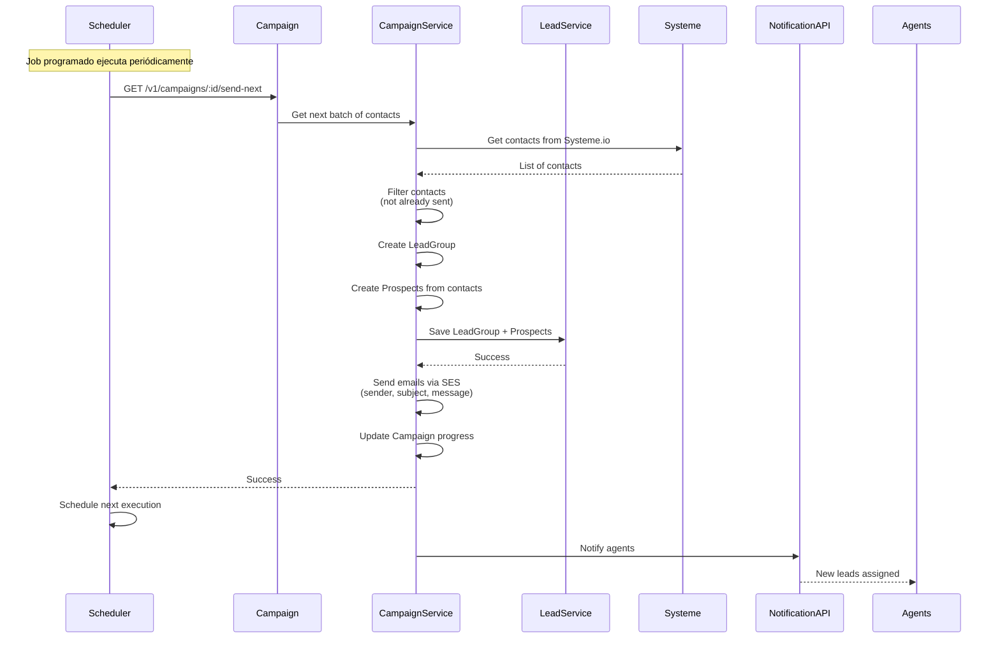

**Explicación Paso a Paso**:

1. **Scheduler**: Job ejecuta periódicamente
2. **Webhook**: GET /v1/campaigns/:id/send-next
3. **Obtener Contactos**: CampaignService obtiene contactos de Systeme.io
4. **Filtrar**: Excluye contactos ya enviados
5. **Crear LeadGroup**: Con Prospects generados
6. **Enviar Emails**: AWS SES envía emails masivos
7. **Asignar**: Prospects asignados a agentes
8. **Notificación**: Agents reciben notificación de nuevos leads

**Transformaciones**:
- Systeme contacts → Prospects
- Prospects → LeadGroup
- LeadGroup → Emails (SES)

**Notificaciones**:
- NotificationAPI: "New leads assigned from Campaign X"

### 11.13 FLUJO COMPLETO: Realizar Llamada Telefónica

**Punto de Entrada**: Usuario hace click en teléfono de Contact/Prospect

```mermaid
flowchart TD
    Start([Usuario: Hacer Llamada]) --> GetPhone[Obtener teléfono<br/>de Contact/Prospect]
    GetPhone --> ValidatePhone{¿Teléfono<br/>válido?}
    ValidatePhone -->|No| ShowErrorPhone[Error: Teléfono inválido]
    ValidatePhone -->|Sí| ShowModal[Mostrar modal de llamada]
    
    ShowModal --> ConfirmCall{¿Confirmar<br/>llamada?}
    ConfirmCall -->|No| Cancel[Cancelar]
    ConfirmCall -->|Sí| CheckPerms{¿Tiene permiso<br/>REQUEST_CALL?}
    
    CheckPerms -->|No| Error403[Error 403: Forbidden]
    CheckPerms -->|Sí| APIRequest[POST /v1/users/make-a-call<br/>Body: { phone, entity_type, entity_id? }]
    
    APIRequest --> BackendValidate[Backend: Validar permisos]
    BackendValidate --> ValidateData{¿Datos<br/>válidos?}
    ValidateData -->|No| Error400[Error 400: Invalid data]
    ValidateData -->|Sí| CallCloudTalk[CloudTalkVoIPProviderRepository:<br/>Iniciar llamada]
    
    CallCloudTalk --> CloudTalkAPI[CloudTalk API:<br/>POST /calls]
    CloudTalkAPI --> CloudTalkSuccess{¿CloudTalk<br/>responde?}
    
    CloudTalkSuccess -->|Error| Error500[Error 500: CloudTalk error]
    CloudTalkSuccess -->|Sí| GetCallId[Obtener call_id<br/>de respuesta]
    
    GetCallId --> RegisterCall[Registrar CallLog:<br/>- entity_type: CONTACT/PROSPECT<br/>- entity_id<br/>- phone<br/>- call_id<br/>- duration: 0<br/>- createdAt]
    
    RegisterCall --> SaveCallLog[Guardar CallLog<br/>en Contact/Prospect]
    SaveCallLog --> Return200[Retornar 200 OK<br/>{ call_id, status }]
    
    Return200 --> FrontendReceive[Frontend recibe éxito]
    FrontendReceive --> ShowSuccess[Mostrar: Llamada iniciada]
    ShowSuccess --> UpdateUI[Actualizar UI:<br/>CallLog añadido]
    UpdateUI --> End([Llamada iniciada<br/>CallLog registrado])
    
    Error403 --> EndError([Error])
    Error400 --> EndError
    Error500 --> EndError
```

**Explicación Paso a Paso**:

1. **Obtener Teléfono**: Frontend obtiene teléfono de Contact/Prospect
2. **Modal**: Muestra modal de confirmación
3. **API Call**: POST /v1/users/make-a-call
4. **Backend**: Valida permisos y datos
5. **CloudTalk**: Llama a CloudTalk API para iniciar llamada
6. **Registrar**: Crea CallLog y lo guarda en Contact/Prospect
7. **Respuesta**: 200 OK con call_id
8. **UI**: Actualiza UI con nuevo CallLog

**Transformaciones**:
- Teléfono → CloudTalk call request
- CloudTalk response → CallLog entity
- CallLog → MongoDB document

**Notificaciones**:
- Ninguna (llamada en progreso)

**Manejo de Errores**:
- CloudTalk error: 500, log error
- Permisos: 403
- Datos inválidos: 400

---

## 12. RESUMEN EJECUTIVO

### 12.1 ¿Qué Hace la Aplicación?

**CRM Core API** es el backend de un sistema de gestión de relaciones con clientes (CRM) especializado en el **sector de préstamos comerciales**. Facilita el proceso completo desde la generación de leads hasta el cierre de préstamos y distribución de comisiones.

**Funcionalidades Principales**:
- **Gestión de Prospectos y Leads**: Importación masiva, seguimiento y conversión a contactos
- **Gestión de Contactos y Empresas**: Información completa de personas y empresas
- **Gestión de Aplicaciones**: Solicitudes de préstamo con documentos, estados y flujo completo
- **Gestión de Bancos**: Catálogo de instituciones financieras, constraints y ofertas
- **Gestión de Comisiones**: Distribución automática y manual de comisiones entre agentes
- **Sistema de Llamadas**: Integración VoIP para llamadas desde la app
- **Campañas de Marketing**: Gestión de campañas que generan leads automáticamente
- **Sistema de Usuarios**: Gestión de usuarios, roles y permisos granulares

### 12.2 Principales Flujos de Negocio

1. **Flujo de Lead a Préstamo**:
   ```
   Lead (CSV/Excel) → Prospect → Contact → Company → Application → 
   Banks → Offers → Commission → Published → Completed
   ```

2. **Flujo de Aplicación**:
   ```
   Crear → READY_TO_SEND → Enviar a Bancos → SENT → 
   Recibir Ofertas → OFFERED → Aceptar → OFFER_ACCEPTED → 
   Commission → Completar → COMPLETED
   ```

3. **Flujo de Comisión**:
   ```
   Oferta Aceptada → Commission Creada (DRAFT) → 
   Configurar Distribución → Publicar (PUBLISHED)
   ```

4. **Flujo de Campaña**:
   ```
   Crear Campaña → STARTED → Generar Leads Automáticamente → 
   Asignar a Agentes → Trabajar Leads
   ```

### 12.3 Arquitectura en Términos de Negocio

**Separación de Responsabilidades**:
- **Domain Layer**: Reglas de negocio puras, independientes de tecnología
- **Application Layer**: Orquestación de casos de uso, validaciones de negocio
- **Infrastructure Layer**: Comunicación externa (REST, MongoDB, AWS, etc.)

**Ventajas para el Negocio**:
- **Escalabilidad**: Puede manejar miles de aplicaciones simultáneas
- **Mantenibilidad**: Cambios en reglas de negocio no afectan infraestructura
- **Testabilidad**: Reglas de negocio pueden testearse independientemente
- **Flexibilidad**: Fácil cambiar proveedores (AWS → GCP, MongoDB → PostgreSQL)

### 12.4 Mapa Mental del Sistema

```mermaid
mindmap
  root((CRM Core API))
    Autenticación
      Auth0
      JWT Tokens
      Permisos Granulares
    Gestión de Leads
      Importación CSV/Excel
      Prospects
      Conversión a Contacts
    Gestión de Contactos
      Información Personal
      Documentos
      Notas
    Gestión de Empresas
      Información de Negocio
      Miembros (Contacts)
      Documentos
    Gestión de Aplicaciones
      Creación
      Documentos Complejos
      Estados y Transiciones
      Envío a Bancos
      Ofertas
      Comisiones Automáticas
    Gestión de Bancos
      Catálogo
      Constraints
      Blacklist
      Ofertas
    Gestión de Comisiones
      Creación Automática
      Distribución PSF
      Distribución Commission
      Publicación
    Campañas
      Generación Automática
      Asignación de Leads
      Webhooks
    Integraciones
      AWS S3 (Archivos)
      AWS SES (Emails)
      CloudTalk (VoIP)
      NotificationAPI (Notificaciones)
      Systeme (Contactos Externos)
```

### 12.5 Puntos Clave del Sistema

**Fortalezas**:
- ✅ Arquitectura limpia y escalable
- ✅ Separación clara de responsabilidades
- ✅ CQRS para optimización
- ✅ Event-Driven para desacoplamiento
- ✅ Sistema de permisos granular
- ✅ Automatizaciones inteligentes (Commission, Leads)
- ✅ Trazabilidad completa (notas, estados, historial)

**Características Únicas**:
- Creación automática de Commission al aceptar oferta
- Cálculo dinámico de períodos para bank statements
- Sistema de recomendación de bancos basado en constraints
- Preservación de historial al convertir Prospect → Contact
- Transferencia de ownership entre usuarios
- Sistema de blacklist para bancos

**Métricas de Negocio**:
- Soporta múltiples tenants (multi-tenancy)
- Escalable horizontalmente
- Tiempo de respuesta < 200ms para queries
- Disponibilidad objetivo: 99.9%

---

## 13. ANÁLISIS PROFUNDO DE TODOS LOS MÓDULOS

### 13.1 MÓDULO: APPLICATION (Aplicaciones)

#### 1. Contexto de Negocio

**Problema que Resuelve**:
- **Centralización**: Antes, las solicitudes de préstamo estaban dispersas en emails, hojas de cálculo y documentos físicos. No había un sistema centralizado.
- **Coordinación con Múltiples Bancos**: Enviar una aplicación a múltiples bancos simultáneamente y rastrear todas las respuestas era manual y propenso a errores.
- **Gestión de Documentos Complejos**: Una aplicación requiere múltiples tipos de documentos (bank statements de 4 períodos, MTD, credit card, filled apps) que deben organizarse y validarse.
- **Trazabilidad**: No había forma de rastrear quién hizo qué, cuándo cambió el estado, o qué ofertas se recibieron.
- **Automatización de Comisiones**: Cuando se acepta una oferta, la comisión debe crearse automáticamente para evitar errores manuales.

**Usuarios y Situaciones**:
- **Agentes/Brokers**: 
  - Situación: Tienen un cliente que necesita un préstamo comercial
  - Uso: Crean la aplicación, suben documentos, la envían a múltiples bancos, comparan ofertas, aceptan la mejor
  - Frecuencia: Diaria, múltiples aplicaciones por día
- **Supervisores**:
  - Situación: Necesitan supervisar el trabajo del equipo
  - Uso: Ven todas las aplicaciones del equipo, transfieren aplicaciones entre agentes, revisan métricas
  - Frecuencia: Diaria, revisión continua
- **Administradores**:
  - Situación: Gestionan el sistema completo
  - Uso: Eliminan aplicaciones en READY_TO_SEND si hay errores, configuran permisos, revisan reportes
  - Frecuencia: Según necesidad

#### 2. Análisis Técnico

**Estructura de Archivos**:

```
domain/application/
├── entities/
│   ├── application.entity.ts          # Entidad principal Application
│   ├── bank-notification.entity.ts    # Notificaciones a bancos
│   ├── offer.entity.ts                # Ofertas de bancos
│   ├── application-document.entity.ts # Documentos de aplicación
│   ├── application-referral.entity.ts # Información de referral
│   └── draft/                         # Entidades de borradores
├── commands/
│   ├── create-application.command.ts
│   ├── add-notifications-to-application.command.ts
│   ├── accept-offer.command.ts
│   ├── complete-application.command.ts
│   └── ... (22 comandos totales)
├── queries/
│   ├── get-application-by-id.query.ts
│   ├── search-applications.query.ts
│   ├── get-recommended-banks.query.ts
│   └── ... (8 queries totales)
├── repositories/
│   └── application.repository.ts      # Interface
└── events/
    └── application-accepted.event.ts  # Evento de dominio

app/application/
├── commands/
│   └── ... (22 command handlers)
├── queries/
│   └── ... (8 query handlers)
├── dtos/
│   ├── requests/                      # DTOs de entrada
│   └── responses/                     # DTOs de salida
├── services/
│   ├── address-resolver.service.ts
│   └── app-cloner.service.ts
└── events/
    └── application-accepted.event-handler.ts

infra/adapters/
├── rest/application/resources/
│   ├── create-application.resource.ts
│   ├── accept-offer.resource.ts
│   └── ... (27+ recursos REST)
└── mongo/application/
    ├── documents/                     # Schemas Mongoose
    ├── repositories/                  # Implementaciones
    └── mappers/                       # Domain ↔ MongoDB
```

**Servicios Relacionados**:

1. **ApplicationRepository** (Interface):
   - `createOne(application)`: Crea aplicación
   - `findById(id)`: Busca por ID
   - `searchApplications(query)`: Búsqueda con filtros
   - `getLastApplication(companyId)`: Última aplicación de company
   - `getActiveByPeriod(period, companyId)`: Aplicación activa por período

2. **AppClonerService**:
   - `cloneForAllTenants(application)`: Clona aplicación para todos los tenants
   - Usado para multi-tenancy

3. **StorageRepository**:
   - `saveFile(file, type)`: Guarda archivos en S3
   - Usado para documentos de aplicación

4. **CompanyRepository**:
   - `findById(id)`: Valida que company exista
   - Usado en validación de creación

**Interfaces y Modelos de Datos**:

```typescript
// Domain Entity
class Application {
  id: Id
  status: APPLICATION_STATUS
  substatus: APPLICATION_SUBSTATUS | null
  companyId: Id
  trackingId: string
  period: string
  loanAmount: number
  product: PRODUCT_TYPE
  referral: ApplicationReferral | null
  filledApplications: FilledApplicationDocument[]
  bankStatements: ApplicationDocument[]      // 4 requeridos
  mtdStatements: ApplicationDocument[]      // 1 opcional
  creditCardStatements: ApplicationDocument[] // 3 opcionales
  additionalStatements: ApplicationDocument[] // 5 opcionales
  notifications: BankNotification[]
  position: number | null                    // 1-5
  rejectReason: REJECT_REASONS | null
  rejectReasonDescription: string | null
  createdBy: Id | null
  signatureUrl: string | null
  createdAt: Date
  updatedAt: Date | undefined
}

// BankNotification Entity
class BankNotification {
  id: Id
  bankId: Id
  status: NOTIFICATION_STATUS
  offers: Offer[]
  rejectReason: REJECT_REASONS | null
  rejectReasonDescription: string | null
  createdAt: Date
  updatedAt: Date | undefined
}

// Offer Entity
class Offer {
  id: Id
  purchasedAmount: number
  factorRate: number
  points: number
  commission: number
  paymentPlan: string
  status: OFFER_STATUS
  createdAt: Date
  updatedAt: Date | undefined
}
```

#### 3. Flujo Completo: Crear Application

```mermaid
flowchart TD
    Start([Usuario: Crear Application]) --> ValidatePerms{¿Tiene permiso<br/>CREATE_APPLICATION?}
    ValidatePerms -->|No| Error403[Error 403: Forbidden]
    ValidatePerms -->|Sí| SelectCompany[Seleccionar Company]
    
    SelectCompany --> ValidateCompany{¿Company existe?}
    ValidateCompany -->|No| Error404[Error 404: Company not found]
    ValidateCompany -->|Sí| FillForm[Completar formulario:<br/>- Monto $1K-$20M<br/>- Producto<br/>- Referral opcional]
    
    FillForm --> ValidateAmount{¿Monto válido?}
    ValidateAmount -->|No| Error400[Error 400: Amount invalid]
    ValidateAmount -->|Sí| CalculatePeriods[Calcular períodos:<br/>GET /v1/last-application-period/:companyId]
    
    CalculatePeriods --> CheckLastApp{¿Company tiene<br/>aplicaciones previas?}
    CheckLastApp -->|Sí| UseLastPeriod[Usar último período válido<br/>+ calcular 4 períodos desde ahí]
    CheckLastApp -->|No| UseDefaultPeriods[Usar últimos 4 períodos<br/>desde hoy]
    
    UseLastPeriod --> UploadDocs[Subir documentos:<br/>- 4 Bank Statements requeridos<br/>- MTD opcional<br/>- Credit Card opcional<br/>- Additional opcional]
    UseDefaultPeriods --> UploadDocs
    
    UploadDocs --> ValidateDocs{¿Documentos válidos?}
    ValidateDocs -->|No| Error400Docs[Error 400: Invalid documents]
    ValidateDocs -->|Sí| CheckDuplicates{¿Archivos<br/>duplicados?}
    
    CheckDuplicates -->|Sí| Error400Dup[Error 400: Duplicate files]
    CheckDuplicates -->|No| CheckBankStatements{¿4 Bank Statements<br/>con períodos correctos?}
    
    CheckBankStatements -->|No| Error400Periods[Error 400: Invalid periods]
    CheckBankStatements -->|Sí| CreateCommand[Crear CreateApplicationCommand]
    
    CreateCommand --> ValidateCommand{¿Command válido?}
    ValidateCommand -->|No| Error400Cmd[Error 400: Invalid command]
    ValidateCommand -->|Sí| CheckCompany[Command Handler:<br/>Verificar Company existe]
    
    CheckCompany --> CompanyExists{¿Company existe?}
    CompanyExists -->|No| Error404Company[Error 404: Company not found]
    CompanyExists -->|Sí| CheckDuplicate[Verificar duplicado:<br/>getActiveByPeriod]
    
    CheckDuplicate --> IsDuplicate{¿Ya existe aplicación<br/>activa en período?}
    IsDuplicate -->|Sí| Error409[Error 409: ApplicationDuplicated]
    IsDuplicate -->|No| GetLastApp[Obtener última aplicación<br/>de company]
    
    GetLastApp --> CreateEntity[Application.create():<br/>- Validar monto<br/>- Validar producto<br/>- Validar documentos<br/>- Validar no duplicados]
    
    CreateEntity --> EntityValid{¿Entity válida?}
    EntityValid -->|No| Error400Entity[Error 400: Invalid entity]
    EntityValid -->|Sí| CloneForTenants[AppClonerService:<br/>Clonar para todos los tenants]
    
    CloneForTenants --> SaveToMongo[Transaction:<br/>Guardar en MongoDB]
    SaveToMongo --> SaveFiles[Guardar archivos en S3:<br/>- Bank statements<br/>- MTD statements<br/>- Credit card statements<br/>- Additional statements]
    
    SaveFiles --> FilesSaved{¿Archivos guardados?}
    FilesSaved -->|Error| Rollback[Rollback transaction]
    FilesSaved -->|Sí| Commit[Commit transaction]
    
    Commit --> EmitEvent[Emitir evento:<br/>ApplicationCreated]
    EmitEvent --> Return201[Retornar 201 Created<br/>con ID de aplicación]
    
    Return201 --> End([Application creada<br/>Estado: READY_TO_SEND])
    
    Error403 --> EndError([Error])
    Error404 --> EndError
    Error400 --> EndError
    Error400Docs --> EndError
    Error400Dup --> EndError
    Error400Periods --> EndError
    Error400Cmd --> EndError
    Error404Company --> EndError
    Error409 --> EndError
    Error400Entity --> EndError
    Rollback --> EndError
```

**Paso a Paso Detallado**:

1. **Entrada del Usuario**:
   - Frontend: Usuario completa formulario multi-paso
   - Selecciona Company existente
   - Ingresa monto ($1,000 - $20,000,000)
   - Selecciona producto
   - Opcionalmente ingresa referral

2. **Cálculo de Períodos**:
   - Frontend llama: `GET /v1/last-application-period/:companyId`
   - Backend - Query Handler: `GetLastApplicationPeriodQueryHandler`
     - Busca última aplicación de company
     - Si existe: calcula períodos desde último período válido
     - Si no: usa últimos 4 períodos desde hoy
   - Retorna períodos requeridos

3. **Subida de Documentos**:
   - Usuario sube archivos en frontend
   - Frontend valida: no duplicados, tipos correctos, tamaño máximo
   - Frontend prepara FormData con:
     - `body`: JSON string con datos de aplicación
     - `documents`: Array de archivos

4. **Request HTTP**:
   - `POST /v1/applications` (FormData)
   - Headers: `Authorization: Bearer <token>`, `X-Tenant: <tenant_id>`

5. **Backend - Resource (REST Controller)**:
   - `CreateApplicationResource.handle()`
   - Valida permisos: `@RequiredPermissions(Permission.CREATE_APPLICATION)`
   - Extrae archivos de `req.files`
   - Parsea body JSON
   - Crea `CreateApplicationCommand`

6. **Backend - Command Handler**:
   - `CreateApplicationCommandHandler.handle()`
   - **Validaciones**:
     - Verifica Company existe: `checkIfCompanyExist()`
     - Verifica no duplicado: `checkForDuplicates()` (aplicación activa en mismo período)
   - **Obtiene última aplicación**: `getLastApplication(companyId)`
   - **Crea Entity**: `Application.create()`
     - Valida monto, producto, documentos
     - Valida períodos de bank statements
     - Valida no archivos duplicados
     - Estado inicial: `READY_TO_SEND`
   - **Clona para tenants**: `clonerService.cloneForAllTenants()`
   - **Transacción MongoDB**:
     - Guarda Application entities
     - Guarda archivos en S3
     - Si error: rollback

7. **Persistencia**:
   - MongoDB: Guarda Application document
   - S3: Guarda archivos (bank statements, MTD, credit card, additional)
   - Retorna ID de aplicación

8. **Respuesta**:
   - `201 Created` con `{ id: string }`
   - Frontend recibe ID y navega a detalles

**Manejo de Errores**:
- `403 Forbidden`: Sin permisos
- `404 Not Found`: Company no existe
- `400 Bad Request`: Validaciones fallidas (monto, documentos, períodos)
- `409 Conflict`: Aplicación duplicada en período
- `500 Internal Server Error`: Error en S3 o MongoDB

**Casos Edge**:
- Company sin aplicaciones previas: usa períodos estándar
- Archivos duplicados: validación previene subir
- Error en S3: rollback de transacción
- Multi-tenancy: clona aplicación para todos los tenants

#### 4. Lógica de Negocio

**Reglas de Negocio Críticas**:

1. **Crear Aplicación**:
   - Monto: $1,000 - $20,000,000 (solo enteros)
   - Bank Statements: Exactamente 4 períodos requeridos
   - Períodos calculados dinámicamente basados en última aplicación
   - No se permiten archivos duplicados (mismo nombre)
   - No puede haber aplicación activa en mismo período para misma company

2. **Enviar a Bancos**:
   - Solo aplicaciones en `READY_TO_SEND`
   - Debe tener posición establecida (1-5)
   - Mensaje: 15-800 caracteres
   - Crea una BankNotification por cada banco
   - Bancos no pueden estar en blacklist

3. **Gestionar Ofertas**:
   - Un banco puede enviar múltiples ofertas
   - Solo una oferta aceptada por notificación
   - Al aceptar: rechaza otras ofertas de la misma notificación
   - Al aceptar: crea Commission automáticamente (Domain Event)

4. **Estados y Transiciones**:
   ```
   READY_TO_SEND → SENT → OFFERED → OFFER_ACCEPTED → COMPLETED
                                ↓
                            REJECTED
   ```
   - Transiciones válidas están validadas en entity
   - No se puede saltar estados

5. **Eliminación**:
   - Solo aplicaciones en `READY_TO_SEND` pueden eliminarse
   - Requiere permiso `DELETE_APPLICATION`

6. **Transferencia**:
   - No puede transferirse si está `COMPLETED`
   - Requiere permiso `TRANSFER_APPLICATION`

**Validaciones Específicas del Dominio**:

```typescript
// Validación de Monto
static validateLoanAmount(loanAmount: OptionalValue<number>): Result<number> {
  return Validator.of(loanAmount)
    .required(() => DomainErrorCode.APPLICATION_AMOUNT_EMPTY)
    .number(() => DomainErrorCode.APPLICATION_AMOUNT_INVALID)
    .min(MIN_LOAN_AMOUNT, () => DomainErrorCode.APPLICATION_AMOUNT_INVALID);
}

// Validación de Bank Statements
static validateBankStatements(bankStatements: OptionalValue<T[]>): Result<T[]> {
  return Validator.of(bankStatements)
    .required(() => DomainErrorCode.APPLICATION_BANK_STATEMENTS_EMPTY)
    .array(() => DomainErrorCode.APPLICATION_BANK_STATEMENTS_INVALID)
    .notEmpty(() => DomainErrorCode.APPLICATION_BANK_STATEMENTS_EMPTY)
    .minLength(4, () => DomainErrorCode.APPLICATION_BANK_STATEMENTS_TOO_FEW)
    .maxLength(4, () => DomainErrorCode.APPLICATION_BANK_STATEMENTS_TOO_MANY)
    .validate(
      (values) => this.ensurePeriodsInArray(values.map((v) => v?.period)),
      () => DomainErrorCode.APPLICATION_BANK_STATEMENTS_INVALID_PERIOD,
    );
}

// Validación de No Duplicados
private validateNoDuplicateFiles(): Result<void> {
  const files = [...this.filledApplications, ...this.bankStatements, ...]
    .map((file) => file.name);
  const uniqueFiles = new Set<string>(files);
  const hasDuplicates = files.length !== uniqueFiles.size;
  return Validator.of([]).validate(
    () => !hasDuplicates,
    () => DomainErrorCode.DUPLICATE_FILE_NAMES_PRESENT,
  );
}
```

#### 5. Integraciones

**Con Otros Módulos**:

1. **Company Module**:
   - **Dependencia Directa**: Application requiere Company existente
   - **Flujo**:
     - `CreateApplicationCommandHandler` valida Company existe
     - Obtiene última aplicación de Company para calcular períodos
     - Application tiene `companyId` como foreign key
   - **Acoplamiento**: Bajo (solo ID, no entity completa)

2. **Bank Module**:
   - **Dependencia Directa**: Application envía a Banks
   - **Flujo**:
     - `GetRecommendedBanksQueryHandler` calcula bancos recomendados
     - Crea BankNotifications al enviar
     - Recibe ofertas de bancos
   - **Acoplamiento**: Bajo (solo IDs y constraints)

3. **Commission Module**:
   - **Dependencia Indirecta**: Application genera Commissions
   - **Flujo**:
     - `ApplicationAcceptedEvent` se dispara al aceptar oferta
     - `ApplicationAcceptedEventHandler` crea Commission automáticamente
   - **Acoplamiento**: Muy bajo (solo Domain Event)

4. **Contact Module**:
   - **Relación Indirecta**: A través de Companies
   - **Flujo**:
     - Los miembros de Company son Contacts
     - Se muestran en Application details
   - **Acoplamiento**: Ninguno directo

**APIs y Servicios Externos**:

1. **AWS S3**:
   - `StorageRepository.saveFile()`: Guarda documentos
   - Usado para: bank statements, MTD, credit card, filled apps, additional statements
   - Tamaño máximo: 10MB por archivo

2. **NotificationAPI**:
   - Envía notificaciones cuando:
     - Application creada
     - Oferta recibida
     - Oferta aceptada
     - Application completada

3. **Scheduler Service**:
   - Puede programar tareas relacionadas con applications
   - Ejemplo: Enviar notificaciones pendientes

#### 6. Casos de Uso

**Escenario 1: Agente Crea y Envía Aplicación**:

1. Agente tiene Company existente
2. Crea Application con documentos
3. Establece posición 3
4. Selecciona 5 bancos recomendados
5. Escribe mensaje personalizado
6. Envía a bancos
7. **Resultado**: Application en estado `SENT`, 5 BankNotifications creadas

**Escenario 2: Banco Responde con Oferta**:

1. Application está en estado `SENT`
2. Banco envía oferta vía webhook o manualmente
3. Backend crea Offer entity
4. BankNotification.status → `OFFERED`
5. Application.status → `OFFERED`
6. Usuario recibe notificación
7. **Resultado**: Oferta disponible para aceptar

**Escenario 3: Agente Acepta Oferta**:

1. Application tiene múltiples ofertas
2. Agente compara ofertas (monto, factor rate, commission)
3. Selecciona mejor oferta
4. Acepta oferta
5. Backend:
   - Offer.status → `ACCEPTED`
   - Otras ofertas → `REJECTED`
   - BankNotification.status → `ACCEPTED`
   - Application.status → `OFFER_ACCEPTED`
   - **Emite Event**: `ApplicationAcceptedEvent`
   - **Event Handler**: Crea Commission automáticamente (DRAFT)
6. **Resultado**: Oferta aceptada, Commission creada

**Flujos Alternativos**:

- **Banco Rechaza**: BankNotification.status → `REJECTED`, Application puede seguir recibiendo ofertas de otros bancos
- **Usuario Rechaza Todas**: Application.status → `REJECTED`, todas las notificaciones rechazadas
- **Error al Crear Commission**: Oferta se acepta, pero Commission no se crea (se loguea error)

**Excepciones**:

- **Application Duplicada**: Si ya existe aplicación activa en mismo período para misma company → Error 409
- **Company No Existe**: Error 404
- **Banco en Blacklist**: No aparece en recomendados, backend rechazará envío
- **Archivos Duplicados**: Validación previene subir archivos con mismo nombre

---

### 13.2 MÓDULO: CONTACT (Contactos)

#### 1. Contexto de Negocio

**Problema que Resuelve**:
- **Gestión Centralizada de Personas**: Antes, la información de contactos estaba dispersa. No había un sistema único de verdad.
- **Información Completa**: Un contacto necesita múltiples datos (SSN, identificación, documentos, notas, historial de llamadas) que deben organizarse.
- **Relación con Companies**: Un contacto puede ser miembro de múltiples empresas, lo que requiere gestión flexible.
- **Trazabilidad**: Rastrear todas las interacciones (llamadas, notas) con un contacto.

**Usuarios y Situaciones**:
- **Agentes/Brokers**:
  - Situación: Tienen un prospecto que quiere convertirse en cliente
  - Uso: Crean contacto, completan información personal, suben documentos, añaden notas sobre interacciones
  - Frecuencia: Diaria, múltiples contactos por día
- **Supervisores**:
  - Situación: Revisan contactos del equipo
  - Uso: Ven todos los contactos, transfieren entre agentes
  - Frecuencia: Según necesidad

#### 2. Análisis Técnico

**Estructura de Archivos**:

```
domain/contact/
├── entities/
│   ├── contact.entity.ts
│   └── contact-document.entity.ts
├── commands/
│   ├── create-contact.command.ts
│   ├── update-contact.command.ts
│   ├── add-contact-file.command.ts
│   └── ... (8 comandos)
├── queries/
│   ├── get-contact-by-id.query.ts
│   ├── search-contacts.query.ts
│   └── ... (4 queries)
└── repositories/
    └── contact.repository.ts

app/contact/
├── commands/ (8 handlers)
├── queries/ (4 handlers)
└── dtos/

infra/adapters/
├── rest/contact/resources/ (11 recursos)
└── mongo/contact/
    ├── documents/
    ├── repositories/
    └── mappers/
```

**Interfaces y Modelos**:

```typescript
class Contact {
  id: Id
  firstName: string                    // 2-50 caracteres
  lastName: string                     // 2-50 caracteres
  birthdate: Date                      // Edad 21-99 años
  ssn: string                         // SSN o ITIN
  address: Address
  phones: Phone[]                      // Máximo 5
  emails: Email[]                     // Máximo 5
  documents: ContactDocument[]         // Máximo 6 totales, 4 por tipo
  notes: Note[]
  createdBy: Id | null
  createdAt: Date
  updatedAt: Date | undefined
}

// Validaciones
- firstName: 2-50 caracteres
- lastName: 2-50 caracteres
- birthdate: Edad entre 21-99 años
- ssn: Formato válido (SSN o ITIN)
- phones: Máximo 5
- emails: Máximo 5
- documents: Máximo 6 totales, máximo 4 por tipo
```

#### 3. Flujo Completo: Crear Contact

```mermaid
flowchart TD
    Start([Usuario: Crear Contact]) --> ValidatePerms{¿Tiene permiso<br/>CREATE_CONTACT?}
    ValidatePerms -->|No| Error403[Error 403]
    ValidatePerms -->|Sí| FillForm[Completar formulario:<br/>- Nombre, Apellido<br/>- Fecha nacimiento<br/>- SSN<br/>- Dirección<br/>- Teléfonos máx 5<br/>- Emails máx 5]
    
    FillForm --> ValidateAge{¿Edad 21-99?}
    ValidateAge -->|No| Error400Age[Error 400: Invalid age]
    ValidateAge -->|Sí| ValidateSSN{¿SSN válido?}
    
    ValidateSSN -->|No| Error400SSN[Error 400: Invalid SSN]
    ValidateSSN -->|Sí| ValidatePhones{¿Máximo 5<br/>teléfonos?}
    
    ValidatePhones -->|No| Error400Phones[Error 400: Too many phones]
    ValidatePhones -->|Sí| ValidateEmails{¿Máximo 5<br/>emails?}
    
    ValidateEmails -->|No| Error400Emails[Error 400: Too many emails]
    ValidateEmails -->|Sí| UploadDocs[Subir documentos<br/>máx 6 totales, 4 por tipo]
    
    UploadDocs --> ValidateDocs{¿Documentos válidos?}
    ValidateDocs -->|No| Error400Docs[Error 400: Invalid documents]
    ValidateDocs -->|Sí| CreateCommand[Crear CreateContactCommand]
    
    CreateCommand --> CreateEntity[Contact.create():<br/>- Validar nombre<br/>- Validar SSN<br/>- Validar edad<br/>- Validar phones/emails]
    
    CreateEntity --> EntityValid{¿Entity válida?}
    EntityValid -->|No| Error400Entity[Error 400]
    EntityValid -->|Sí| SaveToMongo[Guardar en MongoDB]
    
    SaveToMongo --> SaveFiles[Guardar archivos en S3]
    SaveFiles --> Return201[Retornar 201 Created]
    
    Return201 --> End([Contact creado])
    
    Error403 --> EndError([Error])
    Error400Age --> EndError
    Error400SSN --> EndError
    Error400Phones --> EndError
    Error400Emails --> EndError
    Error400Docs --> EndError
    Error400Entity --> EndError
```

**Validaciones Específicas**:

```typescript
// Validación de Edad
static validateBirthdate(birthdate: OptionalValue<string>): Result<Date> {
  return Validator.of(birthdate)
    .required(() => DomainErrorCode.CONTACT_BIRTHDATE_EMPTY)
    .date(() => DomainErrorCode.CONTACT_BIRTHDATE_INVALID)
    .validate(
      (date) => {
        const age = getDateYearsAgo(date);
        return age >= MIN_AGE && age <= 99;
      },
      () => DomainErrorCode.CONTACT_BIRTHDATE_INVALID,
    );
}

// Validación de SSN
static validateSSN(ssn: OptionalValue<string>): Result<string> {
  return Validator.of(ssn)
    .required(() => DomainErrorCode.CONTACT_SSN_EMPTY)
    .string(() => DomainErrorCode.CONTACT_SSN_INVALID)
    .regex(/^\d{9}$/, () => DomainErrorCode.CONTACT_SSN_INVALID);
}

// Validación de Teléfonos
static validatePhonesLength(phones: Phone[]): Result<Phone[]> {
  return Validator.of(phones)
    .array(() => DomainErrorCode.CONTACT_PHONES_INVALID)
    .maxLength(PHONES_MAX_LENGTH, () => DomainErrorCode.CONTACT_PHONES_TOO_MANY);
}
```

#### 4. Lógica de Negocio

**Reglas de Negocio**:
1. Edad: 21-99 años (validado en birthdate)
2. SSN: 9 dígitos, puede ser SSN o ITIN (ITIN empieza con 9)
3. Teléfonos: Máximo 5
4. Emails: Máximo 5
5. Documentos: Máximo 6 totales, máximo 4 por tipo
6. Un Contact puede ser miembro de múltiples Companies (N:M)

**Estados**: Contact no tiene estados formales, pero tiene:
- Activo/Inactivo (implícito)
- Relación con Companies (miembros)

#### 5. Integraciones

**Con Otros Módulos**:
- **Company Module**: Contact puede ser miembro de múltiples Companies (vía CompanyMember)
- **Lead Module**: Prospect puede convertirse en Contact (preserva historial)
- **Application Module**: Indirecta a través de Companies

**APIs Externas**:
- **AWS S3**: Guarda documentos de contacto
- **Systeme**: Puede sincronizar contactos externos

#### 6. Casos de Uso

**Escenario: Convertir Prospect → Contact**:
1. Agente trabaja Prospect
2. Prospect está calificado
3. Agente crea Contact desde Prospect
4. Backend vincula Prospect → Contact
5. Historial de Prospect se preserva
6. **Resultado**: Contact creado, vinculado a Prospect original

**Escenario: Contact como Miembro de Múltiples Companies**:
1. Contact existe
2. Agente crea Company A, asocia Contact como miembro
3. Agente crea Company B, asocia mismo Contact como miembro
4. **Resultado**: Contact es miembro de 2 Companies

---

### 13.3 MÓDULO: COMPANY (Empresas)

#### 1. Contexto de Negocio

**Problema que Resuelve**:
- **Gestión de Empresas Cliente**: Las empresas que solicitan préstamos necesitan información completa y organizada.
- **Gestión de Miembros**: Una empresa puede tener múltiples miembros (contacts) que deben gestionarse.
- **Relación con Applications**: Una empresa puede tener múltiples aplicaciones de préstamo.

**Usuarios**:
- **Agentes**: Crean y gestionan empresas de sus clientes
- **Supervisores**: Supervisan empresas del equipo

#### 2. Análisis Técnico

**Estructura**:

```typescript
class Company {
  id: Id
  companyName: string              // 2-100 caracteres
  dba: string | null               // 2-100 caracteres
  taxId: TaxId                     // EIN
  industry: Industry
  service: string                   // 2-100 caracteres
  creationDate: Date
  entityType: ENTITY_TYPE
  address: Address
  phoneNumbers: Phone[]             // 1-5
  emails: Email[]                   // 1-5
  members: CompanyMember[]          // 1-10 (Contacts)
  documents: CompanyDocument[]      // Máx 4 por tipo
  notes: Note[]
  createdBy: Id | null
  createdAt: Date
  updatedAt: Date | undefined
}

// Validaciones
- companyName: 2-100 caracteres
- members: 1-10 (mínimo 1, máximo 10)
- documents: Máximo 4 por tipo
- phoneNumbers: 1-5
- emails: 1-5
```

#### 3. Flujo Completo: Crear Company

```mermaid
flowchart TD
    Start([Usuario: Crear Company]) --> ValidatePerms{¿Tiene permiso<br/>CREATE_COMPANY?}
    ValidatePerms -->|No| Error403[Error 403]
    ValidatePerms -->|Sí| FillForm[Completar formulario:<br/>- Nombre empresa<br/>- EIN<br/>- Industria<br/>- Tipo entidad<br/>- Dirección<br/>- Teléfonos 1-5<br/>- Emails 1-5]
    
    FillForm --> ValidateName{¿Nombre válido?}
    ValidateName -->|No| Error400Name[Error 400]
    ValidateName -->|Sí| ValidateEIN{¿EIN válido?}
    
    ValidateEIN -->|No| Error400EIN[Error 400]
    ValidateEIN -->|Sí| AddMembers[Añadir miembros:<br/>1-10 Contacts]
    
    AddMembers --> ValidateMembers{¿1-10 miembros?}
    ValidateMembers -->|No| Error400Members[Error 400]
    ValidateMembers -->|Sí| UploadDocs[Subir documentos<br/>máx 4 por tipo]
    
    UploadDocs --> ValidateDocs{¿Documentos válidos?}
    ValidateDocs -->|No| Error400Docs[Error 400]
    ValidateDocs -->|Sí| CreateCommand[Crear CreateCompanyCommand]
    
    CreateCommand --> CreateEntity[Company.create():<br/>- Validar nombre<br/>- Validar EIN<br/>- Validar miembros<br/>- Validar documentos]
    
    CreateEntity --> EntityValid{¿Entity válida?}
    EntityValid -->|No| Error400Entity[Error 400]
    EntityValid -->|Sí| SaveToMongo[Guardar en MongoDB]
    
    SaveToMongo --> SaveFiles[Guardar archivos en S3]
    SaveFiles --> Return201[Retornar 201 Created]
    
    Return201 --> End([Company creada])
    
    Error403 --> EndError([Error])
    Error400Name --> EndError
    Error400EIN --> EndError
    Error400Members --> EndError
    Error400Docs --> EndError
    Error400Entity --> EndError
```

#### 4. Lógica de Negocio

**Reglas**:
1. Mínimo 1 miembro, máximo 10
2. Máximo 4 documentos por tipo
3. Una Company puede tener múltiples Applications
4. Members son Contacts existentes

#### 5. Integraciones

- **Contact Module**: Company tiene Members (Contacts)
- **Application Module**: Company puede tener múltiples Applications

#### 6. Casos de Uso

**Escenario: Crear Company con Múltiples Miembros**:
1. Agente crea Contact A
2. Agente crea Contact B
3. Agente crea Company
4. Asocia Contact A y Contact B como miembros
5. **Resultado**: Company con 2 miembros

---

### 13.4 MÓDULO: BANK (Bancos)

#### 1. Contexto de Negocio

**Problema que Resuelve**:
- **Catálogo Centralizado**: Gestiona todas las instituciones financieras en un solo lugar.
- **Constraints y Criterios**: Cada banco tiene restricciones (amount min/max, industries, territories) que determinan qué aplicaciones puede recibir.
- **Blacklist**: Permite marcar bancos como no disponibles temporal o permanentemente.
- **Gestión de Ofertas**: Rastrea todas las ofertas que un banco ha enviado.

**Usuarios**:
- **Administradores**: Gestionan catálogo de bancos, configuran constraints
- **Agentes**: Consultan bancos disponibles, ven ofertas

#### 2. Análisis Técnico

**Estructura**:

```typescript
class Bank {
  id: Id
  bankName: string
  manager: string                    // 3-100 caracteres
  status: BANK_STATUS                // ACTIVE | INACTIVE
  bankType: BANK_TYPE                // LENDER | BROKER
  address: Address
  contacts: BankContact[]            // 1-6 contactos
  constraints: BankConstraints       // Restricciones de negocio
  documents: BankDocument[]           // Máx 6 archivos
  blacklist: BankBlacklist | null
  createdAt: Date
  updatedAt: Date | undefined
}

class BankConstraints {
  amountMin: number
  amountMax: number
  industries: Industry[]             // Industrias que acepta
  territories: BankTerritory[]       // Territorios que cubre
  depositConstraints: DepositConstraintByIndustry[]
}

class BankBlacklist {
  blacklistedAt: Date
  blacklistedBy: Id
  note: string
}
```

#### 3. Flujo Completo: Crear Bank

```mermaid
flowchart TD
    Start([Admin: Crear Bank]) --> ValidatePerms{¿Tiene permiso<br/>CREATE_BANK?}
    ValidatePerms -->|No| Error403[Error 403]
    ValidatePerms -->|Sí| FillForm[Completar formulario:<br/>- Nombre banco<br/>- Tipo LENDER/BROKER<br/>- Manager<br/>- Dirección<br/>- Contactos 1-6<br/>- Constraints]
    
    FillForm --> ValidateName{¿Nombre válido?}
    ValidateName -->|No| Error400Name[Error 400]
    ValidateName -->|Sí| ValidateContacts{¿1-6 contactos?}
    
    ValidateContacts -->|No| Error400Contacts[Error 400]
    ValidateContacts -->|Sí| SetConstraints[Configurar constraints:<br/>- Amount min/max<br/>- Industries<br/>- Territories]
    
    SetConstraints --> ValidateConstraints{¿Constraints válidos?}
    ValidateConstraints -->|No| Error400Constraints[Error 400]
    ValidateConstraints -->|Sí| UploadDocs[Subir documentos<br/>máx 6 archivos]
    
    UploadDocs --> ValidateDocs{¿Documentos válidos?}
    ValidateDocs -->|No| Error400Docs[Error 400]
    ValidateDocs -->|Sí| CreateCommand[Crear CreateBankCommand]
    
    CreateCommand --> CreateEntity[Bank.create():<br/>- Validar nombre<br/>- Validar manager<br/>- Validar contactos<br/>- Validar constraints]
    
    CreateEntity --> EntityValid{¿Entity válida?}
    EntityValid -->|No| Error400Entity[Error 400]
    EntityValid -->|Sí| SaveToMongo[Guardar en MongoDB]
    
    SaveToMongo --> SaveFiles[Guardar archivos en S3]
    SaveFiles --> Return201[Retornar 201 Created]
    
    Return201 --> End([Bank creado<br/>Status: ACTIVE])
    
    Error403 --> EndError([Error])
    Error400Name --> EndError
    Error400Contacts --> EndError
    Error400Constraints --> EndError
    Error400Docs --> EndError
    Error400Entity --> EndError
```

#### 4. Lógica de Negocio

**Reglas**:
1. Bank puede estar ACTIVE o INACTIVE
2. Bank puede estar en blacklist (temporal o permanente)
3. Constraints determinan qué aplicaciones puede recibir:
   - Amount min/max
   - Industries permitidas
   - Territories cubiertos
4. Sistema calcula bancos recomendados basado en constraints
5. Bank en blacklist no aparece en recomendados

**Método: isActive()**:
```typescript
isActive(): boolean {
  return this._status === BANK_STATUS.ACTIVE && this._blacklist === null;
}
```

#### 5. Integraciones

- **Application Module**: Bank recibe Applications (vía BankNotifications)
- **AWS SES**: Envío de emails a bancos

#### 6. Casos de Uso

**Escenario: Sistema Recomienda Bancos**:
1. Application tiene monto $50,000, industria "Retail", territorio "Puerto Rico"
2. Query: `GetRecommendedBanksQuery`
3. Backend filtra bancos:
   - Status: ACTIVE
   - No en blacklist
   - Constraints: amountMin <= $50,000 <= amountMax
   - Constraints: industries incluye "Retail"
   - Constraints: territories incluye "Puerto Rico"
4. **Resultado**: Lista de bancos recomendados

---

### 13.5 MÓDULO: COMMISSION (Comisiones)

#### 1. Contexto de Negocio

**Problema que Resuelve**:
- **Distribución Automática**: Cuando se acepta una oferta, la comisión debe distribuirse entre múltiples agentes automáticamente.
- **Configuración Flexible**: Permite editar la distribución antes de publicar.
- **Trazabilidad**: Rastrea quién recibe qué monto de comisión.

**Usuarios**:
- **Sistema**: Crea Commission automáticamente al aceptar oferta
- **Administradores/Contadores**: Configuran distribución y publican

#### 2. Análisis Técnico

**Estructura**:

```typescript
class Commission {
  id: Id
  applicationId: Id
  companyId: Id
  bankId: Id
  status: COMMISSION_STATUS        // DRAFT | PUBLISHED
  commission: CommissionDetail     // Distribución de commission
  psf: CommissionDetail            // Distribución de PSF
  createdAt: Date
  updatedAt: Date | undefined
}

class CommissionDetail {
  total: number
  distribution: DistributionItem[]
}

class DistributionItem {
  amount: number
  userId: Id
}
```

#### 3. Flujo Completo: Crear Commission Automáticamente

```mermaid
sequenceDiagram
    participant User
    participant App as Application
    participant Event as ApplicationAcceptedEvent
    participant Handler as ApplicationAcceptedEventHandler
    participant Repo as CommissionRepository
    participant MongoDB
    
    User->>App: Acepta oferta
    App->>App: acceptOffer(notificationId, offerId)
    App->>App: status = OFFER_ACCEPTED
    App->>Event: Emit ApplicationAcceptedEvent
    Event->>Handler: ApplicationAcceptedEventHandler.handle()
    Handler->>Handler: Commission.create(applicationId, companyId, bankId, commission)
    Handler->>Handler: status = DRAFT
    Handler->>Repo: createOne(commission)
    Repo->>MongoDB: Save Commission
    MongoDB-->>Repo: Success
    Repo-->>Handler: Commission saved
    Handler-->>Event: Complete
```

#### 4. Lógica de Negocio

**Reglas**:
1. Commission se crea automáticamente al aceptar oferta
2. Estado inicial: `DRAFT`
3. Puede editarse múltiples veces en DRAFT
4. Al publicar: estado → `PUBLISHED`, no puede editarse más
5. Estructura: PSF (Processing Service Fee) + Commission, cada uno con distribución

#### 5. Integraciones

- **Application Module**: Commission se crea automáticamente desde Application (Domain Event)
- **User Module**: Distribution items apuntan a Users

#### 6. Casos de Uso

**Escenario: Publicar Commission**:
1. Commission está en DRAFT
2. Administrador configura distribución PSF y Commission
3. Guarda (sigue en DRAFT)
4. Revisa distribución
5. Publica: `PUT /v1/commissions/:id/publish`
6. **Resultado**: Commission en PUBLISHED, no puede editarse

---

### 13.6 MÓDULO: CAMPAIGN (Campañas)

#### 1. Contexto de Negocio

**Problema que Resuelve**:
- **Generación Automática de Leads**: Las campañas de marketing generan leads automáticamente.
- **Gestión de Campañas**: Permite iniciar, detener y gestionar campañas de marketing.
- **Asignación Automática**: Los leads generados se asignan automáticamente a agentes.

**Usuarios**:
- **Marketing**: Crea y gestiona campañas
- **Sistema**: Genera leads automáticamente cuando campaña está STARTED

#### 2. Análisis Técnico

**Estructura**:

```typescript
class Campaign {
  id: Id
  sender: string                    // Email válido
  subject: string                    // Máx 100 caracteres
  message: string                    // Máx 2500 caracteres
  contacts: number                   // Número de contactos
  jobId: string | null               // ID del job en scheduler
  // Estado implícito: jobId !== null = STARTED
}
```

#### 3. Flujo Completo: Iniciar Campaña

```mermaid
flowchart TD
    Start([Marketing: Iniciar Campaña]) --> ValidatePerms{¿Tiene permiso<br/>CREATE_CAMPAIGN?}
    ValidatePerms -->|No| Error403[Error 403]
    ValidatePerms -->|Sí| CreateCampaign[Crear Campaign:<br/>- sender, subject, message<br/>- contacts]
    
    CreateCampaign --> ValidateEmail{¿Sender email válido?}
    ValidateEmail -->|No| Error400Email[Error 400]
    ValidateEmail -->|Sí| ValidateSubject{¿Subject válido?}
    
    ValidateSubject -->|No| Error400Subject[Error 400]
    ValidateSubject -->|Sí| ValidateMessage{¿Message válido?}
    
    ValidateMessage -->|No| Error400Message[Error 400]
    ValidateMessage -->|Sí| ValidateContacts{¿Contacts > 0?}
    
    ValidateContacts -->|No| Error400Contacts[Error 400]
    ValidateContacts -->|Sí| SaveCampaign[Guardar Campaign<br/>Estado: STOPPED]
    
    SaveCampaign --> StartCampaign[PUT /v1/campaigns/:id/start]
    StartCampaign --> CreateJob[Scheduler Service:<br/>Crear job]
    CreateJob --> UpdateJobId[Campaign.jobId = jobId<br/>Estado: STARTED]
    
    UpdateJobId --> GenerateLeads[Scheduler genera leads<br/>automáticamente]
    GenerateLeads --> AssignAgents[Asignar leads a agentes]
    
    AssignAgents --> End([Campaña STARTED<br/>Generando leads])
    
    Error403 --> EndError([Error])
    Error400Email --> EndError
    Error400Subject --> EndError
    Error400Message --> EndError
    Error400Contacts --> EndError
```

#### 4. Lógica de Negocio

**Reglas**:
1. Campaign puede estar STARTED (jobId !== null) o STOPPED (jobId === null)
2. Cuando está STARTED, scheduler genera leads automáticamente
3. Leads se asignan a agentes automáticamente
4. Puede detenerse en cualquier momento

#### 5. Integraciones

- **Scheduler Service**: Crea jobs para generar leads
- **Lead Module**: Campaign genera LeadGroups

#### 6. Casos de Uso

**Escenario: Campaña Genera Leads Automáticamente**:
1. Marketing crea Campaign
2. Inicia Campaign (STARTED)
3. Scheduler Service crea job
4. Job ejecuta periódicamente:
   - Genera LeadGroup
   - Crea Prospects
   - Asigna a agentes
5. **Resultado**: Leads generados automáticamente

---

### 13.7 MÓDULO: LEAD (Leads)

#### 1. Contexto de Negocio

**Problema que Resuelve**:
- **Importación Masiva**: Permite importar múltiples prospectos desde CSV/Excel.
- **Gestión de Prospectos**: Organiza prospectos en grupos (LeadGroups) para gestión eficiente.
- **Seguimiento de Interacciones**: Rastrea llamadas y notas de cada prospecto.
- **Conversión a Contactos**: Cuando un prospecto está calificado, puede convertirse en Contact.

**Usuarios**:
- **Marketing**: Importa leads masivamente
- **Agentes**: Trabajan prospectos, hacen llamadas, añaden notas, convierten a Contactos

#### 2. Análisis Técnico

**Estructura**:

```typescript
class LeadGroup {
  id: Id
  fileName: string
  totalProspects: number
  ownerId: Id
  createdAt: Date
}

class Prospect {
  id: Id
  leadGroupId: Id
  company: string | null              // Máx 50 caracteres
  name: string                       // 2-50 caracteres
  email: string | null
  phone: Phone
  notes: Note[]
  callHistory: CallLog[]
  followUpCall: Date | null
  updatedAt: Date | undefined
}

class CallLog {
  id: Id
  duration: number
  createdAt: Date
}
```

#### 3. Flujo Completo: Importar Leads

```mermaid
flowchart TD
    Start([Marketing: Importar Leads]) --> ValidatePerms{¿Tiene permiso<br/>CREATE_LEAD?}
    ValidatePerms -->|No| Error403[Error 403]
    ValidatePerms -->|Sí| UploadFile[Subir archivo CSV/Excel]
    
    UploadFile --> ValidateFile{¿Archivo válido?}
    ValidateFile -->|No| Error400File[Error 400: Invalid file]
    ValidateFile -->|Sí| ParseFile[Parser CSV/Excel:<br/>read-excel-file]
    
    ParseFile --> ValidateRows{¿Filas válidas?}
    ValidateRows -->|No| Error400Rows[Error 400: Invalid rows]
    ValidateRows -->|Sí| CreateLeadGroup[Crear LeadGroup entity]
    
    CreateLeadGroup --> CreateProspects[Para cada fila:<br/>Crear Prospect entity]
    CreateProspects --> ValidateProspect{¿Prospect válido?}
    ValidateProspect -->|No| SkipRow[Saltar fila, log error]
    ValidateProspect -->|Sí| AddProspect[Añadir a LeadGroup]
    
    SkipRow --> CreateProspects
    AddProspect --> MoreRows{¿Más filas?}
    MoreRows -->|Sí| CreateProspects
    MoreRows -->|No| SaveToMongo[Guardar LeadGroup<br/>y Prospects en MongoDB]
    
    SaveToMongo --> AssignOwner[Asignar owner<br/>al usuario actual]
    AssignOwner --> Return201[Retornar 201 Created]
    
    Return201 --> End([LeadGroup creado<br/>con N Prospects])
    
    Error403 --> EndError([Error])
    Error400File --> EndError
    Error400Rows --> EndError
```

#### 4. Lógica de Negocio

**Reglas**:
1. LeadGroup contiene múltiples Prospects
2. Prospect tiene información básica (nombre, teléfono, email, company)
3. Prospect puede tener múltiples notas y call logs
4. Prospect puede convertirse en Contact (preserva historial)
5. Prospect puede tener followUpCall programado

#### 5. Integraciones

- **Contact Module**: Prospect puede convertirse en Contact
- **Campaign Module**: Campaign genera LeadGroups
- **VoIP**: Llamadas desde Prospects se registran en callHistory

#### 6. Casos de Uso

**Escenario: Agente Trabaja Prospect**:
1. Agente ve Prospects asignados
2. Hace llamada: `POST /v1/users/make-a-call`
3. CallLog se registra automáticamente
4. Agente añade nota sobre interacción
5. Programa follow-up call
6. **Resultado**: Prospect con historial completo de interacciones

---

### 13.8 MÓDULO: USER (Usuarios)

#### 1. Contexto de Negocio

**Problema que Resuelve**:
- **Gestión de Usuarios**: Administra usuarios del sistema, roles y permisos.
- **Sistema de Llamadas**: Permite realizar llamadas telefónicas desde la aplicación.
- **Gestión de Affiliates**: Gestiona affiliates y consolidación.

**Usuarios**:
- **Administradores**: Gestionan usuarios, roles, permisos
- **Todos**: Actualizan su propio perfil

#### 2. Análisis Técnico

**Estructura**:

```typescript
class User {
  id: Id
  email: string
  name: string
  roles: Role[]
  enabled: boolean
  tenants: string[]
  createdAt: Date
  updatedAt: Date | undefined
}
```

#### 3. Flujo Completo: Realizar Llamada

```mermaid
flowchart TD
    Start([Usuario: Hacer Llamada]) --> ValidatePerms{¿Tiene permiso<br/>REQUEST_CALL?}
    ValidatePerms -->|No| Error403[Error 403]
    ValidatePerms -->|Sí| GetPhone[Obtener teléfono<br/>de Contact/Prospect]
    
    GetPhone --> ValidatePhone{¿Teléfono válido?}
    ValidatePhone -->|No| Error400Phone[Error 400]
    ValidatePhone -->|Sí| CreateCall[POST /v1/users/make-a-call<br/>body: { phone, contactId? }]
    
    CreateCall --> ValidateCall{¿Datos válidos?}
    ValidateCall -->|No| Error400Call[Error 400]
    ValidateCall -->|Sí| CallCloudTalk[VoIP Service:<br/>CloudTalk API]
    
    CallCloudTalk --> CloudTalkSuccess{¿CloudTalk<br/>responde?}
    CloudTalkSuccess -->|Error| Error500[Error 500: CloudTalk error]
    CloudTalkSuccess -->|Sí| RegisterCall[Registrar llamada:<br/>CallLog en Prospect/Contact]
    
    RegisterCall --> Return200[Retornar 200 OK]
    Return200 --> End([Llamada iniciada])
    
    Error403 --> EndError([Error])
    Error400Phone --> EndError
    Error400Call --> EndError
    Error500 --> EndError
```

#### 4. Lógica de Negocio

**Reglas**:
1. Usuario puede hacer llamada si tiene permiso `REQUEST_CALL`
2. Llamada se registra automáticamente en CallLog
3. Usuario puede actualizar su propio perfil
4. Administradores pueden gestionar roles y permisos

#### 5. Integraciones

- **CloudTalk (VoIP)**: Realiza llamadas telefónicas
- **Auth0**: Sincroniza usuarios y permisos

#### 6. Casos de Uso

**Escenario: Agente Hace Llamada**:
1. Agente ve teléfono de Prospect
2. Hace click en teléfono
3. Backend valida permisos
4. Backend llama a CloudTalk
5. CloudTalk inicia llamada
6. Backend registra CallLog
7. **Resultado**: Llamada iniciada, registrada en historial

---

## 14. COMUNICACIÓN CON FRONTEND

### 14.1 Formato de Requests Esperados

**Requests HTTP**:
- **JSON**: Para operaciones CRUD normales (GET, POST, PUT, PATCH, DELETE)
- **FormData**: Para requests con archivos (POST /v1/applications, POST /v1/contacts/:id/files, etc.)
  - Estructura esperada: `body` (JSON string) + `documents` (files array)
  - Frontend envía FormData con esta estructura

**Headers Esperados**:
- `Authorization`: JWT token de Auth0 (requerido para todas las rutas excepto públicas)
- `X-Tenant`: Tenant ID (inyectado por frontend HttpService)
- `Accept-Language`: Idioma preferido (inyectado por frontend HttpService)
- `Content-Type`: `application/json` (JSON) o `multipart/form-data` (FormData)

### 14.2 Formato de Responses

**Success Response**:
```json
{
  "id": "...",
  "data": { ... },
  // ... otros campos
}
```

**Error Response**:
```json
{
  "statusCode": 400,
  "message": "Validation failed",
  "error": "Bad Request"
}
```

**Paginated Response**:
```json
{
  "data": [...],
  "total": 100,
  "page": 1,
  "limit": 10
}
```

### 14.3 Sincronización de Estados

**Flujo de Sincronización**:
1. Frontend envía request
2. Backend valida y procesa
3. Backend actualiza estado en MongoDB
4. Domain Events disparan side effects si es necesario
5. Backend retorna respuesta con estado actualizado
6. Frontend actualiza Signals basado en respuesta
7. NotificationAPI envía notificaciones en tiempo real (si hay cambios importantes)

**Ejemplo - Aceptar Oferta**:
1. Frontend: `PUT /v1/applications/:id/notifications/:nId/accept/:offerId`
2. Backend: Valida, actualiza Offer.status → ACCEPTED
3. Backend: Actualiza BankNotification.status → ACCEPTED
4. Backend: Actualiza Application.status → OFFER_ACCEPTED
5. Backend: Dispara `ApplicationAcceptedEvent` (Domain Event)
6. Backend: Event Handler crea Commission automáticamente (DRAFT)
7. Backend: Retorna respuesta con Application actualizada
8. Frontend: Actualiza Signals, muestra toast
9. NotificationAPI: Envía notificación en tiempo real

### 14.4 Validaciones Coordinadas

**Frontend (UX)**:
- Validaciones inmediatas para feedback al usuario
- Validación de formularios antes de enviar
- Validación de archivos (tamaño, tipo, duplicados)
- Validación de estados (no permitir acciones inválidas)

**Backend (Seguridad)**:
- Validaciones de seguridad (nunca confiar solo en frontend)
- Validaciones de reglas de negocio en Command Handlers
- Validaciones de permisos en PermissionsGuard
- Validaciones de estados y transiciones en Domain Entities

**Validaciones Redundantes** (defense in depth):
- Monto: Frontend valida $1K-$20M, Backend también valida
- Edad: Frontend valida 21-99, Backend también valida
- Documentos: Frontend valida cantidad, Backend también valida
- Estados: Frontend previene acciones inválidas, Backend rechaza si se intenta

### 14.5 Domain Events y Side Effects

**Domain Events en Backend**:
- Backend usa Domain Events para desacoplar side effects
- Ejemplo: `ApplicationAcceptedEvent` → Crea Commission automáticamente
- Frontend no necesita hacer requests adicionales

**Eventos Principales**:
- `ApplicationAcceptedEvent`: Se dispara al aceptar oferta → Crea Commission
- `DraftCreatedEvent`: Se dispara al crear draft → Notificaciones
- `ProspectCreatedEvent`: Se dispara al crear prospect → Asignación automática

**Flujo Típico**:
1. Frontend hace request (ej: aceptar oferta)
2. Backend procesa y dispara Domain Event
3. Event Handler ejecuta side effect (ej: crear Commission)
4. Backend retorna respuesta exitosa
5. Frontend actualiza UI basado en respuesta
6. NotificationAPI notifica cambios importantes

### 14.6 Multi-tenancy

**Backend**:
- Soporta multi-tenancy
- Al crear Application, se clona para todos los tenants
- Cada tenant tiene su propia instancia de datos

**Frontend**:
- No necesita manejar multi-tenancy explícitamente
- Solo envía `X-Tenant` header
- Backend maneja clonación automáticamente

### 14.7 Componentes Específicos del Frontend

**Frontend tiene componentes específicos** (mencionado para contexto):
- `SendToBanksComponent`: Selección de bancos y envío
- `BankNotificationsComponent`: Gestión de notificaciones y ofertas
- `OffersComponent`: Gestión de ofertas (aceptar, rechazar, actualizar)
- `CompleteApplicationComponent`: Completar aplicación
- `RejectApplicationComponent`: Rechazar aplicación
- `PositionSelectorComponent`: Establecer posición (1-5)
- `UpdateStatusComponent`: Actualizar subestado

**Backend**:
- No necesita conocer estos componentes específicos
- Solo necesita conocer los endpoints que estos componentes llaman
- Separación de concerns: Backend no depende de detalles de UI

### 14.8 Formulario Multi-Paso en Frontend

**Frontend usa formulario multi-paso** (mencionado para contexto):
- **Crear Application**: 3 pasos (Detalles, Documentos, Additional Statements)
- **Crear Contact**: 4 pasos (Básico, Dirección, Documentos, Notas)
- **Crear Company**: 5 pasos (Básico, Contacto, Miembros, Documentos, Notas)

**Backend**:
- No necesita conocer la estructura del formulario multi-paso
- Solo recibe el resultado final (FormData con body + archivos)
- Separación de concerns: Backend no depende de detalles de UI

### 14.9 Referencias al Frontend README

Para más detalles sobre:
- **Arquitectura Frontend**: Ver [Frontend README - Sección 13: Análisis de Arquitectura Completa](../crm-web-app/README.md#13-análisis-de-arquitectura-completa)
- **Componentes Reutilizables**: Ver [Frontend README - Sección 5: Análisis de Componentes Reutilizables](../crm-web-app/README.md#5-análisis-de-componentes-reutilizables)
- **Flujos desde Perspectiva Frontend**: Ver [Frontend README - Sección 12: Flujos Completos](../crm-web-app/README.md#12-flujos-completos-de-procesos---trazabilidad-detallada)
- **Análisis Profundo de Applications**: Ver [Frontend README - Sección 11: Análisis Profundo: Módulo Applications](../crm-web-app/README.md#11-análisis-profundo-módulo-applications)
- **Signals y Estado Local**: Ver [Frontend README - Sección 4.3: Gestión de Estado](../crm-web-app/README.md#43-gestión-de-estado)

---

## CONCLUSIÓN

El backend CRM Core API está construido con una arquitectura sólida y escalable:

- ✅ **Clean Architecture** con separación clara de capas
- ✅ **CQRS** para optimización de lectura/escritura
- ✅ **Event-Driven** para desacoplamiento
- ✅ **Repository Pattern** para independencia de base de datos
- ✅ **NestJS** para estructura y DI
- ✅ **MongoDB** para flexibilidad
- ✅ **AWS** para escalabilidad
- ✅ **Auth0** para seguridad

El sistema maneja eficientemente el ciclo completo desde leads hasta comisiones, con especial atención a la trazabilidad, seguridad y escalabilidad.
