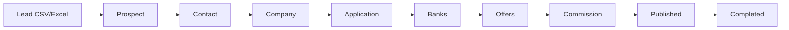

# CRM Sistema Completo - Guía de Lectura y Comprensión

> **Documento de Orientación**: Este documento está diseñado para que puedas leerlo y entender completamente el sistema CRM de gestión de préstamos comerciales. Combina información del frontend (Angular) y backend (NestJS) de manera coherente.

## 📋 Tabla de Contenidos

1. [¿Qué es este Sistema?](#1-qué-es-este-sistema)
2. [Arquitectura General](#2-arquitectura-general)
3. [Flujo Principal de Negocio](#3-flujo-principal-de-negocio)
4. [Módulos del Sistema](#4-módulos-del-sistema)
5. [Cómo Funciona la Comunicación Frontend-Backend](#5-cómo-funciona-la-comunicación-frontend-backend)
6. [Sistema de Permisos](#6-sistema-de-permisos)
7. [Estados y Transiciones](#7-estados-y-transiciones)
8. [Casos de Uso Reales](#8-casos-de-uso-reales)
9. [Documentación Detallada](#9-documentación-detallada)

---

## 1. ¿Qué es este Sistema?

### 1.1 Propósito

Este es un **CRM (Customer Relationship Management)** especializado en la gestión de **préstamos comerciales**. El sistema facilita todo el proceso desde la generación de leads hasta el cierre de préstamos y distribución de comisiones.

### 1.2 ¿Qué Problema Resuelve?

**Antes del Sistema:**
- Las solicitudes de préstamo estaban dispersas en emails, hojas de cálculo y documentos físicos
- No había forma de rastrear el estado de cada solicitud
- Enviar una aplicación a múltiples bancos era manual y propenso a errores
- No había trazabilidad de quién hizo qué y cuándo
- Las comisiones se calculaban manualmente

**Con el Sistema:**
- ✅ Centralización completa de todas las solicitudes
- ✅ Envío simultáneo a múltiples bancos
- ✅ Rastreo completo de ofertas y respuestas
- ✅ Trazabilidad completa (notas, estados, historial)
- ✅ Comisiones creadas automáticamente al aceptar ofertas
- ✅ Gestión de leads masiva desde CSV/Excel

### 1.3 Usuarios del Sistema

- **Agentes/Brokers**: Gestionan sus propios leads, contactos, empresas y aplicaciones
- **Supervisores**: Supervisan todo el equipo, transfieren recursos entre agentes
- **Administradores**: Gestionan bancos, usuarios, permisos, publican comisiones
- **Marketing**: Crea campañas que generan leads automáticamente

---

## 2. Arquitectura General

### 2.1 Visión de Alto Nivel

El sistema está dividido en dos partes principales:

```
┌─────────────────────────────────────────────────────────┐
│                    FRONTEND (Angular)                    │
│  - Interfaz de Usuario                                   │
│  - Gestión de Estado Local (Signals)                    │
│  - Validaciones de UX                                    │
│  - Componentes Reutilizables                             │
└─────────────────────────────────────────────────────────┘
                        ↕ HTTP/REST
┌─────────────────────────────────────────────────────────┐
│                    BACKEND (NestJS)                     │
│  - Lógica de Negocio (Clean Architecture)              │
│  - Validaciones de Seguridad                            │
│  - Persistencia (MongoDB)                               │
│  - Integraciones Externas (AWS, Auth0, etc.)           │
└─────────────────────────────────────────────────────────┘
```

### 2.2 Frontend (Angular 19)

**Tecnologías:**
- Angular 19.1.4 con standalone components
- Tailwind CSS para estilos
- Angular Signals para estado reactivo
- Auth0 para autenticación
- NotificationAPI para notificaciones en tiempo real

**Arquitectura:**
- **Feature-Based**: Organización por módulos de negocio (Applications, Contacts, Companies, etc.)
- **Service Layer**: Servicios para operaciones CRUD
- **Component-Based**: Componentes reutilizables y específicos de features
- **Signal-Based State**: Estado reactivo local (no hay estado global centralizado)

**Estructura:**
```
src/app/
├── features/          # Módulos de negocio (lazy-loaded)
├── components/        # Componentes reutilizables
├── services/          # Servicios de negocio
├── guards/            # Guards de routing
└── utils/             # Utilidades compartidas
```

### 2.3 Backend (NestJS 10)

**Tecnologías:**
- NestJS 10.0.5 con TypeScript
- MongoDB 7.6.2 (Mongoose)
- Clean Architecture + CQRS
- Auth0 para autenticación/autorización
- AWS S3 para archivos, AWS SES para emails
- CloudTalk para VoIP, NotificationAPI para notificaciones

**Arquitectura:**
- **Clean Architecture**: 3 capas (Domain, Application, Infrastructure)
- **CQRS**: Separación de Commands (escritura) y Queries (lectura)
- **Event-Driven**: Domain Events para side effects desacoplados
- **Repository Pattern**: Interfaces en Domain, implementaciones en Infrastructure

**Estructura:**
```
src/
├── domain/            # Capa de Dominio (lógica de negocio pura)
├── app/               # Capa de Aplicación (orquestación)
└── infra/             # Capa de Infraestructura (REST, MongoDB, AWS)
```

---

## 3. Flujo Principal de Negocio

### 3.1 El Flujo Completo: De Lead a Préstamo Cerrado



**Paso a Paso:**

1. **Importar Leads** (Marketing):
   - Sube archivo CSV/Excel con prospectos
   - Sistema crea LeadGroup con múltiples Prospects
   - Prospects se asignan a agentes

2. **Gestionar Prospects** (Agente):
   - Agente ve prospects asignados
   - Hace llamadas (registradas automáticamente)
   - Añade notas sobre interacciones
   - Programa follow-up calls

3. **Convertir a Contact** (Agente):
   - Cuando prospect está calificado, crea Contact
   - Completa información personal (SSN, identificación, documentos)
   - Sistema vincula Prospect → Contact (preserva historial)

4. **Crear Company** (Agente):
   - Crea Company (empresa cliente)
   - Asocia Contact como miembro (puede tener hasta 10 miembros)
   - Sube documentos empresariales

5. **Crear Application** (Agente):
   - Selecciona Company
   - Completa monto ($1K-$20M), producto, referral
   - Sube documentos: 4 bank statements (requeridos), MTD, credit card, additional (máx 5)
   - Sistema calcula períodos dinámicamente
   - Application creada en estado `READY_TO_SEND`

6. **Enviar a Bancos** (Agente):
   - Establece posición (1-5) para prioridad
   - Selecciona bancos (puede ver recomendados basados en constraints)
   - Escribe mensaje opcional (15-800 caracteres)
   - Sistema crea BankNotification por cada banco
   - Estado cambia a `SENT`

7. **Recibir Ofertas** (Bancos):
   - Bancos responden con ofertas (vía webhook o manualmente)
   - Cada oferta tiene: monto, factor rate, points, commission, payment plan
   - Estado cambia a `OFFERED`

8. **Aceptar Oferta** (Agente):
   - Agente compara ofertas y acepta la mejor
   - **Sistema automáticamente crea Commission** (DRAFT)
   - Estado cambia a `OFFER_ACCEPTED`

9. **Publicar Commission** (Administrador):
   - Configura distribución PSF y Commission
   - Publica commission (estado: `PUBLISHED`)
   - Ya no puede editarse

10. **Completar Application** (Agente):
    - Marca aplicación como completada
    - Estado cambia a `COMPLETED`
    - Application bloqueada para edición

---

## 4. Módulos del Sistema

### 4.1 Applications (Aplicaciones) - El Corazón del Sistema

**¿Qué es?**
El módulo más importante. Gestiona solicitudes de préstamo comercial desde creación hasta cierre.

**Estados:**
```
READY_TO_SEND → SENT → OFFERED → OFFER_ACCEPTED → COMPLETED
                              ↓
                          REJECTED
```

**Operaciones Principales:**
- Crear aplicación (formulario multi-paso con documentos)
- Enviar a bancos (múltiples simultáneamente)
- Gestionar ofertas (aceptar, rechazar, actualizar)
- Completar aplicación

**Reglas Clave:**
- Monto: $1,000 - $20,000,000
- Bank Statements: 4 períodos requeridos (calculados dinámicamente)
- Solo `READY_TO_SEND` puede enviarse a bancos
- Al aceptar oferta → Commission creada automáticamente

### 4.2 Leads (Prospectos)

**¿Qué es?**
Gestiona leads/prospectos antes de convertirlos en contactos formales.

**Operaciones:**
- Importar masivamente desde CSV/Excel
- Gestionar prospects (llamadas, notas, follow-up)
- Convertir a Contact cuando está calificado

**Estructura:**
- **LeadGroup**: Contiene múltiples prospects
- **Prospect**: Prospecto individual con información básica

### 4.3 Contacts (Contactos)

**¿Qué es?**
Gestiona personas físicas (miembros de empresas o independientes).

**Validaciones:**
- Edad: 21-99 años
- Máximo 5 teléfonos
- Máximo 5 emails
- Máximo 6 documentos totales, 4 por tipo

**Relaciones:**
- Puede ser miembro de múltiples Companies
- Puede convertirse desde Prospect (preserva historial)

### 4.4 Companies (Empresas)

**¿Qué es?**
Gestiona empresas que solicitan préstamos.

**Validaciones:**
- Nombre: 2-100 caracteres
- Máximo 10 miembros (mínimo 1)
- Máximo 4 documentos por tipo

**Relaciones:**
- Tiene múltiples miembros (Contacts)
- Puede tener múltiples Applications

### 4.5 Banks (Bancos)

**¿Qué es?**
Catálogo de instituciones financieras (lenders/brokers).

**Características:**
- Constraints: amount min/max, industries, territories
- Blacklist: Puede estar blacklisted temporal o permanentemente
- Sistema calcula bancos recomendados basado en constraints

**Operaciones:**
- Crear, actualizar, eliminar bancos
- Gestionar blacklist
- Enviar emails a bancos

### 4.6 Commissions (Comisiones)

**¿Qué es?**
Distribución de comisiones cuando se acepta una oferta.

**Estructura:**
- PSF (Processing Service Fee) con distribución
- Commission con distribución
- Cada uno se distribuye entre múltiples usuarios

**Estados:**
```
DRAFT → PUBLISHED
```

**Flujo:**
1. Se crea automáticamente al aceptar oferta (DRAFT)
2. Administrador configura distribución
3. Publica (PUBLISHED) → ya no puede editarse

### 4.7 Campaigns (Campañas)

**¿Qué es?**
Campañas de marketing que generan leads automáticamente.

**Estados:**
```
STOPPED ↔ STARTED
```

**Flujo:**
1. Marketing crea campaña (STOPPED)
2. Inicia campaña (STARTED)
3. Sistema genera leads automáticamente
4. Leads se asignan a agentes
5. Puede detenerse en cualquier momento

### 4.8 Drafts (Borradores)

**¿Qué es?**
Aplicaciones guardadas como borradores antes de enviar.

**Operaciones:**
- Crear, actualizar, eliminar drafts
- Publicar draft (convierte a Application)

**Relación:**
- 1 Draft → 1 Application (al publicar)

---

## 5. Cómo Funciona la Comunicación Frontend-Backend

### 5.1 Formato de Requests

**JSON** (operaciones normales):
```json
{
  "amount": 50000,
  "product": "TERM_LOAN",
  "company_id": "123"
}
```

**FormData** (con archivos):
```
body: JSON string
documents: Array de archivos
```

### 5.2 Headers Requeridos

- `Authorization`: JWT token de Auth0 (inyectado automáticamente)
- `X-Tenant`: Tenant ID (inyectado por HttpService)
- `Accept-Language`: Idioma preferido (inyectado por HttpService)

### 5.3 Flujo de Request

```
Usuario → Componente → Service → HttpService → Interceptor → Backend API
                                                                    ↓
Usuario ← Componente ← Service ← HttpService ← Interceptor ← Backend API
```

**Ejemplo - Crear Application:**

1. **Frontend**: Usuario completa formulario multi-paso
2. **Frontend**: Valida datos localmente (UX)
3. **Frontend**: Crea FormData (body JSON + archivos)
4. **Frontend**: `POST /v1/applications` (FormData)
5. **Backend**: Valida permisos (`CREATE_APPLICATION`)
6. **Backend**: Valida datos de negocio (seguridad)
7. **Backend**: Crea Application entity
8. **Backend**: Guarda en MongoDB + S3
9. **Backend**: Retorna `201 Created` con ID
10. **Frontend**: Actualiza Signals, navega a detalles

### 5.4 Validaciones Coordinadas

**Frontend (UX):**
- Validaciones inmediatas para feedback al usuario
- Previene envío de datos inválidos

**Backend (Seguridad):**
- **Nunca confía solo en frontend**
- Valida permisos, estados, reglas de negocio
- Algunas validaciones son redundantes por seguridad (defense in depth)

**Ejemplo:**
- Frontend valida monto $1K-$20M → Usuario ve error inmediatamente
- Backend también valida monto $1K-$20M → Rechaza si frontend fue manipulado

### 5.5 Domain Events y Side Effects

**¿Qué son?**
Eventos de dominio que desacoplan side effects del flujo principal.

**Ejemplo - Aceptar Oferta:**

1. Frontend: `PUT /v1/applications/:id/notifications/:nId/accept/:offerId`
2. Backend: Procesa aceptación, actualiza estados
3. Backend: **Dispara `ApplicationAcceptedEvent`** (Domain Event)
4. Backend: **Event Handler crea Commission automáticamente** (DRAFT)
5. Backend: Retorna respuesta exitosa
6. Frontend: Actualiza UI, muestra toast
7. NotificationAPI: Envía notificación en tiempo real

**Ventaja:**
- Frontend no necesita hacer requests adicionales
- Backend maneja automáticamente los side effects
- Código más limpio y desacoplado

---

## 6. Sistema de Permisos

### 6.1 ¿Cómo Funciona?

Los permisos vienen en el **JWT token de Auth0** (claim `permissions`).

**Frontend:**
- `UserPermissionsService` decodifica y almacena permisos
- `PermissionGuard` valida permisos antes de activar rutas
- Componentes verifican permisos para mostrar/ocultar UI

**Backend:**
- `PermissionsGuard` (global) valida permisos antes de ejecutar endpoints
- Decorator `@RequiredPermissions()` especifica permisos requeridos
- Rechaza requests sin permisos (403 Forbidden)

### 6.2 Tipos de Permisos

**"own" vs "all":**
- `LIST_OWN_APPLICATIONS`: Ver solo mis aplicaciones
- `LIST_APPLICATIONS`: Ver todas las aplicaciones

**CRUD:**
- `CREATE_APPLICATION`, `READ_APPLICATION`, `UPDATE_APPLICATION`, `DELETE_APPLICATION`

**Actions:**
- `SEND_APPLICATION`, `TRANSFER_APPLICATION`, `PUBLISH_COMMISSION`

**View Full:**
- `VIEW_FULL_SSN`, `VIEW_FULL_PHONE`, `VIEW_FULL_TAX_ID`, `VIEW_FULL_EMAIL`, `VIEW_FULL_NOTIFICATION`

**Drafts:**
- `READ_DRAFT_APPLICATION`, `CREATE_DRAFT_APPLICATION`, `UPDATE_DRAFT_APPLICATION`, `PUBLISH_DRAFT_APPLICATION`, `DELETE_DRAFT_APPLICATION`, `TRANSFER_DRAFT`

**Notes:**
- `ADD_CONTACT_NOTE`, `DELETE_CONTACT_NOTE`, `ADD_COMPANY_NOTE`, `DELETE_COMPANY_NOTE`, `ADD_PROSPECT_NOTE`

**Calls:**
- `REQUEST_CALL`, `REQUEST_CUSTOM_CALL`

### 6.3 Regla de Oro

**Nunca confiar solo en validación del frontend** - el backend siempre valida permisos, estados y reglas de negocio.

---

## 7. Estados y Transiciones

### 7.1 Application Status

```
READY_TO_SEND → SENT → OFFERED → OFFER_ACCEPTED → COMPLETED
                              ↓
                          REJECTED
```

**Transiciones Válidas:**
- `READY_TO_SEND → SENT`: Al enviar a bancos (requiere posición 1-5)
- `SENT → OFFERED`: Banco envía oferta
- `OFFERED → OFFER_ACCEPTED`: Usuario acepta oferta
- `OFFER_ACCEPTED → COMPLETED`: Completar manualmente
- Cualquier estado → `REJECTED`: Rechazar aplicación

**Reglas:**
- No se puede saltar estados
- Backend valida transiciones
- Frontend previene acciones inválidas

### 7.2 BankNotification Status

```
PENDING → SENT → OFFERED → ACCEPTED
                    ↓
                REJECTED
```

### 7.3 Commission Status

```
DRAFT → PUBLISHED
```

- `DRAFT`: Puede editarse múltiples veces
- `PUBLISHED`: Final, no puede editarse

### 7.4 Campaign Status

```
STOPPED ↔ STARTED
```

- `STOPPED`: No genera leads
- `STARTED`: Genera leads automáticamente

---

## 8. Casos de Uso Reales

### 8.1 Caso de Uso: Agente Crea y Envía Aplicación

**Escenario:**
Agente tiene un cliente (Company) que necesita un préstamo de $50,000.

**Pasos:**

1. **Crear Application:**
   - Selecciona Company existente
   - Completa monto: $50,000
   - Selecciona producto: TERM_LOAN
   - Sistema calcula períodos (última aplicación o estándar)
   - Sube 4 bank statements (períodos calculados)
   - Sube MTD, credit card statements (opcionales)
   - Application creada en estado `READY_TO_SEND`

2. **Enviar a Bancos:**
   - Establece posición: 3 (prioridad media)
   - Carga bancos recomendados (sistema filtra por constraints)
   - Selecciona 5 bancos
   - Escribe mensaje personalizado: "Cliente con excelente historial crediticio..."
   - Envía
   - Sistema crea 5 BankNotifications
   - Estado cambia a `SENT`

3. **Recibir Ofertas:**
   - Banco A responde con oferta: $50,000, factor rate 1.25, 2 points
   - Banco B responde con oferta: $50,000, factor rate 1.20, 3 points
   - Estado cambia a `OFFERED`

4. **Aceptar Oferta:**
   - Agente compara ofertas
   - Selecciona Banco B (mejor factor rate)
   - Acepta oferta
   - **Sistema automáticamente crea Commission** (DRAFT)
   - Estado cambia a `OFFER_ACCEPTED`

5. **Completar:**
   - Una vez financiada, marca como completada
   - Estado cambia a `COMPLETED`

### 8.2 Caso de Uso: Marketing Genera Leads Masivamente

**Escenario:**
Marketing tiene un archivo CSV con 1000 prospectos.

**Pasos:**

1. **Importar Leads:**
   - Sube archivo CSV
   - Sistema parsea archivo
   - Crea LeadGroup con 1000 Prospects
   - Valida cada prospect (nombre, teléfono, email)
   - Omite filas inválidas (retorna lista de omitidas)
   - Asigna prospects a agentes automáticamente

2. **Agente Trabaja Prospects:**
   - Agente ve 50 prospects asignados
   - Hace llamadas (registradas automáticamente)
   - Añade notas sobre interacciones
   - Programa follow-up calls

3. **Convertir a Contact:**
   - Cuando prospect está calificado, crea Contact
   - Completa información personal
   - Sistema vincula Prospect → Contact (preserva historial)

### 8.3 Caso de Uso: Campaña Genera Leads Automáticamente

**Escenario:**
Marketing crea campaña que genera leads automáticamente desde Systeme.io.

**Pasos:**

1. **Crear Campaña:**
   - Define nombre, sender, subject, message
   - Configura contactos a enviar
   - Campaña creada en estado `STOPPED`

2. **Iniciar Campaña:**
   - Cambia estado a `STARTED`
   - Sistema crea job en Scheduler Service
   - Job ejecuta periódicamente

3. **Generación Automática:**
   - Job obtiene contactos de Systeme.io
   - Filtra contactos ya enviados
   - Crea LeadGroup con Prospects
   - Envía emails masivos (AWS SES)
   - Asigna Prospects a agentes
   - Agentes reciben notificación de nuevos leads

---

## 9. Documentación Detallada

### 9.1 Documentación por Capa

**Frontend:**
- **`.cursorrules`**: Contexto conciso para AI (crm-web-app/.cursorrules)
- **`README.md`**: Análisis exhaustivo del frontend (crm-web-app/README.md)

**Backend:**
- **`.cursorrules`**: Contexto conciso para AI (crm-core-api/.cursorrules)
- **`README.md`**: Análisis exhaustivo del backend (crm-core-api/README.md)

### 9.2 Secciones Clave de los READMEs

**Frontend README:**
- Sección 1: Análisis Arquitectónico y Estructural
- Sección 2: Análisis de Lógica de Negocio por Módulo
- Sección 11: Análisis Profundo: Módulo Applications
- Sección 12: Flujos Completos de Procesos
- Sección 13: Análisis de Arquitectura Completa
- Sección 14: Comunicación con Backend

**Backend README:**
- Sección 1: Análisis Arquitectónico y Estructural
- Sección 2: Análisis de Lógica de Negocio por Módulo
- Sección 7: Análisis Completo de Arquitectura
- Sección 11: Flujos Completos de Procesos
- Sección 13: Análisis Profundo de Todos los Módulos
- Sección 14: Comunicación con Frontend

### 9.3 Diagramas Disponibles

Los READMEs incluyen diagramas Mermaid para:
- Arquitectura de capas
- Flujos de datos
- Estados y transiciones
- Entidades y relaciones
- Flujos completos de procesos

### 9.4 Análisis de Coherencia

Se creó `ANALISIS_COHERENCIA_COMPLETO_4_ARCHIVOS.md` que verifica:
- Coherencia entre frontend y backend
- Coherencia entre `.cursorrules` y `README.md`
- Información faltante o inconsistente
- Recomendaciones de mejora

**Estado**: ✅ MUY COHERENTE (con correcciones menores aplicadas)

---

## 10. Conceptos Clave para Entender el Sistema

### 10.1 Clean Architecture (Backend)

**Principio**: Las capas internas no dependen de las externas.

```
Infrastructure (REST, MongoDB, AWS)
    ↓ depende de
Application (Command/Query Handlers)
    ↓ depende de
Domain (Entities, Business Logic)
```

**Ventaja**: Lógica de negocio independiente de frameworks y tecnologías.

### 10.2 CQRS (Backend)

**Separación:**
- **Commands**: Modifican estado (Create, Update, Delete)
- **Queries**: Solo leen datos (Get, Search, List)

**Ventaja**: Optimización independiente, escalabilidad.

### 10.3 Domain Events (Backend)

**Ejemplo:**
- Al aceptar oferta → `ApplicationAcceptedEvent` se dispara
- Event Handler crea Commission automáticamente

**Ventaja**: Desacoplamiento, extensibilidad.

### 10.4 Signals (Frontend)

**Estado Reactivo:**
- `signal()`: Valores mutables
- `computed()`: Valores derivados
- Actualización automática de UI

**Ventaja**: Simplicidad, performance, nativo de Angular.

### 10.5 Feature-Based Architecture (Frontend)

**Organización:**
- Cada feature es independiente
- Lazy loading por feature
- Alta cohesión, bajo acoplamiento

**Ventaja**: Escalabilidad, colaboración en equipo.

---

## 11. Preguntas Frecuentes

### 11.1 ¿Cómo se crean las Comisiones?

**Respuesta:**
Se crean automáticamente cuando se acepta una oferta. El backend dispara un Domain Event (`ApplicationAcceptedEvent`) que un Event Handler procesa para crear la Commission en estado DRAFT.

### 11.2 ¿Cómo se calculan los períodos de Bank Statements?

**Respuesta:**
- Si la Company tiene aplicaciones previas: Calcula desde el último período válido + 4 períodos
- Si no tiene aplicaciones previas: Usa los últimos 4 períodos desde hoy

### 11.3 ¿Cómo funciona el sistema de recomendación de bancos?

**Respuesta:**
El sistema filtra bancos basado en:
- Status: ACTIVE
- No en blacklist
- Constraints: amount min/max, industries, territories
- Historial previo

### 11.4 ¿Qué pasa si un banco está en blacklist?

**Respuesta:**
- No aparece en bancos recomendados
- Backend rechazará el envío si se intenta enviar manualmente

### 11.5 ¿Puedo transferir una Application entre usuarios?

**Respuesta:**
Sí, si:
- Tienes permiso `TRANSFER_APPLICATION`
- La Application no está en estado `COMPLETED`

### 11.6 ¿Cómo funcionan las notificaciones en tiempo real?

**Respuesta:**
- Backend usa NotificationAPI para enviar notificaciones
- Frontend usa NotificationAPI SDK con WebSocket
- Notificaciones aparecen automáticamente cuando hay cambios importantes

### 11.7 ¿Qué es multi-tenancy?

**Respuesta:**
El backend soporta múltiples tenants. Al crear una Application, se clona automáticamente para todos los tenants. El frontend solo envía el header `X-Tenant`, el backend maneja el resto.

---

## 12. Próximos Pasos

### 12.1 Para Desarrolladores

1. **Leer los READMEs completos:**
   - `crm-web-app/README.md` (Frontend)
   - `crm-core-api/README.md` (Backend)

2. **Revisar `.cursorrules`:**
   - `crm-web-app/.cursorrules` (Contexto Frontend)
   - `crm-core-api/.cursorrules` (Contexto Backend)

3. **Explorar el código:**
   - Frontend: `src/app/features/` para ver módulos
   - Backend: `src/domain/` para ver lógica de negocio

### 12.2 Para Product Owners

1. **Entender los flujos de negocio:**
   - Sección 3: Flujo Principal de Negocio
   - Sección 8: Casos de Uso Reales

2. **Revisar estados y transiciones:**
   - Sección 7: Estados y Transiciones

3. **Entender permisos:**
   - Sección 6: Sistema de Permisos

### 12.3 Para QA/Testing

1. **Revisar validaciones:**
   - Sección 5.4: Validaciones Coordinadas
   - READMEs tienen secciones de validaciones por módulo

2. **Entender flujos completos:**
   - Sección 3: Flujo Principal
   - READMEs tienen diagramas de flujo detallados

---

## 13. Resumen Ejecutivo

### 13.1 ¿Qué Hace el Sistema?

Gestiona el ciclo completo de préstamos comerciales:
- **Leads** → **Contacts** → **Companies** → **Applications** → **Banks** → **Offers** → **Commissions**

### 13.2 Arquitectura

- **Frontend**: Angular 19, Feature-Based, Signals
- **Backend**: NestJS 10, Clean Architecture, CQRS, Event-Driven

### 13.3 Características Clave

- ✅ Centralización completa
- ✅ Envío simultáneo a múltiples bancos
- ✅ Comisiones automáticas
- ✅ Trazabilidad completa
- ✅ Permisos granulares
- ✅ Notificaciones en tiempo real
- ✅ Multi-tenancy

### 13.4 Flujo Principal

1. Importar/Gestionar Leads
2. Convertir a Contacts/Companies
3. Crear Applications
4. Enviar a Bancos
5. Recibir/Aceptar Ofertas
6. Comisiones Automáticas
7. Completar

---

**Documento creado**: 2024
**Versión**: 1.0
**Estado**: ✅ Completo y Coherente

---

## Notas Finales

Este documento es una **guía de lectura** para entender el sistema completo. Para detalles técnicos específicos, consulta los READMEs completos de frontend y backend.

**Documentación Completa:**
- Frontend: `crm-web-app/README.md` (4511 líneas)
- Backend: `crm-core-api/README.md` (4738 líneas)
- Análisis de Coherencia: `ANALISIS_COHERENCIA_COMPLETO_4_ARCHIVOS.md`

**Contexto para AI:**
- Frontend: `crm-web-app/.cursorrules` (923 líneas)
- Backend: `crm-core-api/.cursorrules` (659 líneas)

